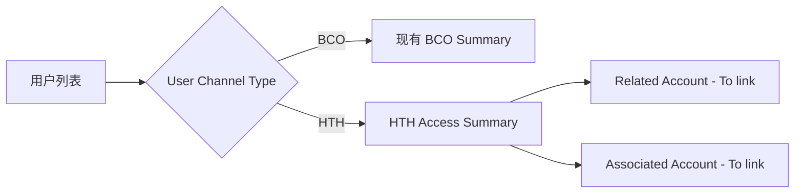
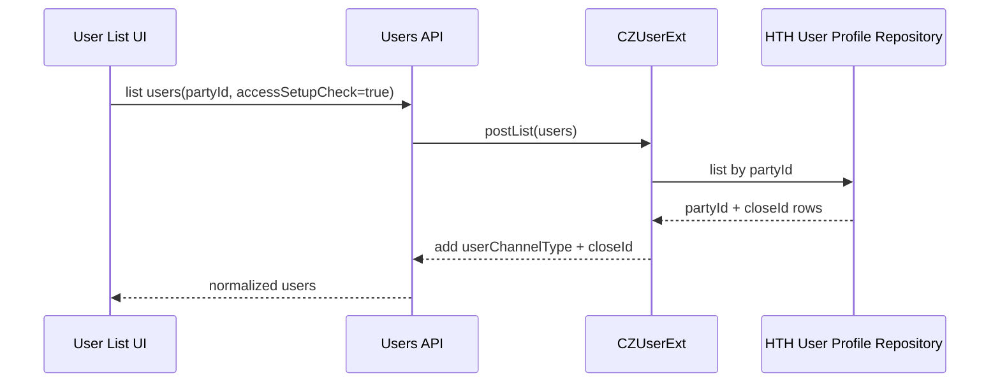
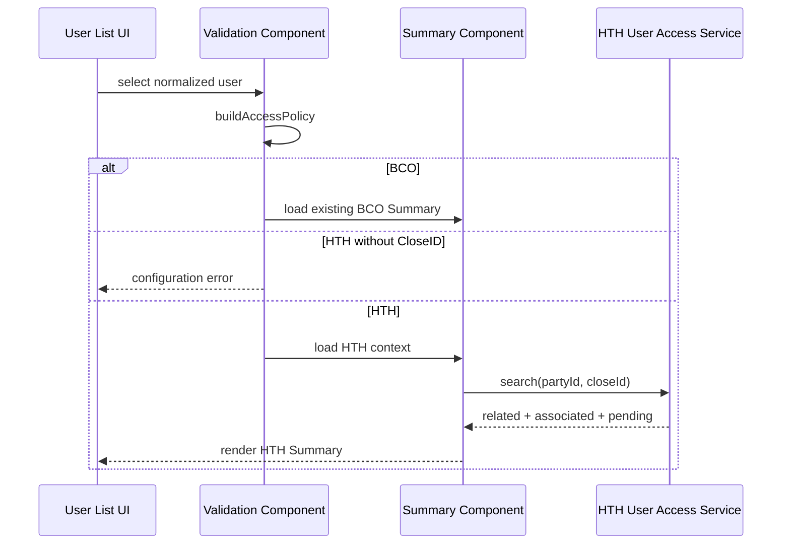

# BCOH2H-538 Technical Design

| 项目 | 内容 |
| --- | --- |
| Story | BCOH2H-538 |
| 功能 | HTH User Accounts & Services Access Summary |
| 文档状态 | Draft for Review |
| 代码基线 | `main` / `19e464f6542c` |
| 依赖 Story | BCOH2H-595 提供 HTH User Access 生效数据和查询服务 |
| 更新时间 | 2026-08-25 |

## 1. 目标

在现有 `User Accounts & Services Access` 用户列表中识别 HTH 用户，并在点击 Username 后进入 HTH Access Summary。

- BCO 用户继续走现有流程，不能受到影响。
- HTH 用户进入 HTH Summary。
- 页面显示 User Name、Full Name、User Channel Type。
- Summary 显示 Related Account 和 Associated Account 的已关联账户数量。
- 点击 `To link` 时带入正确的用户和公司信息。

### 1.1 In Scope

- User Accounts & Services Access 用户列表新增/展示 Channel Type。
- 用户列表服务返回 `closeId`。
- 点击 Username 时根据 HTH/BCO 分流。
- HTH Summary 展示用户资料、Related Summary、Associated Summary。
- Summary 展示生效和 Pending Approval 状态。
- Related/Associated `To link` 构造正确的下一页 Context。
- UI 权限、异常提示、NLS 和 BCO 回归测试。

### 1.2 Out of Scope

- 账户 Checkbox、API Service Mapping、Review 和保存逻辑，归 BCOH2H-595。
- 企业 HTH Enable/Disable、UAM Client ID 和 Certificate Management。
- 修改 BCO Account Access 数据结构。
- 在本 Story 中重新定义或生成 CloseID。

### 1.3 设计结论

1. 复用现有 `user-list-details`、`validation` 和 `summary`，通过 `channelMode` 控制 HTH 行为。
2. BCO 不传 HTH 参数时继续执行现有代码，避免 BCO 回归。
3. `closeId` 只能由后端返回，前端不生成。
4. HTH Summary 读取新的 HTH User Access Service，不读取 BCO `DIGX_AM_*`。
5. Summary Count 只统计审批后生效的数据。

## 2. 当前情况

现有代码已经完成一部分：

- 用户列表已经显示 `User Channel Type`。
- 后端通过 `HTH_USER_PROFILE` 判断用户是 HTH 还是 BCO。
- 现有 BCO Summary 已支持 Related 和 Associated Account 展示。

主要缺口：

- 点击 Username 后目前总是进入 BCO 流程。
- Account Access 用户列表没有返回 `closeId`。
- Summary 没有 HTH 模式，也没有显示 User Channel Type。
- Summary 当前读取的是 BCO Account Access 数据。

### 2.1 现有代码定位

| 功能 | 现有文件 | 当前行为 |
| --- | --- | --- |
| 用户列表查询 | `consulting/channel/extensions/components/common/user-list-details/user-list-details.js` | 调用 `users?partyId=...&isAccessSetupCheckRequired=true`。 |
| 用户列表 UI | `.../common/user-list-details/user-list-details.html` | 已有 User Channel Type Column 和 Username Link。 |
| 点击用户处理 | `.../account-access-management/validation/validation.js` | `showUserAccountAccess` 无条件加载现有 Summary。 |
| Summary | `.../account-access-management/summary/summary.js/.html` | 已有 Related/Associated UI，但只理解 BCO Account Access。 |
| Summary Model | `.../account-access-management/summary/model.js` | 一次请求 CSA、TRD、LON、VER、VRA、LER。 |
| Channel Type 后端 | `CZUserExt.java` | 已把 `userChannelType` 放入 User DTO Dictionary。 |
| HTH 用户判断 | `LocalUserExtensionDataRepositoryAdapter.java` | 通过 `HTH_USER_PROFILE` 是否存在判断 HTH。 |

### 2.2 当前数据流

```text
User List
→ users API
→ CZUserExt 查询 UserExtensionData
→ UserExtensionData Repository 查询 HTH_USER_PROFILE
→ 返回 userChannelType
→ Username Click
→ validation.showUserAccountAccess
→ 总是加载 BCO Summary
```

BCOH2H-538 修改最后两步，并把 `closeId` 一起返回。

## 3. 页面流程



## 4. 前端设计

### 4.1 用户列表

扩展用户列表返回和前端数据模型，使每个用户至少包含：

```json
{
  "username": "USER@P100",
  "fullName": "Example User",
  "userChannelType": "HTH",
  "closeId": "USER@P100"
}
```

注意：前端必须使用后端返回的 `closeId`，不能自己用 Username 拼接。

主要修改位置：

- `common/user-list-details/user-list-details.js`
- `account-access-management/validation/validation.js`
- `CZUserExt.java`

建议统一前端 User View Model，避免每个页面重复解析 Dictionary：

```javascript
function normalizeUser(item) {
    return {
        username: item.username,
        firstName: item.firstName,
        lastName: item.lastName,
        fullName: buildFullName(item.firstName, item.lastName),
        userChannelType: readDictionary(item, "userChannelType") || "BCO",
        closeId: readDictionary(item, "closeId") || null,
        linkedAccountStatus: item.linkedAccountStatus
    };
}
```

规范化只执行一次，后续组件直接读取属性，不再遍历原始 Dictionary。

### 4.2 HTH/BCO 分流

点击 Username 后建立统一的页面参数：

```javascript
{
    channelMode: "HTH",
    partyId: "P100",
    closeId: "USER@P100",
    username: "USER@P100",
    fullName: "Example User"
}
```

处理规则：

- `userChannelType = BCO`：按现有逻辑加载 Summary。
- `userChannelType = HTH` 且有 `closeId`：加载 HTH Summary。
- HTH 用户没有 `closeId`：停止跳转并显示配置错误，不能自动当作 BCO 用户。

建议增加统一 Policy：

```javascript
function buildAccessPolicy(user) {
    const isHth = user.userChannelType === "HTH";

    return {
        channelMode: isHth ? "HTH" : "BCO",
        closeId: isHth ? user.closeId : null,
        allowedAccountTypes: isHth ? ["CSA"] : null,
        serviceMappingType: isHth ? "HTH_API" : "OBDX_TASK"
    };
}
```

`null` 表示 BCO 继续使用现有账户类型和 Task Mapping，不在本 Story 重新定义。

### 4.3 HTH Summary

建议复用现有 `account-access-management/summary`，通过 `channelMode` 控制行为，不复制整套 Summary 代码。

HTH 模式需要：

- 增加 User Channel Type 显示。
- 从 HTH User Access 服务读取 Summary，不读取 BCO `taskIds` 数据。
- Related Account 使用当前 `partyId`。
- Associated Account 每一组使用对应的 `linkedPartyId`。
- `To link` 跳转时传递：
  - `partyId`
  - `closeId`
  - `accessPartyId`
  - `linkageType`：`RELATED` 或 `ASSOCIATED`
  - `channelMode = HTH`

建议 HTH Summary 只显示 `Current and Savings`，因为 BCOH2H-595 只允许设置这一类账户。最终以产品确认结果为准。

### 4.4 Summary 状态定义

| `setupStatus` | 页面显示 | 可用操作 |
| --- | --- | --- |
| `NOT_SETUP` | No account(s) linked | 有维护权限时显示 `To link`。 |
| `ACTIVE` | Account Type 和数量 | 显示 `To link` 或 View/Edit 入口。 |
| `PENDING_CREATE` | Pending Approval + Reference | 禁止重复 Create/Edit/Delete。 |
| `PENDING_EDIT` | 仍显示当前生效数量，同时显示 Pending Edit | 生效数据可查看，不可再次修改。 |
| `PENDING_DELETE` | 仍显示当前生效数量，同时显示 Pending Delete | 不可再次修改。 |
| `DISABLED` | HTH service disabled | 页面只读或禁止进入。 |
| `ERROR` | 数据配置异常 | 不提供维护操作。 |

### 4.5 Navigation Context

所有 Summary → Linkage 跳转使用同一种对象：

```json
{
  "channelMode": "HTH",
  "partyId": "P100",
  "closeId": "USER@P100",
  "username": "USER@P100",
  "fullName": "Example User",
  "userChannelType": "HTH",
  "linkageType": "ASSOCIATED",
  "accessPartyId": "P200",
  "accessPartyName": "Associated Limited",
  "setupStatus": "NOT_SETUP",
  "objectVersionNumber": null
}
```

Related 必须满足 `accessPartyId = partyId`；Associated 必须使用被点击的公司 ID，不能继续使用上一次选择的 Linked Party。

### 4.6 前端文件影响

| 文件/组件 | 修改内容 |
| --- | --- |
| `common/user-list-details/user-list-details.js` | 解析 CloseID、标准化用户、把完整用户对象传给 Click Handler。 |
| `common/user-list-details/user-list-details.html` | 保持现有 Column；补充异常/Tooltip 如需要。 |
| `account-access-management/validation/validation.js` | 构建 Policy、校验 HTH CloseID、分流并传递 Context。 |
| `account-access-management/summary/summary.js` | 增加 HTH 初始化、Search、状态和导航分支。 |
| `account-access-management/summary/summary.html` | 显示 Channel Type、Pending/Error 状态和 HTH Account Rows。 |
| `account-access-management/summary/model.js` | 新增 HTH Summary 调用；保留现有 BCO Calls。 |
| `extensions/resources/nls/access-management.js` | 新增 HTH、Pending、Missing CloseID 等文字。 |

## 5. 后端设计

### 5.1 用户列表返回 CloseID

当前创建 HTH 用户时：

```text
HTH_USER_PROFILE.PARTY_ID = UserExtensionData.cdcNo
HTH_USER_PROFILE.CLOSE_ID = UserExtensionData.userID
```

用户列表扩展需要把查询到的 `closeId` 与 `userChannelType` 一起放入响应。

BCO 用户返回：

```json
{
  "userChannelType": "BCO",
  "closeId": null
}
```

建议 `CZUserExt` 将两个扩展值放在同一个 Dictionary：

```json
{
  "nameValuePairDTOArray": [
    {
      "name": "userChannelType",
      "genericName": "userChannelType",
      "value": "HTH"
    },
    {
      "name": "closeId",
      "genericName": "closeId",
      "value": "USER@P100"
    }
  ]
}
```

如果现有响应序列化把它们拆成多个 Dictionary，前端解析器必须同时支持两种结构。

### 5.2 Summary 接口

由 BCOH2H-595 共用的 HTH User Access 服务提供：

```http
GET /hostToHostUserAccess/search?partyId={partyId}&closeId={closeId}
```

简化响应示例：

```json
{
  "enterpriseHthStatus": "ENABLE",
  "related": {
    "accessPartyId": "P100",
    "setupStatus": "ACTIVE",
    "casaAccountCount": 4,
    "pendingReferenceNumber": null
  },
  "associated": [
    {
      "accessPartyId": "P200",
      "accessPartyName": "Associated Limited",
      "setupStatus": "NOT_SETUP",
      "casaAccountCount": 0,
      "pendingReferenceNumber": null
    }
  ]
}
```

Summary 只统计已经生效的授权。Pending Approval 需要单独显示，不能提前算作已关联账户。

完整响应建议：

```json
{
  "user": {
    "partyId": "P100",
    "closeId": "USER@P100",
    "username": "USER@P100",
    "fullName": "Example User",
    "userChannelType": "HTH"
  },
  "enterpriseHthStatus": "ENABLE",
  "related": {
    "linkageType": "RELATED",
    "accessPartyId": "P100",
    "accessPartyName": "Example Limited",
    "setupStatus": "ACTIVE",
    "objectVersionNumber": 3,
    "accountCountByType": {
      "CSA": 4
    },
    "pendingAction": null,
    "pendingReferenceNumber": null
  },
  "associated": [],
  "status": {
    "result": "SUCCESS"
  }
}
```

### 5.3 Service 分层

Summary Search 与 595 共用以下 Service：

```text
REST Endpoint
  com.ofss.digx.cz.bea.appx.hosttohost.service.HostToHostUserAccess

Application Service
  com.ofss.digx.cz.bea.app.hosttohost.service.HostToHostUserAccess

DTO
  HostToHostUserAccessSearchDTO
  HostToHostUserAccessSummaryDTO
  HostToHostUserAccessContextDTO
  HostToHostUserAccessResponseDTO

Repository
  HthUserAccessRepository
  HthUserAccessRequestRepository
```

Search Service 执行顺序：

1. Canonicalize `partyId` 和 `closeId`。
2. 执行 Service Access Policy。
3. 验证 HTH User Profile。
4. 查询企业 HTH 状态。
5. 一次读取该用户所有 Active Access Header 和 Account Count。
6. 一次读取该用户所有未结束 Request。
7. 查询可管理的 Associated Parties。
8. 按 `accessPartyId` 组装 Related/Associated Summary。
9. 执行 Response Policy 后返回。

不要为每个 Associated Party 单独查询账户数量，避免 N+1 Query。

## 6. 校验和权限

后端必须校验：

- `(partyId, closeId)` 存在于 `HTH_USER_PROFILE`。
- 用户仍属于该 Party，并且没有被删除。
- 企业 HTH 状态是 `ENABLE`。
- 当前 BM 用户有查看或维护该公司的权限。
- Associated Party 确实与当前 Party 有有效关联关系。

### 6.1 Service Entitlement

Search 使用新的只读 Entitlement：

```text
com.ofss.digx.cz.bea.app.hosttohost.service.HostToHostUserAccess.search_View
```

需要配置：

- Backend Service Resource。
- UI Component Resource。
- Resource Action `VIW/PRM` Mapping。
- Entitlement Group，建议沿用现有 User Account Access 所属 Group。
- BM Maker 和 Checker 都应有 Search 权限，但写权限由 595 单独控制。

### 6.2 错误处理

| Error Code | HTTP | 页面处理 |
| --- | --- | --- |
| `HTH_UA_001` Profile/CloseID 不存在 | 400 | 返回用户列表并提示配置错误。 |
| `HTH_UA_002` HTH 未启用 | 409 | 显示 Disabled/只读状态。 |
| `HTH_UA_003` Party Context 无效 | 403 | 停止跳转，不显示目标公司资料。 |
| `HTH_UA_008` 有 Pending Request | 200 | 正常返回 Summary，并设置 Pending 状态。 |
| Access Denied | 403 | 显示标准无权限页面。 |
| Unexpected Error | 500 | 显示通用错误并记录 Correlation ID。 |

## 7. Table 和查询设计

### 7.1 本 Story 使用的现有表

BCOH2H-538 本身不新增业务表，用户类型和 CloseID 继续使用现有表：

```sql
HTH_BEAUAT.HTH_USER_PROFILE
```

| Column | Type | Key | 用途 |
| --- | --- | --- | --- |
| `PARTY_ID` | `VARCHAR2(64)` | PK(1) | 用户所属 Corporate Party。 |
| `CLOSE_ID` | `VARCHAR2(255)` | PK(2) | HTH 用户标识；当前实现保存完整 OBDX User ID。 |

现有主键是：

```sql
PRIMARY KEY (PARTY_ID, CLOSE_ID)
```

这里没有单独的 `USER_CHANNEL_TYPE` Column。判断规则是：

```text
存在 HTH_USER_PROFILE(PARTY_ID, CLOSE_ID) → HTH
不存在                                      → BCO
```

当前代码又使用 `CLOSE_ID = USER_ID` 把 Profile 记录匹配回用户。因此如果未来 CloseID 与 User ID 不同，这张表必须增加 `USER_ID`，否则无法知道 CloseID 属于哪个用户。

### 7.2 用户列表怎么查

用户列表服务先按 Party 查询用户，再一次性查询该 Party 的 HTH Profile：

```sql
SELECT PARTY_ID, CLOSE_ID
  FROM HTH_BEAUAT.HTH_USER_PROFILE
 WHERE PARTY_ID = :partyId;
```

后端把结果转换成 Map，避免为每个用户单独查询：

```text
key   = PARTY_ID + USER_ID
value = CLOSE_ID
```

然后向用户列表响应加入：

```json
{
  "userChannelType": "HTH",
  "closeId": "USER@P100"
}
```

这部分不修改用户主表，也不把 `closeId` 写入 `UserExtensionData` 表。`UserExtensionData.closeId` 继续保持 transient，只在响应阶段使用。

### 7.3 Summary 数据从哪里来

538 的 Summary 读取 595 建立的生效表：

```text
HTH_USER_ACCESS
  └── HTH_USER_ACCESS_ACCOUNT
```

Related Summary 的逻辑条件：

```text
PARTY_ID       = 当前 Corporate Party
CLOSE_ID       = 当前 HTH CloseID
ACCESS_PARTY_ID = PARTY_ID
LINKAGE_TYPE   = RELATED
OBJECT_STATUS  = A
```

Associated Summary 的逻辑条件：

```text
PARTY_ID        = 当前 Corporate Party
CLOSE_ID        = 当前 HTH CloseID
ACCESS_PARTY_ID = 对应 Associated Party
LINKAGE_TYPE    = ASSOCIATED
OBJECT_STATUS   = A
```

`Number of Account(s)` 使用 `HTH_USER_ACCESS_ACCOUNT` 按 `HTH_USER_ACCESS_ID` 计数。不能使用前端传入的数量，也不能使用 BCO `DIGX_AM_*` 数据。

Pending 状态从 `HTH_USER_ACCESS_REQUEST.TRANSACTION_ID` 关联 OBDX Approval Transaction 查询。Pending Request 只改变页面状态，不计入生效账户数量。

因此 538 的完整 Summary 依赖 595 的表、Repository 和 Search Service 先部署。

### 7.4 数据异常处理

| 情况 | 页面处理 |
| --- | --- |
| HTH 用户没有 Profile/CloseID | 阻止进入 HTH Summary，显示配置错误。 |
| Profile 存在但没有 User Access | 显示 `No related account(s) linked to the user.`。 |
| 生效数据存在但账户已失效 | Summary 不应继续计数，并记录数据一致性告警。 |
| 同一上下文存在 Pending Request | 显示 Pending，禁用重复维护。 |
| HTH Management 已 Disable | 页面只读或禁止进入，最终按产品决定。 |

## 8. 关键时序

### 8.1 用户列表



### 8.2 打开 HTH Summary



## 9. 非功能设计

### 9.1 安全

- 后端从授权上下文校验 BM 用户是否可管理 `partyId`，不能只相信 Query Parameter。
- CloseID、Account Number 不写入普通 INFO Log；需要排查时只记录 Masked/Hash 值。
- UI 不在 URL Fragment 或浏览器持久 Storage 保存未遮罩 CloseID。
- Associated Party Name 和 Count 只在关系验证通过后返回。

### 9.2 性能

- 一个 Party 的 HTH Profile 使用单次批量查询。
- Summary 使用按 User Context 的 Aggregate Query，不按 Company 循环查询。
- 默认不缓存 User Access Summary，避免 Approval 后显示旧状态。
- 如果必须缓存，Cache Key 至少包含 `partyId + closeId`，并在 595 Approve 后清除。

### 9.3 Logging 和 Audit

Search Log 建议包含：

```text
correlationId, actingUser, partyId,
maskedCloseId, relatedCount, associatedGroupCount,
pendingCount, result/errorCode, elapsedMs
```

不能记录完整 Account List、完整 CloseID 或 HTH Credential。

## 10. 测试设计

- BCO 用户仍进入原来的 BCO Summary。
- HTH 用户进入 HTH Summary。
- HTH 用户的 Username、Full Name、Channel Type 和 CloseID 正确。
- HTH 用户缺少 CloseID 时显示错误。
- Related 和不同 Associated Party 的数据不会混用。
- 每个 `To link` 带入正确的 `accessPartyId` 和 `linkageType`。
- Pending Approval 不会显示为已经生效。
- BCO Summary、账户类型和审批流程回归通过。

### 10.1 Unit Test

- Dictionary 中 Channel Type/CloseID 在同一或不同数组时均能解析。
- HTH、BCO、空值和大小写输入规范化正确。
- HTH 缺 CloseID 时不会调用 Summary API。
- Related/Associated Navigation Context 构造正确。
- Setup Status 到按钮/文字状态的 Mapping 正确。

### 10.2 Integration Test

- HTH Profile Row 能正确返回 CloseID。
- 一位用户多个 Associated Party 时 Count 正确且无 N+1 行为。
- Pending Create/Edit/Delete 状态与 Approval Transaction 一致。
- HTH Disabled、无 Profile、无权限时返回正确错误。

### 10.3 Regression Test

- BCO 用户响应结构和现有字段保持兼容。
- BCO Username 仍进入原 Summary。
- BCO Summary 仍查询全部原有账户类型。
- BCO Create/Edit/Delete 和审批不调用 HTH Service。

## 11. 待确认事项

1. HTH Summary 是否只显示 Current and Savings。
2. HTH 未启用时，页面是只读显示还是直接禁止进入。
3. Pending Approval 在 Summary 中使用文字、图标还是禁用 `To link`。
4. CloseID 是否长期等于当前 OBDX User ID；如果不是，需要调整 `HTH_USER_PROFILE` 结构。

## 12. 部署与回滚

部署顺序：

1. 先部署 BCOH2H-595 Schema、Repository 和 Search Service。
2. 部署 User API CloseID 扩展。
3. 部署 Summary 前端和 NLS。
4. 部署 Search/UI Entitlement。
5. 刷新 Authorization Cache 或重启 Managed Server。
6. 执行 HTH Smoke Test 和 BCO Regression Test。

建议使用 Feature Flag `HTH_USER_ACCESS_ENABLED` 控制 HTH 路由。Rollback 时关闭 Flag 即可恢复 BCO-only 行为，已经写入的 HTH 数据和 Approval History 不删除。

## 13. 实现任务拆分

1. 用户列表返回并解析 CloseID。
2. 增加 HTH/BCO 路由分流。
3. Summary 增加 HTH 模式和用户信息。
4. 接入 HTH Summary API。
5. 完成 Related/Associated 跳转和测试。

### 13.1 建议 Commit

```text
feat: expose HTH close id in account access user list
feat: route HTH users to HTH access summary
feat: add HTH related and associated access summary
test: cover HTH summary and BCO routing regression
```

## 14. Story 验收对照

| Story 要求 | Technical 实现 | 验证方式 |
| --- | --- | --- |
| 显示 User Channel Type | Users API Dictionary + User List Column | UI/E2E Test |
| Username 可点击 | 保留现有 Link，改用 Normalized User Context | UI Test |
| HTH/BCO 分流 | `buildAccessPolicy` + Validation Branch | Unit/E2E Test |
| HTH 用户资料 | Summary Header 读取 Context/User Response | UI/API Test |
| Related Summary | Active Header + Account Count | Repository/API Test |
| Associated Summary | 按 Access Party 分组 | API/E2E Test |
| To link | 标准 Navigation Context | UI Test |
| Pending 状态 | Request + Approval Transaction | Integration Test |
| BCO 保持现状 | BCO Default Branch | Full Regression |
