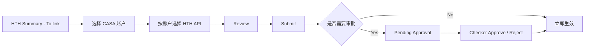
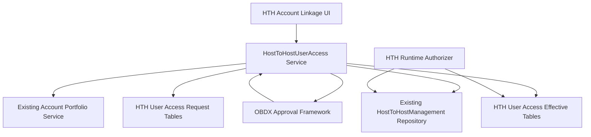
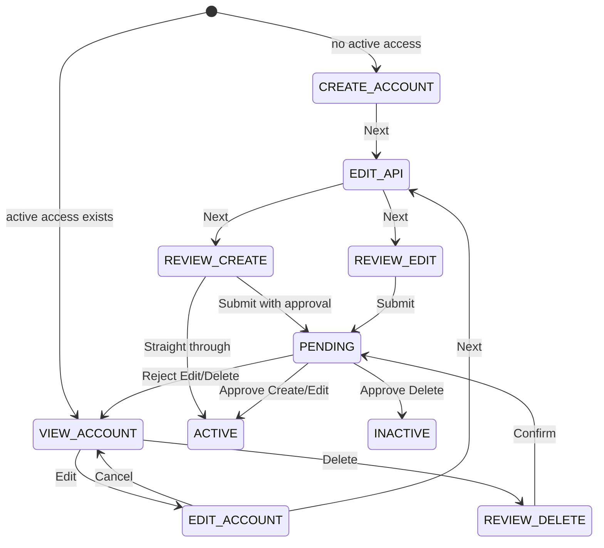
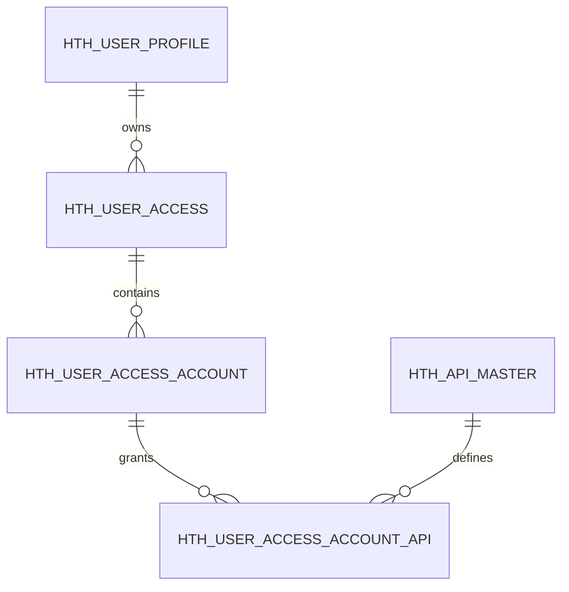
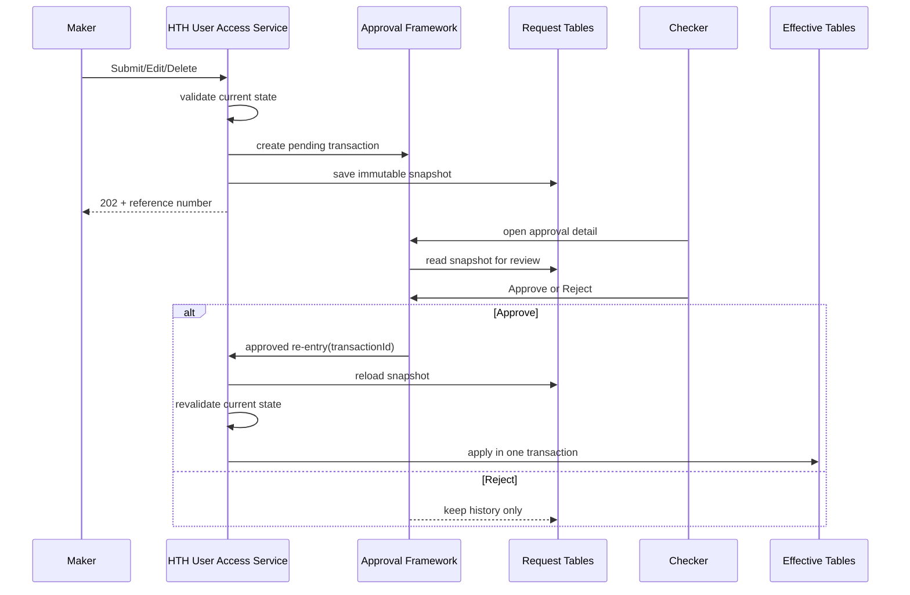

# BCOH2H-595 Technical Design

| 项目 | 内容 |
| --- | --- |
| Story | BCOH2H-595 |
| 功能 | HTH User Account Linkage and API Service Access |
| 文档状态 | Draft for Review |
| 代码基线 | `main` / `19e464f6542c` |
| 前置依赖 | 企业 HTH Management 已部署并处于 ENABLE |
| 关联 Story | BCOH2H-538 提供用户分流和 HTH Summary 入口 |
| 更新时间 | 2026-08-25 |

## 1. 目标

为 HTH 用户设置可以访问的 Current and Savings Accounts，以及每个账户允许使用的 HTH API Service。

需要支持：

- Related Account linkage。
- 仅显示 Current and Savings Tab。
- 查看、Edit、Cancel、Back、Next 和 Delete。
- 已保存账户和 API 的回填。
- Review、提交和 Maker/Checker Approval。
- 审批后生成真正生效的用户、账户和 API 授权。

Associated Account 使用同一套后端设计；完整前端页面需要等待对应 UI 确认。

### 1.1 In Scope

- HTH Related Account(s) Linkage。
- CASA Account 查询、选择和已保存状态回填。
- HTH API Catalogue 和按账户 API Mapping。
- Create/Edit/Delete 的 Review、Confirmation、Maker/Checker。
- 生效表、审批快照表、ORM、Repository 和 Service。
- Summary/Detail 查询接口。
- Runtime HTH User/Account/API Authorization Contract。
- Permission、Task、Error/NLS、Audit、部署和测试。

### 1.2 Out of Scope

- 企业级 HTH Enable/Disable、UAM Client、Certificate 和企业 API Maintenance。
- BCO Account Access Task Mapping 的修改。
- HTH Time Deposit、Loan、MPF、Investment、Trade Account。
- Associated Linkage 的最终页面细节；本设计只保证数据和 API 可支持。
- HTH API 本身的业务处理逻辑。
- 独立 CloseID 生成规则；本 Story 使用现有 HTH User Profile。

### 1.3 前置条件

- `HTH_USER_PROFILE` 中存在目标 `(partyId, closeId)`。
- `HTH_MANAGEMENT` 中该 Party 为 `ENABLE`。
- `HTH_MANAGEMENT_API` 已维护企业允许的 API。
- Account Portfolio Service 可以返回 `accessPartyId` 下的 CASA Accounts。
- Maker/Checker 的 Application Role 和 Policy 已确认。

## 2. 设计原则

1. 复用现有 BCO 的账户列表和按钮状态，不重写整套页面。
2. HTH 模式在前端和后端都只允许 `CSA`。
3. 新建 HTH API Mapping，不使用现有 BCO `taskIds`。
4. 企业级 `HTH_MANAGEMENT_API` 是用户可选 API 的上限。
5. 新建 HTH User Access 数据表，不修改现有 `DIGX_AM_*` 的含义。
6. Maker 提交完整的目标状态；审批通过后才更新生效数据。

### 2.1 现有代码复用分析

| 功能 | 现有实现 | 处理方式 |
| --- | --- | --- |
| Account Tab/Checkbox | `account-access-management/mapping-modules` | 复用外壳和 CASA Template，增加 HTH Policy。 |
| View/Edit/Delete/Cancel/Back | `mapping-modules.html` | 复用按钮布局，调整 HTH 状态判断。 |
| BCO Transaction Mapping | `account-transactions-mapping` | 不复用数据语义；HTH 新建 API Mapping Component。 |
| BCO User Access REST | `users/{userId}/accountAccess` | 保持 BCO-only，不写 HTH API。 |
| Enterprise HTH APIs | `HTH_MANAGEMENT_API` | 作为用户可选择 API 的上限。 |
| API Master/URI | `HTH_API_MASTER`, `HTH_API_URI` | 复用 API Code、名称、显示顺序和运行时 URI Mapping。 |
| Approval Pattern | `HostToHostManagement` | 复用 Task、Assembler、Request Snapshot 和 Approved Re-entry 模式。 |

现有 `account-transactions-mapping` 产生：

```json
{
  "accountNumber": "123456789",
  "taskIds": ["some-obdx-task-id"]
}
```

HTH 需要的是：

```json
{
  "accountNumber": "123456789",
  "apiCodes": ["ACCOUNT_ACTIVITY", "BALANCE_INQUIRY"]
}
```

两者含义不同，因此不能通过简单改 Label 复用。

## 3. 页面流程



### 3.1 目标架构



### 3.2 Access Context

所有页面和 Service 使用同一个 Context：

| Field | 用途 |
| --- | --- |
| `partyId` | HTH 用户所属主 Corporate Party。 |
| `closeId` | 目标 HTH User Identity。 |
| `accessPartyId` | 账户所属 Party。 |
| `linkageType` | `RELATED` 或 `ASSOCIATED`。 |
| `objectVersionNumber` | Edit/Delete 乐观锁。 |

`username`、`fullName`、`accessPartyName` 只用于显示，不能用作数据库关联 Key。

## 4. 前端设计

### 4.1 账户选择

复用：

- `account-access-management/mapping-modules`
- `casa-account-access` 账户表格模板

HTH 模式修改：

- `tabLists` 只包含 `CASA`。
- 账户查询只请求 `accountType=CSA`。
- Checkbox 在 View 模式禁用，在 Edit/Create 模式启用。
- Cancel 恢复点击 Edit 前的账户和 API 快照。
- Back 有未保存修改时显示确认提示。
- Next 只携带当前选中的账户。
- 没有选择账户时不能进入下一步。

账户来源可以继续使用现有 Account Portfolio API，但它只负责返回可选账户；是否已经授权必须以新的 HTH User Access 数据为准。

HTH Policy 示例：

```javascript
{
    channelMode: "HTH",
    allowedAccountTypes: ["CSA"],
    serviceMappingType: "HTH_API",
    linkageType: "RELATED",
    disableNonCasaRequests: true
}
```

前端过滤只能改善体验，不能作为安全控制；REST Service 仍必须拒绝非 CSA Payload。

### 4.2 HTH API Service Mapping

新增独立组件：

```text
account-access-management/hth-api-service-mapping/
├── hth-api-service-mapping.js
├── hth-api-service-mapping.html
└── model.js
```

页面行为：

- 每个已选择账户显示为可展开项目。
- 展开后显示该账户可选择的 HTH API。
- API 列表只包含企业已经启用的 API。
- Edit 时回填当前已生效 API。
- 提交时传 `apiCode`，不传显示名称，也不传 OBDX Task ID。

现有 API 中 Exchange Rate、Audit Log 等可能不属于单一账户。产品需要先确认这些 API 是账户级还是用户级；用户级 API 应单独显示，不能虚假绑定到某个账户。

组件输入：

```javascript
{
    context: accessContext,
    mode: "CREATE", // CREATE | VIEW | EDIT
    selectedAccounts: [],
    effectiveMappings: [],
    eligibleApis: [],
    beforeEditSnapshot: {}
}
```

组件输出：

```javascript
{
    accounts: [{
        accountNumber: "123456789",
        accountType: "CSA",
        currency: "HKD",
        apiCodes: ["ACCOUNT_ACTIVITY", "BALANCE_INQUIRY"]
    }]
}
```

规则：

- 每个选择的 Account 至少选择一个 API；如果产品允许“只关联账户不授权 API”，需要删除此规则。
- API Checkbox 使用 `API_CODE` 作为 Value，`API_NAME` 只显示。
- API Display Order 使用 `HTH_API_MASTER.DISPLAY_ORDER`。
- Back 返回账户页时保留 API Selection，但移除已取消账户的 API Mapping。
- Cancel 使用进入 Edit 时的 Deep Copy 恢复 Account 和 API。

### 4.3 Review 和结果页

新增 `review-hth-user-access`，显示：

- Create、Edit 或 Delete。
- User Name、Full Name、User Channel Type。
- Related/Associated 公司。
- 选中的 Current and Savings Accounts。
- 每个账户下的 API Services。

提交成功后可复用现有 Confirmation 页面显示 Reference Number 和 Pending/Success 状态。

### 4.4 UI 状态机



### 4.5 前端文件影响

| 文件/组件 | 修改/新增 |
| --- | --- |
| `mapping-modules/mapping-modules.js` | 增加 HTH Policy、CASA-only Tab 和状态快照。 |
| `mapping-modules/mapping-modules.html` | HTH Button Enablement、Pending 状态和提示。 |
| `summary/model.js` 或新 HTH Model | 账户和 HTH Access Detail 查询。 |
| `hth-api-service-mapping/*` | 新增 API Mapping 页面。 |
| `review-hth-user-access/*` | 新增 Maker/Checker Review。 |
| `user-access-management-base.js` | 注册 HTH Observables/Context，避免放入 BCO Task Arrays。 |
| `extensions/extension.json` | 注册新组件。 |
| `META-INF/UIAuthorization.json` | 注册新 Service 和组件权限。 |
| `extensions/resources/nls/access-management.js` | HTH API、Pending、错误和 Review 文字。 |

## 5. 后端 API

建议新增服务：

```text
com.ofss.digx.cz.bea.app.hosttohost.service.HostToHostUserAccess
```

### 5.1 查询账户和当前授权

```http
GET /hostToHostUserAccess/accounts
    ?partyId={partyId}
    &closeId={closeId}
    &accessPartyId={accessPartyId}
    &linkageType={RELATED|ASSOCIATED}
```

返回：

- 可选择的 CASA 账户。
- 当前已选账户和 API。
- 企业允许的 API 列表。
- 当前 `objectVersionNumber`。
- 是否存在 Pending Request。

完整响应示例：

```json
{
  "context": {
    "partyId": "P100",
    "closeId": "USER@P100",
    "accessPartyId": "P100",
    "linkageType": "RELATED"
  },
  "setupStatus": "ACTIVE",
  "accessId": "1c12e2bb-1111-2222-3333-123456789012",
  "objectVersionNumber": 3,
  "pendingAction": null,
  "pendingReferenceNumber": null,
  "eligibleApis": [
    {
      "apiMasterId": "HTH_API_ACCOUNT_ACTIVITY",
      "apiCode": "ACCOUNT_ACTIVITY",
      "apiName": "Account Activity / Trans. Inquiry",
      "displayOrder": 10,
      "scopeType": "ACCOUNT"
    }
  ],
  "accounts": [
    {
      "accountNumber": "123456789",
      "maskedAccountNumber": "*****6789",
      "accountType": "CSA",
      "currency": "HKD",
      "eligible": true,
      "selected": true,
      "selectedApiCodes": ["ACCOUNT_ACTIVITY"]
    }
  ],
  "status": {
    "result": "SUCCESS"
  }
}
```

Account Portfolio 返回的 Account 与 Effective Mapping 合并规则：

- Portfolio 有、Effective 有：显示且 Selected。
- Portfolio 有、Effective 无：显示且未选。
- Portfolio 无、Effective 有：不允许继续编辑；在 View 中显示为已失效账户并提示处理。
- 非 CSA：永远不进入正常可选列表。

### 5.2 新增、修改和删除

```http
POST /hostToHostUserAccess/submit
POST /hostToHostUserAccess/edit
POST /hostToHostUserAccess/delete
```

Create/Edit 请求示例：

```json
{
  "partyId": "P100",
  "closeId": "USER@P100",
  "linkageType": "RELATED",
  "accessPartyId": "P100",
  "objectVersionNumber": 3,
  "accounts": [
    {
      "accountNumber": "123456789",
      "accountType": "CSA",
      "currency": "HKD",
      "apiCodes": ["ACCOUNT_ACTIVITY", "BALANCE_INQUIRY"]
    }
  ]
}
```

Delete 只需要用户、公司上下文和版本号。

Delete Request：

```json
{
  "partyId": "P100",
  "closeId": "USER@P100",
  "linkageType": "RELATED",
  "accessPartyId": "P100",
  "objectVersionNumber": 3
}
```

Pending Response：

```json
{
  "referenceNumber": "HTHUA202608250001",
  "transactionId": "1234567890",
  "transactionStatus": "PENDING_APPROVAL",
  "status": {
    "result": "SUCCESS"
  }
}
```

HTTP 行为：

| 结果 | HTTP | 说明 |
| --- | --- | --- |
| 查询成功 | 200 | 返回 Detail。 |
| Straight-through 成功 | 200 | 生效表已经更新。 |
| Pending Approval | 202 | 返回 Reference/Transaction。 |
| 输入错误 | 400 | 返回 HTH User Access Error Code。 |
| 无权限 | 403 | 标准 Access Denied。 |
| 版本/状态冲突 | 409 | Stale Version、已有 Pending、非法 Operation。 |
| 系统错误 | 500 | 返回 Correlation ID，不暴露内部 SQL。 |

### 5.3 DTO 设计

```text
HostToHostUserAccessDTO
  partyId
  closeId
  accessPartyId
  linkageType
  objectVersionNumber
  accounts[]

HostToHostUserAccessAccountDTO
  accountNumber
  maskedAccountNumber
  accountType
  currency
  selected
  apiCodes[]

HostToHostUserAccessApiDTO
  apiMasterId
  apiCode
  apiName
  displayOrder
  scopeType

HostToHostUserAccessResponseDTO
  detail/summary
  referenceNumber
  transactionId
  transactionStatus
  status
```

DTO `validate()` 只做格式、必填和基本枚举验证；账户归属、Party Relationship、API Eligibility 等需要 Repository/Adapter 的业务校验放在 Service/Business Policy。

### 5.4 Service 写操作顺序

Create/Edit/Delete 共用模板：

```text
1. canonicalizeInput
2. checkAccessPolicy
3. validate DTO structure
4. validate HTH user and enterprise status
5. validate linkage party
6. validate accounts against authoritative source
7. validate APIs against party API catalogue
8. check active/pending/version state
9. initialize reference number
10. start Interaction / DB transaction
11. create Approval Transaction
12. persist immutable Request Snapshot
13. if approved/straight-through, apply Effective State
14. commit and build response
15. response policy / notification / audit
```

审批重入时必须重新执行步骤 4-8，防止 Maker 提交后账户、Party Relationship 或企业 API 已失效。

## 6. 数据库设计

所有新表放在现有 HTH Schema：

```text
HTH_BEAUAT
```

主键 `ID` 沿用当前 HTH Management 做法，由 Java Service 使用 `UUID.randomUUID().toString()` 生成，不使用 Oracle Sequence。时间使用数据库 `SYSDATE`，`OBJECT_VERSION_NUMBER` 初始值为 `1`。

### 6.1 Table 关系



数据分两组：

- Effective Tables：保存已经审批生效、运行时真正使用的授权。
- Request Tables：保存 Maker 当时提交的完整快照，供 Checker 和 Audit 使用。

### 6.2 `HTH_USER_ACCESS`：授权头

一条记录代表“一个 HTH 用户，在一个 Related/Associated Party 下的一份授权”。

| Column | Type | Null | 说明 |
| --- | --- | --- | --- |
| `ID` | `VARCHAR2(36)` | N | UUID 主键。 |
| `PARTY_ID` | `VARCHAR2(64)` | N | HTH 用户所属主 Party。 |
| `CLOSE_ID` | `VARCHAR2(255)` | N | HTH 用户 CloseID。 |
| `ACCESS_PARTY_ID` | `VARCHAR2(64)` | N | 账户所属 Party；Related 时等于 `PARTY_ID`。 |
| `LINKAGE_TYPE` | `VARCHAR2(16)` | N | `RELATED` 或 `ASSOCIATED`。 |
| `OBJECT_STATUS` | `VARCHAR2(1)` | N | `A` 生效、`I` 已删除/停用。 |
| `CREATED_BY` | `VARCHAR2(255)` | N | 创建人。 |
| `CREATION_DATE` | `DATE` | N | 创建时间。 |
| `LAST_UPDATED_BY` | `VARCHAR2(255)` | N | 最后更新人。 |
| `LAST_UPDATE_DATE` | `DATE` | N | 最后更新时间。 |
| `OBJECT_VERSION_NUMBER` | `NUMBER` | N | 乐观锁版本号。 |

建议 DDL：

```sql
CREATE TABLE HTH_BEAUAT.HTH_USER_ACCESS (
  ID                    VARCHAR2(36)  NOT NULL,
  PARTY_ID              VARCHAR2(64)  NOT NULL,
  CLOSE_ID              VARCHAR2(255) NOT NULL,
  ACCESS_PARTY_ID       VARCHAR2(64)  NOT NULL,
  LINKAGE_TYPE          VARCHAR2(16)  NOT NULL,
  OBJECT_STATUS         VARCHAR2(1)   DEFAULT 'A' NOT NULL,
  CREATED_BY            VARCHAR2(255) NOT NULL,
  CREATION_DATE         DATE          DEFAULT SYSDATE NOT NULL,
  LAST_UPDATED_BY       VARCHAR2(255) NOT NULL,
  LAST_UPDATE_DATE      DATE          DEFAULT SYSDATE NOT NULL,
  OBJECT_VERSION_NUMBER NUMBER        DEFAULT 1 NOT NULL,
  CONSTRAINT PK_HTH_USER_ACCESS PRIMARY KEY (ID),
  CONSTRAINT UK_HTH_USER_ACCESS_CTX UNIQUE
    (PARTY_ID, CLOSE_ID, ACCESS_PARTY_ID, LINKAGE_TYPE),
  CONSTRAINT FK_HTH_UA_USER_PROFILE FOREIGN KEY (PARTY_ID, CLOSE_ID)
    REFERENCES HTH_BEAUAT.HTH_USER_PROFILE (PARTY_ID, CLOSE_ID),
  CONSTRAINT CK_HTH_UA_LINKAGE CHECK
    (LINKAGE_TYPE IN ('RELATED', 'ASSOCIATED')),
  CONSTRAINT CK_HTH_UA_STATUS CHECK
    (OBJECT_STATUS IN ('A', 'I'))
);

CREATE INDEX HTH_BEAUAT.IX_HTH_UA_ACCESS_PARTY
  ON HTH_BEAUAT.HTH_USER_ACCESS (ACCESS_PARTY_ID);
```

业务规则：

- Related：`ACCESS_PARTY_ID = PARTY_ID`。
- Associated：`ACCESS_PARTY_ID != PARTY_ID`，并且必须存在有效 Party Relationship。
- 这项跨 Column/跨表规则由 Service 校验，不只依赖数据库 Check Constraint。
- Delete 审批后把 `OBJECT_STATUS` 改为 `I`；以后重新 Create 时复用该 Header、重新设为 `A` 并增加版本号。

### 6.3 `HTH_USER_ACCESS_ACCOUNT`：授权账户

一条记录代表该用户被允许访问的一个 CASA 账户。

| Column | Type | Null | 说明 |
| --- | --- | --- | --- |
| `ID` | `VARCHAR2(36)` | N | UUID 主键。 |
| `HTH_USER_ACCESS_ID` | `VARCHAR2(36)` | N | 指向授权头。 |
| `ACCOUNT_NUMBER` | `VARCHAR2(64)` | N | 未遮罩、规范化后的账户标识。 |
| `ACCOUNT_TYPE` | `VARCHAR2(8)` | N | 当前固定为 `CSA`。 |
| `CURRENCY` | `VARCHAR2(3)` | Y | 展示用币种快照，不作为账户归属判断依据。 |
| Audit Columns | 同 Header |  | 创建、更新和版本信息。 |

建议 DDL：

```sql
CREATE TABLE HTH_BEAUAT.HTH_USER_ACCESS_ACCOUNT (
  ID                    VARCHAR2(36)  NOT NULL,
  HTH_USER_ACCESS_ID    VARCHAR2(36)  NOT NULL,
  ACCOUNT_NUMBER        VARCHAR2(64)  NOT NULL,
  ACCOUNT_TYPE          VARCHAR2(8)   NOT NULL,
  CURRENCY              VARCHAR2(3),
  OBJECT_STATUS         VARCHAR2(1)   DEFAULT 'A' NOT NULL,
  CREATED_BY            VARCHAR2(255) NOT NULL,
  CREATION_DATE         DATE          DEFAULT SYSDATE NOT NULL,
  LAST_UPDATED_BY       VARCHAR2(255) NOT NULL,
  LAST_UPDATE_DATE      DATE          DEFAULT SYSDATE NOT NULL,
  OBJECT_VERSION_NUMBER NUMBER        DEFAULT 1 NOT NULL,
  CONSTRAINT PK_HTH_UA_ACCOUNT PRIMARY KEY (ID),
  CONSTRAINT UK_HTH_UA_ACCOUNT UNIQUE
    (HTH_USER_ACCESS_ID, ACCOUNT_NUMBER),
  CONSTRAINT FK_HTH_UAA_TO_ACCESS FOREIGN KEY (HTH_USER_ACCESS_ID)
    REFERENCES HTH_BEAUAT.HTH_USER_ACCESS (ID),
  CONSTRAINT CK_HTH_UAA_TYPE CHECK (ACCOUNT_TYPE = 'CSA'),
  CONSTRAINT CK_HTH_UAA_STATUS CHECK (OBJECT_STATUS IN ('A', 'I'))
);

CREATE INDEX HTH_BEAUAT.IX_HTH_UAA_ACCOUNT_NO
  ON HTH_BEAUAT.HTH_USER_ACCESS_ACCOUNT (ACCOUNT_NUMBER);
```

不对 Account Core 建 Foreign Key，因为账户数据来自外部/现有 Account Service。Create、Edit 和审批生效时都必须重新调用权威账户服务验证账户归属和状态。

### 6.4 `HTH_USER_ACCESS_ACCOUNT_API`：账户 API

一条记录代表一个账户被允许调用一个 HTH API。

| Column | Type | Null | 说明 |
| --- | --- | --- | --- |
| `ID` | `VARCHAR2(36)` | N | UUID 主键。 |
| `HTH_USER_ACCESS_ACCOUNT_ID` | `VARCHAR2(36)` | N | 指向授权账户。 |
| `API_MASTER_ID` | `VARCHAR2(36)` | N | 指向现有 `HTH_API_MASTER`。 |
| Audit Columns | 同 Header |  | 创建、更新和版本信息。 |

建议 DDL：

```sql
CREATE TABLE HTH_BEAUAT.HTH_USER_ACCESS_ACCOUNT_API (
  ID                         VARCHAR2(36)  NOT NULL,
  HTH_USER_ACCESS_ACCOUNT_ID VARCHAR2(36)  NOT NULL,
  API_MASTER_ID              VARCHAR2(36)  NOT NULL,
  OBJECT_STATUS              VARCHAR2(1)   DEFAULT 'A' NOT NULL,
  CREATED_BY                 VARCHAR2(255) NOT NULL,
  CREATION_DATE              DATE          DEFAULT SYSDATE NOT NULL,
  LAST_UPDATED_BY            VARCHAR2(255) NOT NULL,
  LAST_UPDATE_DATE           DATE          DEFAULT SYSDATE NOT NULL,
  OBJECT_VERSION_NUMBER      NUMBER        DEFAULT 1 NOT NULL,
  CONSTRAINT PK_HTH_UAA_API PRIMARY KEY (ID),
  CONSTRAINT UK_HTH_UAA_API UNIQUE
    (HTH_USER_ACCESS_ACCOUNT_ID, API_MASTER_ID),
  CONSTRAINT FK_HTH_UAAA_TO_ACCOUNT
    FOREIGN KEY (HTH_USER_ACCESS_ACCOUNT_ID)
    REFERENCES HTH_BEAUAT.HTH_USER_ACCESS_ACCOUNT (ID),
  CONSTRAINT FK_HTH_UAAA_TO_API FOREIGN KEY (API_MASTER_ID)
    REFERENCES HTH_BEAUAT.HTH_API_MASTER (ID),
  CONSTRAINT CK_HTH_UAAA_STATUS CHECK (OBJECT_STATUS IN ('A', 'I'))
);

CREATE INDEX HTH_BEAUAT.IX_HTH_UAAA_API
  ON HTH_BEAUAT.HTH_USER_ACCESS_ACCOUNT_API (API_MASTER_ID);
```

用户可选 API 必须同时满足：

```text
HTH_API_MASTER.OBJECT_STATUS = A
并且
API_MASTER_ID 存在于该 Party 的 HTH_MANAGEMENT_API
```

如果产品确认存在不属于任何账户的“用户级 API”，不能用空 Account Number 塞进本表。应另外增加：

```text
HTH_USER_ACCESS_API
  ID, HTH_USER_ACCESS_ID, API_MASTER_ID, Audit Columns

HTH_USER_ACCESS_REQ_USER_API
  ID, HTH_USER_ACCESS_REQUEST_ID, API_MASTER_ID,
  API_CODE, API_NAME, Audit Columns
```

这两张可选表分别保存生效的用户级 API 和审批快照。是否需要它们取决于 API Scope 的产品确认。

### 6.5 `HTH_USER_ACCESS_REQUEST`：审批请求头

保存 Maker 提交时的用户、公司和操作快照。

| Column | Type | Null | 说明 |
| --- | --- | --- | --- |
| `ID` | `VARCHAR2(36)` | N | UUID 主键。 |
| `TRANSACTION_ID` | `VARCHAR2(64)` | N | 对应 `DIGX_AP_TRANSACTION.TXN_ID`。 |
| `REFERENCE_NO` | `VARCHAR2(64)` | N | 页面显示的 Reference Number。 |
| `ACTION_TYPE` | `VARCHAR2(16)` | N | `CREATE`、`EDIT`、`DELETE`。 |
| `PARTY_ID` | `VARCHAR2(64)` | N | 主 Party。 |
| `CLOSE_ID` | `VARCHAR2(255)` | N | 目标用户。 |
| `ACCESS_PARTY_ID` | `VARCHAR2(64)` | N | 账户所属 Party。 |
| `LINKAGE_TYPE` | `VARCHAR2(16)` | N | Related/Associated。 |
| `SUBMITTED_VERSION` | `NUMBER` | Y | Edit/Delete 提交时版本；Create 可为空。 |
| `USER_NAME` | `VARCHAR2(255)` | Y | 审批展示快照。 |
| `FULL_NAME` | `VARCHAR2(255)` | Y | 审批展示快照。 |
| `ACCESS_PARTY_NAME` | `VARCHAR2(255)` | Y | 审批展示快照。 |
| Audit Columns | 同 Header |  | 请求创建和更新信息。 |

建议 DDL：

```sql
CREATE TABLE HTH_BEAUAT.HTH_USER_ACCESS_REQUEST (
  ID                    VARCHAR2(36)  NOT NULL,
  TRANSACTION_ID        VARCHAR2(64)  NOT NULL,
  REFERENCE_NO          VARCHAR2(64)  NOT NULL,
  ACTION_TYPE           VARCHAR2(16)  NOT NULL,
  PARTY_ID              VARCHAR2(64)  NOT NULL,
  CLOSE_ID              VARCHAR2(255) NOT NULL,
  ACCESS_PARTY_ID       VARCHAR2(64)  NOT NULL,
  LINKAGE_TYPE          VARCHAR2(16)  NOT NULL,
  SUBMITTED_VERSION     NUMBER,
  USER_NAME             VARCHAR2(255),
  FULL_NAME             VARCHAR2(255),
  ACCESS_PARTY_NAME     VARCHAR2(255),
  OBJECT_STATUS         VARCHAR2(1)   DEFAULT 'A' NOT NULL,
  CREATED_BY            VARCHAR2(255) NOT NULL,
  CREATION_DATE         DATE          DEFAULT SYSDATE NOT NULL,
  LAST_UPDATED_BY       VARCHAR2(255) NOT NULL,
  LAST_UPDATE_DATE      DATE          DEFAULT SYSDATE NOT NULL,
  OBJECT_VERSION_NUMBER NUMBER        DEFAULT 1 NOT NULL,
  CONSTRAINT PK_HTH_UA_REQUEST PRIMARY KEY (ID),
  CONSTRAINT UK_HTH_UAR_TXN UNIQUE (TRANSACTION_ID),
  CONSTRAINT UK_HTH_UAR_REF UNIQUE (REFERENCE_NO),
  CONSTRAINT CK_HTH_UAR_ACTION CHECK
    (ACTION_TYPE IN ('CREATE', 'EDIT', 'DELETE')),
  CONSTRAINT CK_HTH_UAR_LINKAGE CHECK
    (LINKAGE_TYPE IN ('RELATED', 'ASSOCIATED'))
);

CREATE INDEX HTH_BEAUAT.IX_HTH_UAR_CONTEXT
  ON HTH_BEAUAT.HTH_USER_ACCESS_REQUEST
    (PARTY_ID, CLOSE_ID, ACCESS_PARTY_ID, LINKAGE_TYPE);
```

审批状态以 OBDX Approval Transaction 为准，不在 Request Table 再维护另一份 `PENDING/APPROVED/REJECTED`，避免两个状态不一致。

### 6.6 `HTH_USER_ACCESS_REQ_ACCOUNT`：请求账户快照

```sql
CREATE TABLE HTH_BEAUAT.HTH_USER_ACCESS_REQ_ACCOUNT (
  ID                         VARCHAR2(36)  NOT NULL,
  HTH_USER_ACCESS_REQUEST_ID VARCHAR2(36)  NOT NULL,
  ACCOUNT_NUMBER             VARCHAR2(64)  NOT NULL,
  ACCOUNT_TYPE               VARCHAR2(8)   NOT NULL,
  CURRENCY                   VARCHAR2(3),
  DISPLAY_ORDER              NUMBER,
  OBJECT_STATUS              VARCHAR2(1)   DEFAULT 'A' NOT NULL,
  CREATED_BY                 VARCHAR2(255) NOT NULL,
  CREATION_DATE              DATE          DEFAULT SYSDATE NOT NULL,
  LAST_UPDATED_BY            VARCHAR2(255) NOT NULL,
  LAST_UPDATE_DATE           DATE          DEFAULT SYSDATE NOT NULL,
  OBJECT_VERSION_NUMBER      NUMBER        DEFAULT 1 NOT NULL,
  CONSTRAINT PK_HTH_UAR_ACCOUNT PRIMARY KEY (ID),
  CONSTRAINT UK_HTH_UAR_ACCOUNT UNIQUE
    (HTH_USER_ACCESS_REQUEST_ID, ACCOUNT_NUMBER),
  CONSTRAINT FK_HTH_UARA_TO_REQUEST
    FOREIGN KEY (HTH_USER_ACCESS_REQUEST_ID)
    REFERENCES HTH_BEAUAT.HTH_USER_ACCESS_REQUEST (ID),
  CONSTRAINT CK_HTH_UARA_TYPE CHECK (ACCOUNT_TYPE = 'CSA'),
  CONSTRAINT CK_HTH_UARA_STATUS CHECK (OBJECT_STATUS IN ('A', 'I'))
);
```

Delete Request 没有 Account Snapshot；因为 Delete 的目标是整个 `(partyId, closeId, accessPartyId, linkageType)` 授权上下文。

### 6.7 `HTH_USER_ACCESS_REQ_API`：请求 API 快照

```sql
CREATE TABLE HTH_BEAUAT.HTH_USER_ACCESS_REQ_API (
  ID                         VARCHAR2(36)  NOT NULL,
  HTH_USER_ACCESS_REQ_ACC_ID VARCHAR2(36)  NOT NULL,
  API_MASTER_ID              VARCHAR2(36)  NOT NULL,
  API_CODE                   VARCHAR2(64)  NOT NULL,
  API_NAME                   VARCHAR2(255) NOT NULL,
  DISPLAY_ORDER              NUMBER,
  OBJECT_STATUS              VARCHAR2(1)   DEFAULT 'A' NOT NULL,
  CREATED_BY                 VARCHAR2(255) NOT NULL,
  CREATION_DATE              DATE          DEFAULT SYSDATE NOT NULL,
  LAST_UPDATED_BY            VARCHAR2(255) NOT NULL,
  LAST_UPDATE_DATE           DATE          DEFAULT SYSDATE NOT NULL,
  OBJECT_VERSION_NUMBER      NUMBER        DEFAULT 1 NOT NULL,
  CONSTRAINT PK_HTH_UAR_API PRIMARY KEY (ID),
  CONSTRAINT UK_HTH_UAR_API UNIQUE
    (HTH_USER_ACCESS_REQ_ACC_ID, API_MASTER_ID),
  CONSTRAINT FK_HTH_UARA_TO_ACCOUNT
    FOREIGN KEY (HTH_USER_ACCESS_REQ_ACC_ID)
    REFERENCES HTH_BEAUAT.HTH_USER_ACCESS_REQ_ACCOUNT (ID),
  CONSTRAINT FK_HTH_UARA_TO_API FOREIGN KEY (API_MASTER_ID)
    REFERENCES HTH_BEAUAT.HTH_API_MASTER (ID),
  CONSTRAINT CK_HTH_UARAPI_STATUS CHECK (OBJECT_STATUS IN ('A', 'I'))
);
```

`API_CODE` 和 `API_NAME` 在提交时复制，保证以后 Master 改名，历史审批画面仍显示 Maker 当时看到的内容。

### 6.8 Create/Edit/Delete 怎么落表

| 操作 | Maker 提交时 | Checker Approve 时 | Reject 时 |
| --- | --- | --- | --- |
| Create | 写 Request Header、Account、API Snapshot；创建 Pending Transaction。 | 新建或重新激活 `HTH_USER_ACCESS`，写入 Account/API，版本设为 1 或加 1。 | 只保留 Request History，不写生效表。 |
| Edit | 保存完整目标状态和当前版本。 | 先用版本号锁定 Header，再替换该 Header 下全部 Account/API，版本加 1。 | 原生效数据不变。 |
| Delete | 写 Delete Request Header，不写 Account/API Snapshot。 | 删除 Child Account/API，并把 Header 设为 `I`，版本加 1。 | 原生效数据不变。 |

Edit 使用完整替换而不是逐项算差异，处理顺序为：

```text
1. UPDATE Header ... WHERE ID = ? AND OBJECT_VERSION_NUMBER = ?
2. 更新行数不是 1 → 返回 Stale Version
3. 删除现有 Account API Rows
4. 删除现有 Account Rows
5. 插入 Request Snapshot 中的 Account Rows
6. 插入 Request Snapshot 中的 API Rows
7. Commit
```

上述步骤必须在同一数据库 Transaction 中执行，任何一步失败都 Rollback。

### 6.9 Summary、Detail 和运行时怎么查

| 场景 | 主要查询 |
| --- | --- |
| 538 Summary | `HTH_USER_ACCESS` Join `HTH_USER_ACCESS_ACCOUNT`，只统计 Header/Account `OBJECT_STATUS = 'A'`。 |
| 595 Edit 回填 | 按上下文查 Header，再一次读取全部 Account/API，避免 N+1 Query。 |
| API Catalogue | `HTH_MANAGEMENT` → `HTH_MANAGEMENT_API` → `HTH_API_MASTER`，只返回企业已启用且 Active 的 API。 |
| Pending 检查 | Request 的 `TRANSACTION_ID` Join OBDX Approval Transaction，判断是否未结束。 |
| Runtime 鉴权 | 按 Party、CloseID、Account Number、API Master/Code 查询 Active Effective Rows。 |

运行时逻辑查询相当于：

```sql
SELECT 1
  FROM HTH_BEAUAT.HTH_USER_ACCESS UA
  JOIN HTH_BEAUAT.HTH_USER_ACCESS_ACCOUNT UAA
    ON UAA.HTH_USER_ACCESS_ID = UA.ID
  JOIN HTH_BEAUAT.HTH_USER_ACCESS_ACCOUNT_API UAPI
    ON UAPI.HTH_USER_ACCESS_ACCOUNT_ID = UAA.ID
  JOIN HTH_BEAUAT.HTH_API_MASTER AM
    ON AM.ID = UAPI.API_MASTER_ID
 WHERE UA.PARTY_ID = :partyId
   AND UA.CLOSE_ID = :closeId
   AND UAA.ACCOUNT_NUMBER = :accountNumber
   AND AM.API_CODE = :apiCode
   AND UA.OBJECT_STATUS = 'A'
   AND UAA.OBJECT_STATUS = 'A'
   AND UAPI.OBJECT_STATUS = 'A'
   AND AM.OBJECT_STATUS = 'A';
```

实际 Repository 应使用参数绑定，不能拼接 SQL。Account Number 和 CloseID 不能以明文写入日志。

### 6.10 ORM 和 Repository 实现

每张生效表和请求表建立对应 Domain Object、Key、ORM 和 Repository：

```text
HthUserAccess / HthUserAccessKey
HthUserAccessAccount / HthUserAccessAccountKey
HthUserAccessAccountApi / HthUserAccessAccountApiKey
HthUserAccessRequest / HthUserAccessRequestKey
HthUserAccessRequestAccount / HthUserAccessRequestAccountKey
HthUserAccessRequestApi / HthUserAccessRequestApiKey
```

Repository Adapter 建议保持和现有 HTH Management 一致：

```text
LocalHthUserAccessRepositoryAdapter
LocalHthUserAccessAccountRepositoryAdapter
LocalHthUserAccessAccountApiRepositoryAdapter
LocalHthUserAccessRequestRepositoryAdapter
```

需要同步完成：

- 在 `consulting/config/orm/eclipselink/mappings/cz/hosttohost/` 增加 ORM XML。
- 在 `cz-hosttohost.cfg.xml` 注册全部 Mapping。
- 在 `DIGX_FW_CONFIG_ALL_B` 和 `DIGX_FW_CONFIG_ALL_O` 注册 Repository Adapter。
- Repository 提供按完整 Context 查询、批量读取 Account/API、按 Transaction ID 读取 Request Snapshot 的方法。
- Service 控制数据库 Transaction；Repository 不应在每一条 Child Insert 后单独 Commit。

### 6.11 SQL 交付文件

建议按现有 HTH Management 的方式拆分 SQL：

```text
1_HTH_User_Access_Schema.sql
2_HTH_User_Access_Permission.sql
2_HTH_User_Access_Permission_1_Maker.sql
2_HTH_User_Access_Permission_2_Checker.sql
3_HTH_User_Access_Process.sql
4_HTH_User_Access_Repository_Adapters.sql
5_HTH_User_Access_Error_NLS.sql
```

Schema SQL 需要包含 Table、Constraint、Index、Comment 和验证查询；权限及配置 SQL 应能重复执行，避免重复部署产生多条 Resource/Entitlement Mapping。

## 7. 后端校验

服务必须校验：

- `(partyId, closeId)` 是有效 HTH 用户。
- 企业 HTH 状态是 `ENABLE`。
- Related 的 `accessPartyId` 等于 `partyId`。
- Associated Party 与主 Party 存在有效关系。
- 每个账户属于 `accessPartyId`。
- 每个账户类型都是 `CSA`。
- 每个 API 都是 Active，并且已包含在企业 `HTH_MANAGEMENT_API` 中。
- Create 时不能已有生效记录。
- Edit/Delete 时必须已有生效记录，且版本号一致。
- 同一用户和公司上下文不能同时存在两个 Pending Request。
- 当前 BM 用户拥有对应的 Perform/Approve 权限。

### 7.1 校验矩阵

| 校验 | Create | Edit | Delete | Approve 时重查 |
| --- | --- | --- | --- | --- |
| HTH User Profile 存在 | Y | Y | Y | Y |
| HTH Management = ENABLE | Y | Y | Y | Y |
| Related/Associated Context 有效 | Y | Y | Y | Y |
| Account 属于 Access Party | Y | Y | - | Y |
| Account Type = CSA | Y | Y | - | Y |
| API 属于 Party Enabled API | Y | Y | - | Y |
| 不存在 Active Header | Y | - | - | Y |
| 存在 Active Header | - | Y | Y | Y |
| Object Version 一致 | - | Y | Y | Y |
| 不存在其他 Pending Request | Y | Y | Y | Y |
| 至少一个 Account | Y | Y | - | Y |
| 每个 Account 至少一个 API | 按产品确认 | 按产品确认 | - | Y |

### 7.2 Error Catalogue

| Error Code | 场景 | HTTP |
| --- | --- | --- |
| `HTH_UA_001` | HTH User Profile/CloseID 不存在 | 400 |
| `HTH_UA_002` | 企业 HTH 未启用 | 409 |
| `HTH_UA_003` | Related/Associated Context 无效 | 403 |
| `HTH_UA_004` | Account Type 不是 CSA | 400 |
| `HTH_UA_005` | Account 不属于 Access Party 或不可维护 | 400 |
| `HTH_UA_006` | API 无效、已停用或企业未启用 | 400 |
| `HTH_UA_007` | Object Version 已过期 | 409 |
| `HTH_UA_008` | 相同 Context 已有 Pending Request | 409 |
| `HTH_UA_009` | 没有选择 Account/API | 400 |
| `HTH_UA_010` | 当前状态不允许该操作 | 409 |
| `HTH_UA_011` | Effective Mapping 数据不一致 | 500 |
| `HTH_UA_012` | Account 已关闭或在审批期间失效 | 409 |

错误文字需要加入英文、繁体中文和简体中文 NLS。Response 不返回完整 Account Number、SQL 或 Stack Trace。

## 8. Maker/Checker

沿用现有 HTH Management 的实现方式：

- 新 Service Entitlement：Search、Submit、Edit、Delete。
- 每个写操作分别配置 Perform 和 Approve。
- 新增 Approval Assembler。
- 使用 OBDX Approval Framework 创建 Pending Transaction。
- Checker Approve 后重新进入服务并写入生效表。

建议任务码，最终需要和 Task Catalogue 确认：

```text
UAT_N_HUA_NEW
UAT_N_HUA_EDT
UAT_N_HUA_DEL
```

### 8.1 Service Entitlement

```text
HostToHostUserAccess.search_View
HostToHostUserAccess.submit_Perform
HostToHostUserAccess.submit_Approve
HostToHostUserAccess.edit_Perform
HostToHostUserAccess.edit_Approve
HostToHostUserAccess.delete_Perform
HostToHostUserAccess.delete_Approve
```

需要建立：

- `DIGX_AZ_RESOURCE`
- `DIGX_AZ_ENTITLEMENT`
- `DIGX_AZ_RESOURCE_ACTION`
- `DIGX_AZ_ENTGROUP_ENT_MAPPING`
- `DIGX_AZ_POLICY_ENT_MAP`
- `DIGX_CM_TASK`
- `DIGX_CM_TASK_ASPECTS`
- `DIGX_CM_RESOURCE_TASK_REL`
- Approval Assembler 配置

Maker 获得 Search + Perform；Checker 获得 Search + Perform + Approve，和现有 HTH Management 的 Checker 配置方式一致。

### 8.2 Approval Assembler

新增：

```text
SubmitHostToHostUserAccessApprovalAssembler
```

Assembler 的责任：

- 从 Request DTO 生成 Approval Transaction Detail。
- 保存 `partyId`、`closeId`、`accessPartyId`、Action 和 Reference。
- 提供 Checker Review 所需的 Transaction Entity Identifier。
- Approved Re-entry 时只用 Transaction ID 找 Request Snapshot。
- 不把完整 Account/API Payload 塞入普通 Transaction Description。

### 8.3 Approval 时序



### 8.4 Pending Conflict

同一 Context：

```text
(PARTY_ID, CLOSE_ID, ACCESS_PARTY_ID, LINKAGE_TYPE)
```

在存在未结束 Approval Transaction 时拒绝第二个 Create/Edit/Delete。该检查不能只看 Request Table，因为 Request History 会永久保留；必须结合 Approval Transaction Status。

## 9. 运行时权限检查

保存配置后，HTH API 请求还必须真正检查这份授权：

```text
UAM Client ID
→ 找到 Party
→ 根据请求 URI 找到 API Code
→ 获取认证用户的 CloseID
→ 获取请求 Account Number
→ 检查 Party + CloseID + Account + API 是否已授权
→ Allow 或 Deny
```

API Code 必须通过 `HTH_API_URI` 解析，不能相信客户端自己传入的 API Code。

如果运行时鉴权由其他 Story 实现，需要把它列为上线依赖；否则本 Story 只完成了配置页面，没有真正限制 API 使用。

### 9.1 Runtime Authorizer 输入

Authorizer 必须从可信来源得到：

| 值 | 可信来源 |
| --- | --- |
| `partyId` | Active UAM Client ID → `HTH_MANAGEMENT`。 |
| `closeId` | 已认证的 HTH Identity/Token。 |
| `apiCode` | Request Method + URI → `HTH_API_URI`/`HTH_API_MASTER`。 |
| `accountNumber` | 对应 API 的已验证 Request Field/Path。 |

不能从普通 Query Parameter 直接信任这些值。

### 9.2 Allow 条件

只有以下条件全部成立才 Allow：

```text
Enterprise HTH = ENABLE
AND API is active and enabled for party
AND HTH user profile exists
AND Active HTH_USER_ACCESS exists
AND Active account mapping exists
AND Active account/API mapping exists
```

任何 Metadata、Identity 或 Mapping 缺失都 Fail Closed。

### 9.3 Cache

如果 Runtime Query 使用 Cache：

```text
Cache Key = partyId + closeId + accountNumber + apiCode
```

- Positive 和 Negative Cache 都设置短 TTL。
- Create/Edit/Delete Approve 后按 `partyId + closeId` 清除。
- HTH Management Disable/Edit 后按 Party 清除。
- API Master/URI 改动后按 API 清除或刷新全部 HTH Authorization Cache。

### 9.4 Global API

如果 API 不包含 Account Number，则不能执行 Account Mapping Query。产品确认其 Scope 为 `USER` 后，Runtime 改查可选的 `HTH_USER_ACCESS_API`；在 Scope 未确认前不得默认放行。

## 10. Java/Backend Component Design

### 10.1 REST Layer

```text
consulting/middleware/projects/endpoint/
  .../appx/hosttohost/service/HostToHostUserAccess.java
  .../appx/hosttohost/service/IHostToHostUserAccess.java
```

职责：

- JAX-RS Path、Query/Body 解析和 Swagger Annotation。
- 获取 `ChannelContext`。
- 调用 Application Service。
- 根据 Response DTO 构造 200/202/4xx Response。
- 不直接访问 Repository。

### 10.2 Application Service

```text
.../app/hosttohost/service/HostToHostUserAccess.java
.../app/hosttohost/service/IHostToHostUserAccess.java
```

建议公开方法：

```java
search(sessionContext, requestDTO)
accounts(sessionContext, requestDTO)
submit(sessionContext, requestDTO)
edit(sessionContext, requestDTO)
delete(sessionContext, requestDTO)
```

职责：Access Policy、Business Validation、Interaction/Transaction、Approval、Snapshot、Effective Apply、Notification 和 Response Policy。

### 10.3 Domain/Repository

```text
domain/hosttohost/entity/HthUserAccess*.java
domain/hosttohost/entity/repository/HthUserAccess*Repository.java
domain/hosttohost/entity/repository/adapter/LocalHthUserAccess*RepositoryAdapter.java
```

关键 Repository 方法：

```java
findActiveContext(partyId, closeId, accessPartyId, linkageType)
listContextsByUser(partyId, closeId)
readDetailWithAccountsAndApis(accessId)
findPendingRequest(context)
readRequestByTransactionId(transactionId)
createRequestSnapshot(request)
replaceEffectiveAccess(snapshot, expectedVersion)
deactivateEffectiveAccess(context, expectedVersion)
isRuntimeAuthorized(partyId, closeId, accountNumber, apiCode)
```

`readDetailWithAccountsAndApis` 应批量查询，不能对每个 Account 再查询一次 API。

### 10.4 Adapter Integration

需要复用或增加 Adapter：

- HTH User Profile Adapter：验证 CloseID。
- HostToHost Management Repository：读取 Enterprise Status/API Set。
- Account Portfolio Adapter：读取和验证 Access Party 的 CASA Account。
- Party Relationship Adapter：验证 Associated Party。
- Approval Framework Adapter/Assembler：建立和读取 Transaction。
- Notification/Activity Adapter：审批生效后发送事件。

## 11. UI Authorization 和组件注册

新组件至少包括：

```text
hth-api-service-mapping
review-hth-user-access
```

`UIAuthorization.json` 建议：

```json
{
  "moduleName": "com.ofss.digx.cz.bea.app.hosttohost.service.HostToHostUserAccess",
  "components": [
    {
      "componentName": "user-access-management-base",
      "service": "read",
      "perform": "validation#user-list-details#summary#mapping-modules#hth-api-service-mapping"
    },
    {
      "componentName": "user-access-management-base",
      "service": "submit",
      "perform": "review-hth-user-access",
      "approve": "review-hth-user-access"
    }
  ]
}
```

Edit/Delete 也需要对应 Entry。最终 JSON 可以拆成多个 Component Entry，但不能修改现有 BCO Module 的 Service Mapping。

## 12. 非功能设计

### 12.1 Security

- REST 端重新验证所有 Party、Account 和 API，不信任 UI Filter。
- CloseID、Account Number 在 Log、Notification 和错误信息中 Mask。
- Checker 从服务端 Snapshot Review，不能使用浏览器提交的 Account/API 替换 Snapshot。
- Runtime Authorization Fail Closed。
- Repository 使用参数绑定，禁止动态拼接 Account/API SQL。

### 12.2 Performance

- Summary：按用户一次读取所有 Context 和 Count。
- Detail：一次读取 Eligible Accounts，一次读取全部 Effective Mapping，一次读取 API Catalogue。
- API Mapping：前端不为每个 Account 单独请求 Catalogue。
- 对大量 Account 使用既有 Pagination；提交时后端仍验证全部选中账户。
- Runtime Query 必须使用 Context、Account、API Index，并记录 P95/P99 Latency。

### 12.3 Logging/Monitoring

记录：

```text
correlationId, action, transactionId, referenceNumber,
actingUser, partyId, maskedCloseId, accessPartyId,
accountCount, apiMappingCount, result/errorCode, elapsedMs
```

监控：

- Submit/Edit/Delete 成功和失败数量。
- Pending 超时数量。
- Approval Apply 失败。
- Runtime Authorization Deny Rate。
- Orphan Profile、失效 Account Mapping、企业已取消但用户仍保留的 API Mapping。

### 12.4 Concurrency

Edit/Delete 使用：

```sql
UPDATE HTH_USER_ACCESS
   SET OBJECT_VERSION_NUMBER = OBJECT_VERSION_NUMBER + 1,
       LAST_UPDATED_BY = :user,
       LAST_UPDATE_DATE = SYSDATE
 WHERE ID = :id
   AND OBJECT_VERSION_NUMBER = :expectedVersion;
```

更新行数为 0 时返回 `HTH_UA_007`，不能继续替换 Child Rows。

## 13. Deployment、Migration 和 Rollback

### 13.1 Deployment Order

1. Schema、Constraint、Index 和 Grant。
2. ORM Mapping 和 Repository Adapter Config。
3. Backend DTO/Domain/Repository/Service/Endpoint。
4. Error/NLS、Resource、Entitlement、Task 和 Approval Assembler。
5. Frontend Component、Manifest、UIAuthorization。
6. Runtime Authorizer 和 Cache Invalidation。
7. Authorization/ORM Cache Refresh 或 Managed Server Restart。
8. Smoke、Approval、Runtime 和 BCO Regression Test。

### 13.2 Migration

- 不从 BCO `DIGX_AM_*` 自动迁移，因为 Task ID 不等于 HTH API Code。
- 上线前检查目标 HTH 用户都有 `HTH_USER_PROFILE`。
- Existing HTH Users 若缺 CloseID，需要业务提供 Mapping，不能按 Username 猜测。
- `HTH_API_MASTER` 已被 Request/Effective Table 引用后只允许 Inactivate，不物理删除。

### 13.3 Rollback

- 关闭 Feature Flag `HTH_USER_ACCESS_ENABLED`。
- 撤销新 UI/Service Entitlement，恢复 HTH 入口不可见。
- 不删除 Effective/Request Tables 和 Approval History。
- 如果 Runtime Authorizer 回滚，默认策略必须由 Security Owner 确认；不能意外变为 Allow All。
- 数据修复使用单独、可审计 SQL，不直接清空表。

## 14. 测试设计

- HTH 页面只出现 Current and Savings Tab。
- 直接调用后端提交 TD、Loan 等账户会被拒绝。
- 已保存账户和 API 正确回填。
- Edit、Cancel、Back 和 Next 状态正确。
- 只能选择企业已启用的 API。
- Related 和 Associated 账户不会混用。
- Create/Edit/Delete 正确进入 Pending Approval。
- Approve 后生效，Reject 后不改变原数据。
- 旧版本 Edit/Delete 被拒绝。
- Pending Request 期间不能重复提交。
- HTH API 在审批前被拒绝，审批后允许，删除审批后再次拒绝。
- BCO 的账户类型、Task Mapping 和审批流程保持不变。

### 14.1 Unit Test

- HTH Policy 只生成 CASA Tab。
- Account/API Selection 的 Back/Cancel Snapshot。
- DTO Required/Enum/Duplicate Validation。
- Create/Edit/Delete State Validation。
- Object Version Lock。
- Request Snapshot ↔ DTO Assembler。
- Runtime Allow/Deny Matrix。

### 14.2 Repository Test

- Context Unique Constraint。
- Account/API Duplicate Constraint。
- 非 CSA Check Constraint。
- Header/Child 批量读取。
- Edit Complete Replacement 的 Commit/Rollback。
- Delete Inactivate 和 Recreate Reactivate。
- Request 通过 Transaction ID 恢复完整 Snapshot。

### 14.3 Integration Test

- Account Portfolio + Effective + API Catalogue Merge。
- Party/Account/API 在 Maker 后失效，Approve 时被拒绝。
- Create/Edit/Delete Pending Transaction 和 Review。
- Checker Approve/Reject。
- Duplicate Pending 和 Stale Version。
- Notification/Audit/Reference Number。
- Runtime Cache Invalidation。

### 14.4 E2E/Regression

- Story 截图中的 View/Edit/Button/Checkbox 行为。
- Related 和 Associated Context 隔离。
- HTH 只显示 CSA。
- BCO 原有 CASA/TD/MPF/Trade/Loan 和 Task Mapping 不变。
- 不同 Maker/Checker Role 的 UI 和 REST 权限。

## 15. 待确认事项

1. 哪些 API 是账户级，哪些是用户级。
2. Associated Account Linkage 的完整页面和交互。
3. Delete 是物理删除还是 `OBJECT_STATUS = I`。
4. Create/Edit/Delete 是否全部需要 Maker/Checker。
5. `Link All Accounts` 是否属于本 Story。

6. 每个选中 Account 是否必须至少选择一个 API。
7. Pending Approval 时是否允许只读查看当前生效配置。
8. Runtime Authorization 由本 Story 还是独立 Story 交付。
9. HTH API Scope Metadata 存在哪里；建议在 API Master 增加 `SCOPE_TYPE` 或建立独立 Mapping Table。

## 16. 实现任务拆分

1. 增加 HTH CASA-only 账户选择模式。
2. 新增 HTH API Service Mapping 和 Review。
3. 新增生效表、审批快照表和 Repository。
4. 新增 HostToHostUserAccess API 和校验。
5. 接入 Maker/Checker、权限和 Task 配置。
6. 接入运行时权限检查。
7. 完成 HTH 测试和 BCO 回归测试。

### 16.1 建议 Commit

```text
feat: add HTH CASA account linkage mode
feat: add HTH account API service mapping UI
feat: add HTH user access effective and request schema
feat: add HostToHostUserAccess query and maintenance API
feat: add HTH user access maker checker workflow
feat: enforce HTH user account API authorization
test: cover HTH user access and BCO regression
```

## 17. Story 验收对照

| Story 要求 | Technical 实现 | 验证方式 |
| --- | --- | --- |
| 只显示 Current and Savings | HTH Policy + CSA API Filter + DB Check | UI/API/DB Test |
| 已保存账户回填 | Effective Detail Merge | Integration/E2E |
| Edit | View → Edit 状态 + Complete Desired State | UI/API Test |
| Cancel | Deep Copy Snapshot Restore | Unit/E2E |
| Back | 保留选择并处理 Dirty State | UI Test |
| Next | Account → API Mapping | E2E |
| Delete | Delete Review + Approval + Header Inactivate | Integration |
| API Service 设置 | New HTH API Mapping Component | UI/API Test |
| Maker/Checker | Task/Entitlement/Assembler/Request Snapshot | Approval Test |
| 真正限制 HTH API | Runtime Authorizer | Security/E2E |
| BCO 不受影响 | 独立 HTH Service/Data + BCO Default Branch | Regression |

## 18. Definition of Done

- 所有待确认项已在 Jira AC 或 Architecture Decision 中关闭。
- 6 张核心 Table、Constraint、Index、ORM 和 Repository 已完成。
- REST Contract 和 Swagger 已完成。
- Create/Edit/Delete 与 Maker/Checker 全流程通过。
- Runtime Authorization 已接入或有明确 Release Dependency。
- 日志不包含完整 CloseID/Account Number。
- HTH Unit/Integration/E2E/Security Test 通过。
- BCO Account Access 全量回归通过。
- 部署、Cache Refresh、Verification Query 和 Rollback 已演练。
