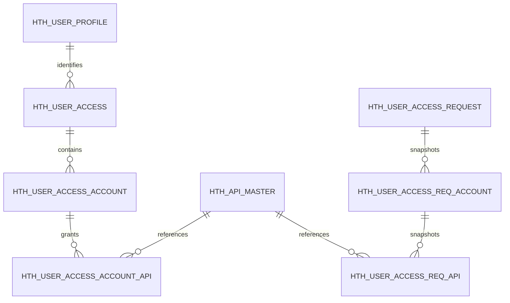

# BCOH2H-538 / BCOH2H-595 Database Change Design

| 项目 | 内容 |
| --- | --- |
| Stories | BCOH2H-538、BCOH2H-595 |
| 文档范围 | Oracle Business Table、Configuration Data、Migration、Verification、Rollback |
| Schema | `HTH_BEAUAT`（业务表）及 OBDX Configuration Tables |
| 文档状态 | Draft for DBA / Technical Review |
| 代码基线 | `main` / `19e464f6542c` |
| 更新时间 | 2026-08-25 |

## 1. 变更摘要

| Story | Database Change | 说明 |
| --- | --- | --- |
| BCOH2H-538 | 默认不新增业务表 | 使用现有 `HTH_USER_PROFILE` 判断 HTH 用户和读取 CloseID。需要部署前数据检查及可能的 Existing User Backfill。 |
| BCOH2H-538 | 查询行为变化 | User List 返回 `closeId`；HTH Summary 查询 595 新增的生效表和审批请求。 |
| BCOH2H-595 | 新增 3 张 Effective Tables | 保存审批后真正生效的 User、Account、API Mapping。 |
| BCOH2H-595 | 新增 3 张 Request Snapshot Tables | 保存 Maker 提交内容，供 Checker Review、Approved Re-entry 和 Audit。 |
| BCOH2H-595 | 新增 Framework Configuration | Repository Adapter、Resource、Entitlement、Task、Approval Assembler、Error/NLS。 |
| 两个 Story | 不修改 `DIGX_AM_*` | BCO Task ID 和 HTH API Code 含义不同，不能共用现有 BCO Account Access Tables。 |

核心新增表：

```text
Effective
├── HTH_USER_ACCESS
├── HTH_USER_ACCESS_ACCOUNT
└── HTH_USER_ACCESS_ACCOUNT_API

Approval Snapshot
├── HTH_USER_ACCESS_REQUEST
├── HTH_USER_ACCESS_REQ_ACCOUNT
└── HTH_USER_ACCESS_REQ_API
```

## 2. 现有表依赖

### 2.1 `HTH_USER_PROFILE`

现有结构：

```sql
CREATE TABLE HTH_BEAUAT.HTH_USER_PROFILE (
  PARTY_ID VARCHAR2(64 BYTE) NOT NULL,
  CLOSE_ID VARCHAR2(255 BYTE) NOT NULL,
  CONSTRAINT PK_HTH_USER_PROFILE PRIMARY KEY (PARTY_ID, CLOSE_ID)
);
```

用途：

- `(PARTY_ID, CLOSE_ID)` 存在代表 HTH User。
- BCOH2H-538 从这里读取 `closeId`。
- BCOH2H-595 的 `HTH_USER_ACCESS` 使用 Composite Foreign Key 指向此表。

当前实现保存：

```text
PARTY_ID = UserExtensionData.cdcNo
CLOSE_ID = UserExtensionData.userID
```

本次 Baseline Design 暂不修改这张表，前提是业务确认 CloseID 就是完整 OBDX User ID。

### 2.2 Enterprise HTH Tables

复用现有表：

| Table | 用途 |
| --- | --- |
| `HTH_MANAGEMENT` | 确认 Party HTH Status 为 `ENABLE`，并通过 UAM Client 找到 Party。 |
| `HTH_MANAGEMENT_API` | 企业已启用 API 集合，是用户级授权上限。 |
| `HTH_API_MASTER` | API Code、API Name、显示顺序和 Active Status。 |
| `HTH_API_URI` | Runtime 使用 Method/URI 解析 API Master/API Code。 |
| `HTH_REQUEST`, `HTH_REQUEST_API` | 只用于企业级 HTH Management Approval，不保存用户账户授权。 |

### 2.3 OBDX Framework Tables

逻辑依赖：

| Table/Config | 用途 |
| --- | --- |
| `DIGX_AP_TRANSACTION` | Maker/Checker Transaction Status。 |
| `DIGX_AZ_RESOURCE` | REST/UI Resource。 |
| `DIGX_AZ_ENTITLEMENT` | Search/Create/Edit/Delete Entitlement。 |
| `DIGX_AZ_RESOURCE_ACTION` | Resource 与 View/Perform/Approve Mapping。 |
| `DIGX_AZ_ENTGROUP_ENT_MAPPING` | Entitlement Group Mapping。 |
| `DIGX_AZ_POLICY_ENT_MAP` | Maker/Checker Policy Grant。 |
| `DIGX_CM_TASK` | HTH User Access Task。 |
| `DIGX_CM_TASK_ASPECTS` | Approval/Audit/Blackout Aspect。 |
| `DIGX_CM_RESOURCE_TASK_REL` | Service Resource 与 Task Mapping。 |
| `DIGX_FW_CONFIG_ALL_B/O` | Repository Adapter、Approval Assembler 等配置。 |

## 3. 数据关系



Effective 和 Request Snapshot 分开：

- Effective Tables 只代表当前真正可用的授权。
- Request Tables 代表 Maker 提交时的完整内容，不因 Master Name 或 Current Access 改变而变化。
- Checker Approve 时根据 `TRANSACTION_ID` 重新读取 Request Snapshot。
- Reject 不修改 Effective Tables。

## 4. ID、Audit 和状态标准

### 4.1 ID

所有新增 `ID VARCHAR2(36)` 由 Java Service 生成：

```java
UUID.randomUUID().toString()
```

不新增 Oracle Sequence，不在 SQL 中使用 `SYS_GUID()`，以保持与现有 HTH Management Service 一致。

### 4.2 Audit Columns

业务表使用：

```text
OBJECT_STATUS          VARCHAR2(1)   DEFAULT 'A'
CREATED_BY             VARCHAR2(255)
CREATION_DATE          DATE          DEFAULT SYSDATE
LAST_UPDATED_BY        VARCHAR2(255)
LAST_UPDATE_DATE       DATE          DEFAULT SYSDATE
OBJECT_VERSION_NUMBER  NUMBER        DEFAULT 1
```

状态：

- `A`：Active。
- `I`：Inactive/Deleted。

Request Snapshot 原则上 Insert 后不修改，但仍保留标准 Audit Columns，方便 Framework 和运维一致处理。

### 4.3 乐观锁

Header `HTH_USER_ACCESS.OBJECT_VERSION_NUMBER` 是 Aggregate Version：

- Create：初始 `1`。
- Edit Approve：`+1`。
- Delete Approve：`+1` 并设为 `I`。
- Recreate Approve：复用 Inactive Header，设为 `A` 并 `+1`。

Child Version 不参与前端并发判断；它们跟随 Header 在一个 Transaction 内整体替换。

## 5. Mandatory DDL

以下 DDL 是设计稿，最终 SQL 需要 DBA 按目标 Oracle Version、Tablespace、Storage 和 Grant 标准调整。

### 5.1 `HTH_USER_ACCESS`

一个 Header 表示一个用户在一个 Related/Associated Party 下的一份授权。

```sql
CREATE TABLE HTH_BEAUAT.HTH_USER_ACCESS (
  ID                    VARCHAR2(36 BYTE)  NOT NULL,
  PARTY_ID              VARCHAR2(64 BYTE)  NOT NULL,
  CLOSE_ID              VARCHAR2(255 BYTE) NOT NULL,
  ACCESS_PARTY_ID       VARCHAR2(64 BYTE)  NOT NULL,
  LINKAGE_TYPE          VARCHAR2(16 BYTE)  NOT NULL,
  OBJECT_STATUS         VARCHAR2(1 BYTE)   DEFAULT 'A' NOT NULL,
  CREATED_BY            VARCHAR2(255 BYTE) NOT NULL,
  CREATION_DATE         DATE               DEFAULT SYSDATE NOT NULL,
  LAST_UPDATED_BY       VARCHAR2(255 BYTE) NOT NULL,
  LAST_UPDATE_DATE      DATE               DEFAULT SYSDATE NOT NULL,
  OBJECT_VERSION_NUMBER NUMBER             DEFAULT 1 NOT NULL,
  CONSTRAINT PK_HTH_USER_ACCESS PRIMARY KEY (ID),
  CONSTRAINT UK_HTH_USER_ACCESS_CTX UNIQUE
    (PARTY_ID, CLOSE_ID, ACCESS_PARTY_ID, LINKAGE_TYPE),
  CONSTRAINT FK_HTH_UA_USER_PROFILE FOREIGN KEY (PARTY_ID, CLOSE_ID)
    REFERENCES HTH_BEAUAT.HTH_USER_PROFILE (PARTY_ID, CLOSE_ID),
  CONSTRAINT CK_HTH_UA_LINKAGE CHECK
    (LINKAGE_TYPE IN ('RELATED', 'ASSOCIATED')),
  CONSTRAINT CK_HTH_UA_STATUS CHECK
    (OBJECT_STATUS IN ('A', 'I'))
);

CREATE INDEX HTH_BEAUAT.IX_HTH_UA_ACCESS_PARTY
  ON HTH_BEAUAT.HTH_USER_ACCESS (ACCESS_PARTY_ID);

COMMENT ON TABLE HTH_BEAUAT.HTH_USER_ACCESS IS
  'Effective HTH user access header by user and account-owning party.';
COMMENT ON COLUMN HTH_BEAUAT.HTH_USER_ACCESS.PARTY_ID IS
  'Primary corporate party that owns the HTH user.';
COMMENT ON COLUMN HTH_BEAUAT.HTH_USER_ACCESS.CLOSE_ID IS
  'HTH user CloseID from HTH_USER_PROFILE.';
COMMENT ON COLUMN HTH_BEAUAT.HTH_USER_ACCESS.ACCESS_PARTY_ID IS
  'Party that owns the linked accounts.';
COMMENT ON COLUMN HTH_BEAUAT.HTH_USER_ACCESS.LINKAGE_TYPE IS
  'RELATED or ASSOCIATED.';
```

补充规则由 Service 校验：

- `RELATED`：`ACCESS_PARTY_ID = PARTY_ID`。
- `ASSOCIATED`：`ACCESS_PARTY_ID <> PARTY_ID`，并且存在有效 Party Relationship。

这些规则涉及跨表关系，不只依赖 Check Constraint。

### 5.2 `HTH_USER_ACCESS_ACCOUNT`

```sql
CREATE TABLE HTH_BEAUAT.HTH_USER_ACCESS_ACCOUNT (
  ID                    VARCHAR2(36 BYTE)  NOT NULL,
  HTH_USER_ACCESS_ID    VARCHAR2(36 BYTE)  NOT NULL,
  ACCOUNT_NUMBER        VARCHAR2(64 BYTE)  NOT NULL,
  ACCOUNT_TYPE          VARCHAR2(8 BYTE)   NOT NULL,
  CURRENCY              VARCHAR2(3 BYTE),
  OBJECT_STATUS         VARCHAR2(1 BYTE)   DEFAULT 'A' NOT NULL,
  CREATED_BY            VARCHAR2(255 BYTE) NOT NULL,
  CREATION_DATE         DATE               DEFAULT SYSDATE NOT NULL,
  LAST_UPDATED_BY       VARCHAR2(255 BYTE) NOT NULL,
  LAST_UPDATE_DATE      DATE               DEFAULT SYSDATE NOT NULL,
  OBJECT_VERSION_NUMBER NUMBER             DEFAULT 1 NOT NULL,
  CONSTRAINT PK_HTH_UA_ACCOUNT PRIMARY KEY (ID),
  CONSTRAINT UK_HTH_UA_ACCOUNT UNIQUE
    (HTH_USER_ACCESS_ID, ACCOUNT_NUMBER),
  CONSTRAINT FK_HTH_UAA_TO_ACCESS FOREIGN KEY (HTH_USER_ACCESS_ID)
    REFERENCES HTH_BEAUAT.HTH_USER_ACCESS (ID),
  CONSTRAINT CK_HTH_UAA_TYPE CHECK (ACCOUNT_TYPE = 'CSA'),
  CONSTRAINT CK_HTH_UAA_STATUS CHECK (OBJECT_STATUS IN ('A', 'I'))
);

CREATE INDEX HTH_BEAUAT.IX_HTH_UAA_ACCOUNT_NO
  ON HTH_BEAUAT.HTH_USER_ACCESS_ACCOUNT (ACCOUNT_NUMBER);

COMMENT ON TABLE HTH_BEAUAT.HTH_USER_ACCESS_ACCOUNT IS
  'Effective Current and Savings accounts granted to an HTH user.';
COMMENT ON COLUMN HTH_BEAUAT.HTH_USER_ACCESS_ACCOUNT.ACCOUNT_NUMBER IS
  'Canonical unmasked account identifier; must not be logged in plain text.';
COMMENT ON COLUMN HTH_BEAUAT.HTH_USER_ACCESS_ACCOUNT.ACCOUNT_TYPE IS
  'Only CSA is supported by BCOH2H-595.';
COMMENT ON COLUMN HTH_BEAUAT.HTH_USER_ACCESS_ACCOUNT.CURRENCY IS
  'Display snapshot only; not used to validate account ownership.';
```

没有对 Account Core Table 建 Foreign Key，因为 Account 数据来自现有 Account Service/外部系统。Service 在 Maker Submit 和 Checker Approve 时都要重新验证 Account Ownership、Type 和 Status。

### 5.3 `HTH_USER_ACCESS_ACCOUNT_API`

```sql
CREATE TABLE HTH_BEAUAT.HTH_USER_ACCESS_ACCOUNT_API (
  ID                         VARCHAR2(36 BYTE)  NOT NULL,
  HTH_USER_ACCESS_ACCOUNT_ID VARCHAR2(36 BYTE)  NOT NULL,
  API_MASTER_ID              VARCHAR2(36 BYTE)  NOT NULL,
  OBJECT_STATUS              VARCHAR2(1 BYTE)   DEFAULT 'A' NOT NULL,
  CREATED_BY                 VARCHAR2(255 BYTE) NOT NULL,
  CREATION_DATE              DATE               DEFAULT SYSDATE NOT NULL,
  LAST_UPDATED_BY            VARCHAR2(255 BYTE) NOT NULL,
  LAST_UPDATE_DATE           DATE               DEFAULT SYSDATE NOT NULL,
  OBJECT_VERSION_NUMBER      NUMBER             DEFAULT 1 NOT NULL,
  CONSTRAINT PK_HTH_UAA_API PRIMARY KEY (ID),
  CONSTRAINT UK_HTH_UAA_API UNIQUE
    (HTH_USER_ACCESS_ACCOUNT_ID, API_MASTER_ID),
  CONSTRAINT FK_HTH_UAAA_TO_ACCOUNT
    FOREIGN KEY (HTH_USER_ACCESS_ACCOUNT_ID)
    REFERENCES HTH_BEAUAT.HTH_USER_ACCESS_ACCOUNT (ID),
  CONSTRAINT FK_HTH_UAAA_TO_API FOREIGN KEY (API_MASTER_ID)
    REFERENCES HTH_BEAUAT.HTH_API_MASTER (ID),
  CONSTRAINT CK_HTH_UAAA_STATUS CHECK (OBJECT_STATUS IN ('A', 'I'))
);

CREATE INDEX HTH_BEAUAT.IX_HTH_UAAA_API
  ON HTH_BEAUAT.HTH_USER_ACCESS_ACCOUNT_API (API_MASTER_ID);

COMMENT ON TABLE HTH_BEAUAT.HTH_USER_ACCESS_ACCOUNT_API IS
  'Effective HTH API grants by HTH user account.';
COMMENT ON COLUMN HTH_BEAUAT.HTH_USER_ACCESS_ACCOUNT_API.API_MASTER_ID IS
  'References the active API definition in HTH_API_MASTER.';
```

DB Foreign Key 只保证 API Master 存在。Service 还要验证该 API 当前存在于目标 Party 的 `HTH_MANAGEMENT_API`。

### 5.4 `HTH_USER_ACCESS_REQUEST`

```sql
CREATE TABLE HTH_BEAUAT.HTH_USER_ACCESS_REQUEST (
  ID                    VARCHAR2(36 BYTE)  NOT NULL,
  TRANSACTION_ID        VARCHAR2(64 BYTE)  NOT NULL,
  REFERENCE_NO          VARCHAR2(64 BYTE)  NOT NULL,
  ACTION_TYPE           VARCHAR2(16 BYTE)  NOT NULL,
  PARTY_ID              VARCHAR2(64 BYTE)  NOT NULL,
  CLOSE_ID              VARCHAR2(255 BYTE) NOT NULL,
  ACCESS_PARTY_ID       VARCHAR2(64 BYTE)  NOT NULL,
  LINKAGE_TYPE          VARCHAR2(16 BYTE)  NOT NULL,
  SUBMITTED_VERSION     NUMBER,
  USER_NAME             VARCHAR2(255 BYTE),
  FULL_NAME             VARCHAR2(255 BYTE),
  ACCESS_PARTY_NAME     VARCHAR2(255 BYTE),
  OBJECT_STATUS         VARCHAR2(1 BYTE)   DEFAULT 'A' NOT NULL,
  CREATED_BY            VARCHAR2(255 BYTE) NOT NULL,
  CREATION_DATE         DATE               DEFAULT SYSDATE NOT NULL,
  LAST_UPDATED_BY       VARCHAR2(255 BYTE) NOT NULL,
  LAST_UPDATE_DATE      DATE               DEFAULT SYSDATE NOT NULL,
  OBJECT_VERSION_NUMBER NUMBER             DEFAULT 1 NOT NULL,
  CONSTRAINT PK_HTH_UA_REQUEST PRIMARY KEY (ID),
  CONSTRAINT UK_HTH_UAR_TXN UNIQUE (TRANSACTION_ID),
  CONSTRAINT UK_HTH_UAR_REF UNIQUE (REFERENCE_NO),
  CONSTRAINT CK_HTH_UAR_ACTION CHECK
    (ACTION_TYPE IN ('CREATE', 'EDIT', 'DELETE')),
  CONSTRAINT CK_HTH_UAR_LINKAGE CHECK
    (LINKAGE_TYPE IN ('RELATED', 'ASSOCIATED')),
  CONSTRAINT CK_HTH_UAR_STATUS CHECK
    (OBJECT_STATUS IN ('A', 'I'))
);

CREATE INDEX HTH_BEAUAT.IX_HTH_UAR_CONTEXT
  ON HTH_BEAUAT.HTH_USER_ACCESS_REQUEST
    (PARTY_ID, CLOSE_ID, ACCESS_PARTY_ID, LINKAGE_TYPE);

COMMENT ON TABLE HTH_BEAUAT.HTH_USER_ACCESS_REQUEST IS
  'Immutable HTH user access approval request header snapshot.';
COMMENT ON COLUMN HTH_BEAUAT.HTH_USER_ACCESS_REQUEST.TRANSACTION_ID IS
  'References the OBDX approval transaction identifier.';
COMMENT ON COLUMN HTH_BEAUAT.HTH_USER_ACCESS_REQUEST.SUBMITTED_VERSION IS
  'Effective header version submitted by Edit/Delete; null for initial Create.';
```

不在此表维护 `PENDING/APPROVED/REJECTED`，Approval Status 以 OBDX Approval Transaction 为准，避免两份状态不一致。

### 5.5 `HTH_USER_ACCESS_REQ_ACCOUNT`

```sql
CREATE TABLE HTH_BEAUAT.HTH_USER_ACCESS_REQ_ACCOUNT (
  ID                         VARCHAR2(36 BYTE)  NOT NULL,
  HTH_USER_ACCESS_REQUEST_ID VARCHAR2(36 BYTE)  NOT NULL,
  ACCOUNT_NUMBER             VARCHAR2(64 BYTE)  NOT NULL,
  ACCOUNT_TYPE               VARCHAR2(8 BYTE)   NOT NULL,
  CURRENCY                   VARCHAR2(3 BYTE),
  DISPLAY_ORDER              NUMBER,
  OBJECT_STATUS              VARCHAR2(1 BYTE)   DEFAULT 'A' NOT NULL,
  CREATED_BY                 VARCHAR2(255 BYTE) NOT NULL,
  CREATION_DATE              DATE               DEFAULT SYSDATE NOT NULL,
  LAST_UPDATED_BY            VARCHAR2(255 BYTE) NOT NULL,
  LAST_UPDATE_DATE           DATE               DEFAULT SYSDATE NOT NULL,
  OBJECT_VERSION_NUMBER      NUMBER             DEFAULT 1 NOT NULL,
  CONSTRAINT PK_HTH_UAR_ACCOUNT PRIMARY KEY (ID),
  CONSTRAINT UK_HTH_UAR_ACCOUNT UNIQUE
    (HTH_USER_ACCESS_REQUEST_ID, ACCOUNT_NUMBER),
  CONSTRAINT FK_HTH_UARA_TO_REQUEST
    FOREIGN KEY (HTH_USER_ACCESS_REQUEST_ID)
    REFERENCES HTH_BEAUAT.HTH_USER_ACCESS_REQUEST (ID),
  CONSTRAINT CK_HTH_UARA_TYPE CHECK (ACCOUNT_TYPE = 'CSA'),
  CONSTRAINT CK_HTH_UARA_STATUS CHECK (OBJECT_STATUS IN ('A', 'I'))
);

COMMENT ON TABLE HTH_BEAUAT.HTH_USER_ACCESS_REQ_ACCOUNT IS
  'Account snapshot submitted in an HTH user access approval request.';
```

Delete Request 不写 Account Snapshot，因为 Delete 针对整个 User/Access Party Context。

### 5.6 `HTH_USER_ACCESS_REQ_API`

```sql
CREATE TABLE HTH_BEAUAT.HTH_USER_ACCESS_REQ_API (
  ID                         VARCHAR2(36 BYTE)  NOT NULL,
  HTH_USER_ACCESS_REQ_ACC_ID VARCHAR2(36 BYTE)  NOT NULL,
  API_MASTER_ID              VARCHAR2(36 BYTE)  NOT NULL,
  API_CODE                   VARCHAR2(64 BYTE)  NOT NULL,
  API_NAME                   VARCHAR2(255 BYTE) NOT NULL,
  DISPLAY_ORDER              NUMBER,
  OBJECT_STATUS              VARCHAR2(1 BYTE)   DEFAULT 'A' NOT NULL,
  CREATED_BY                 VARCHAR2(255 BYTE) NOT NULL,
  CREATION_DATE              DATE               DEFAULT SYSDATE NOT NULL,
  LAST_UPDATED_BY            VARCHAR2(255 BYTE) NOT NULL,
  LAST_UPDATE_DATE           DATE               DEFAULT SYSDATE NOT NULL,
  OBJECT_VERSION_NUMBER      NUMBER             DEFAULT 1 NOT NULL,
  CONSTRAINT PK_HTH_UAR_API PRIMARY KEY (ID),
  CONSTRAINT UK_HTH_UAR_API UNIQUE
    (HTH_USER_ACCESS_REQ_ACC_ID, API_MASTER_ID),
  CONSTRAINT FK_HTH_UARA_TO_ACCOUNT
    FOREIGN KEY (HTH_USER_ACCESS_REQ_ACC_ID)
    REFERENCES HTH_BEAUAT.HTH_USER_ACCESS_REQ_ACCOUNT (ID),
  CONSTRAINT FK_HTH_UARA_TO_API FOREIGN KEY (API_MASTER_ID)
    REFERENCES HTH_BEAUAT.HTH_API_MASTER (ID),
  CONSTRAINT CK_HTH_UARAPI_STATUS CHECK (OBJECT_STATUS IN ('A', 'I'))
);

COMMENT ON TABLE HTH_BEAUAT.HTH_USER_ACCESS_REQ_API IS
  'API code/name snapshot submitted for an HTH user account.';
COMMENT ON COLUMN HTH_BEAUAT.HTH_USER_ACCESS_REQ_API.API_CODE IS
  'Copied at submit time for historical review.';
COMMENT ON COLUMN HTH_BEAUAT.HTH_USER_ACCESS_REQ_API.API_NAME IS
  'Copied at submit time so later master renames do not change history.';
```

## 6. Optional DDL：API Scope

当前 API Master 没有说明 API 是 Account Scope 还是 User Scope。BCOH2H-595 截图表达的是“Account 下展开 API”，但 Exchange Rate、Audit Log 等 API 可能不属于单一账户。

在 Scope 未确认前，不执行本节 DDL。

### 6.1 API Master Scope

如果产品确认需要显式 Scope：

```sql
ALTER TABLE HTH_BEAUAT.HTH_API_MASTER
  ADD SCOPE_TYPE VARCHAR2(16 BYTE);

-- 根据审批后的 API Matrix 回填，不能默认全部为 ACCOUNT。
-- UPDATE ... SET SCOPE_TYPE = 'ACCOUNT' WHERE API_CODE IN (...);
-- UPDATE ... SET SCOPE_TYPE = 'USER' WHERE API_CODE IN (...);

ALTER TABLE HTH_BEAUAT.HTH_API_MASTER
  ADD CONSTRAINT CK_HTH_API_MASTER_SCOPE
  CHECK (SCOPE_TYPE IN ('ACCOUNT', 'USER'));

-- 全部回填并验证后再执行：
ALTER TABLE HTH_BEAUAT.HTH_API_MASTER
  MODIFY SCOPE_TYPE NOT NULL;
```

### 6.2 User Scope Effective Table

```sql
CREATE TABLE HTH_BEAUAT.HTH_USER_ACCESS_API (
  ID                    VARCHAR2(36 BYTE)  NOT NULL,
  HTH_USER_ACCESS_ID    VARCHAR2(36 BYTE)  NOT NULL,
  API_MASTER_ID         VARCHAR2(36 BYTE)  NOT NULL,
  OBJECT_STATUS         VARCHAR2(1 BYTE)   DEFAULT 'A' NOT NULL,
  CREATED_BY            VARCHAR2(255 BYTE) NOT NULL,
  CREATION_DATE         DATE               DEFAULT SYSDATE NOT NULL,
  LAST_UPDATED_BY       VARCHAR2(255 BYTE) NOT NULL,
  LAST_UPDATE_DATE      DATE               DEFAULT SYSDATE NOT NULL,
  OBJECT_VERSION_NUMBER NUMBER             DEFAULT 1 NOT NULL,
  CONSTRAINT PK_HTH_UA_API PRIMARY KEY (ID),
  CONSTRAINT UK_HTH_UA_API UNIQUE (HTH_USER_ACCESS_ID, API_MASTER_ID),
  CONSTRAINT FK_HTH_UAPI_TO_ACCESS FOREIGN KEY (HTH_USER_ACCESS_ID)
    REFERENCES HTH_BEAUAT.HTH_USER_ACCESS (ID),
  CONSTRAINT FK_HTH_UAPI_TO_API FOREIGN KEY (API_MASTER_ID)
    REFERENCES HTH_BEAUAT.HTH_API_MASTER (ID),
  CONSTRAINT CK_HTH_UAPI_STATUS CHECK (OBJECT_STATUS IN ('A', 'I'))
);
```

对应 Request Snapshot 还需要 `HTH_USER_ACCESS_REQ_USER_API`。如果最终所有 API 都是 Account Scope，则不创建这两张 Optional Tables。

## 7. Create/Edit/Delete 数据变化

### 7.1 Maker Submit

| Action | Effective Tables | Request Tables | Approval Transaction |
| --- | --- | --- | --- |
| Create | 不修改 | 写 Header + Account + API Snapshot | 创建 Pending |
| Edit | 不修改 | 写 Header + 完整目标 Account/API Snapshot | 创建 Pending |
| Delete | 不修改 | 只写 Delete Request Header | 创建 Pending |

### 7.2 Checker Approve

Create：

```text
1. 重新验证 HTH User、Party、Account 和 API
2. 确认没有 Active Header
3. 新建 Header，或重新激活同 Context 的 Inactive Header
4. 插入 Account Rows
5. 插入 Account API Rows
6. Commit
```

Edit：

```text
1. UPDATE Header WHERE OBJECT_VERSION_NUMBER = submittedVersion
2. Row Count != 1 → Stale Version，Rollback
3. 删除/停用原 Account API Rows
4. 删除/停用原 Account Rows
5. 从 Snapshot 插入完整 Account Rows
6. 从 Snapshot 插入完整 API Rows
7. Header Version + 1
8. Commit
```

Delete：

```text
1. UPDATE Header WHERE OBJECT_VERSION_NUMBER = submittedVersion
2. Row Count != 1 → Stale Version，Rollback
3. 删除或停用 Child API Rows
4. 删除或停用 Child Account Rows
5. Header OBJECT_STATUS = I，Version + 1
6. Commit
```

建议 Child Rows 物理删除、Header 逻辑停用；完整历史由 Request Snapshot 保留。若 DBA/Audit 要求 Child 也逻辑停用，需要在所有查询中统一过滤 `OBJECT_STATUS = 'A'`。

### 7.3 Checker Reject

- Effective Tables 不改变。
- Request Snapshot 保留。
- Approval Transaction 记录 Reject Status/Reason。
- 下次维护可以创建新的 Request。

## 8. BCOH2H-538 查询变化

### 8.1 User List

```sql
SELECT PARTY_ID, CLOSE_ID
  FROM HTH_BEAUAT.HTH_USER_PROFILE
 WHERE PARTY_ID = :partyId;
```

现有 Primary Key `(PARTY_ID, CLOSE_ID)` 的 Leading Column 是 `PARTY_ID`，可以支持此查询，不需要额外 Index。

### 8.2 Related Summary

```sql
SELECT UA.ID,
       UA.OBJECT_VERSION_NUMBER,
       COUNT(UAA.ID) AS CASA_ACCOUNT_COUNT
  FROM HTH_BEAUAT.HTH_USER_ACCESS UA
  LEFT JOIN HTH_BEAUAT.HTH_USER_ACCESS_ACCOUNT UAA
    ON UAA.HTH_USER_ACCESS_ID = UA.ID
   AND UAA.OBJECT_STATUS = 'A'
 WHERE UA.PARTY_ID = :partyId
   AND UA.CLOSE_ID = :closeId
   AND UA.ACCESS_PARTY_ID = :partyId
   AND UA.LINKAGE_TYPE = 'RELATED'
   AND UA.OBJECT_STATUS = 'A'
 GROUP BY UA.ID, UA.OBJECT_VERSION_NUMBER;
```

### 8.3 Associated Summary

```sql
SELECT UA.ACCESS_PARTY_ID,
       UA.ID,
       UA.OBJECT_VERSION_NUMBER,
       COUNT(UAA.ID) AS CASA_ACCOUNT_COUNT
  FROM HTH_BEAUAT.HTH_USER_ACCESS UA
  LEFT JOIN HTH_BEAUAT.HTH_USER_ACCESS_ACCOUNT UAA
    ON UAA.HTH_USER_ACCESS_ID = UA.ID
   AND UAA.OBJECT_STATUS = 'A'
 WHERE UA.PARTY_ID = :partyId
   AND UA.CLOSE_ID = :closeId
   AND UA.LINKAGE_TYPE = 'ASSOCIATED'
   AND UA.OBJECT_STATUS = 'A'
 GROUP BY UA.ACCESS_PARTY_ID, UA.ID, UA.OBJECT_VERSION_NUMBER;
```

Associated Party Name 从权威 Party Service/Relationship Data 获取，不在 User Access Table 重复保存当前名称。Request Snapshot 保存提交时名称，只供历史 Review。

### 8.4 Pending Request

`HTH_USER_ACCESS_REQUEST` 必须关联 Approval Transaction Status 判断 Pending。不能只根据 Request Row 是否存在，因为 Request History 永久保留。

逻辑条件：

```text
PARTY_ID + CLOSE_ID + ACCESS_PARTY_ID + LINKAGE_TYPE
AND Approval Transaction Status is not final
```

最终 SQL 使用实际 `DIGX_AP_TRANSACTION` Status Column/Enum，需由 Approval Framework Owner 确认。

## 9. Runtime Authorization Query

Account Scope API：

```sql
SELECT 1
  FROM HTH_BEAUAT.HTH_USER_ACCESS UA
  JOIN HTH_BEAUAT.HTH_USER_ACCESS_ACCOUNT UAA
    ON UAA.HTH_USER_ACCESS_ID = UA.ID
  JOIN HTH_BEAUAT.HTH_USER_ACCESS_ACCOUNT_API UAPI
    ON UAPI.HTH_USER_ACCESS_ACCOUNT_ID = UAA.ID
  JOIN HTH_BEAUAT.HTH_API_MASTER AM
    ON AM.ID = UAPI.API_MASTER_ID
  JOIN HTH_BEAUAT.HTH_MANAGEMENT HM
    ON HM.PARTY_ID = UA.PARTY_ID
 WHERE UA.PARTY_ID = :partyId
   AND UA.CLOSE_ID = :closeId
   AND UAA.ACCOUNT_NUMBER = :accountNumber
   AND AM.API_CODE = :apiCode
   AND UA.OBJECT_STATUS = 'A'
   AND UAA.OBJECT_STATUS = 'A'
   AND UAPI.OBJECT_STATUS = 'A'
   AND AM.OBJECT_STATUS = 'A'
   AND HM.OBJECT_STATUS = 'A'
   AND HM.HTH_STATUS = 'ENABLE';
```

Service 还要确认 API 在 `HTH_MANAGEMENT_API` 中。可以直接加入 Join，或者先从缓存的 Enterprise API Set 判断。

Repository 使用参数绑定。完整 CloseID、Account Number 不能出现在 SQL Log/Application Log。

## 10. Repository Adapter Configuration

建议 Adapter IDs：

```text
HTH_USER_ACCESS_LOCAL_REPOSITORY_ADAPTER
HTH_USER_ACCESS_ACCOUNT_LOCAL_REPOSITORY_ADAPTER
HTH_USER_ACCESS_ACCOUNT_API_LOCAL_REPOSITORY_ADAPTER
HTH_USER_ACCESS_REQUEST_LOCAL_REPOSITORY_ADAPTER
HTH_USER_ACCESS_REQ_ACCOUNT_LOCAL_REPOSITORY_ADAPTER
HTH_USER_ACCESS_REQ_API_LOCAL_REPOSITORY_ADAPTER
```

每个 Adapter 需要同时注册：

```text
DIGX_FW_CONFIG_ALL_B
  CATEGORY_ID = repositoryadapterconfig

DIGX_FW_CONFIG_ALL_O
  PREFERENCE_NAME = RepositoryAdapterFactories
  DETERMINANT_VALUE = OBDX_BU
```

对应 ORM Mapping 加入：

```text
consulting/config/orm/eclipselink/mappings/cz/hosttohost/
consulting/config/orm/eclipselink/cfg/cz-hosttohost.cfg.xml
```

## 11. Resource、Entitlement 和 Task 数据

### 11.1 Service Resource

```text
com.ofss.digx.cz.bea.app.hosttohost.service.HostToHostUserAccess.search
com.ofss.digx.cz.bea.app.hosttohost.service.HostToHostUserAccess.accounts
com.ofss.digx.cz.bea.app.hosttohost.service.HostToHostUserAccess.submit
com.ofss.digx.cz.bea.app.hosttohost.service.HostToHostUserAccess.edit
com.ofss.digx.cz.bea.app.hosttohost.service.HostToHostUserAccess.delete
```

### 11.2 Entitlement

```text
HostToHostUserAccess.search_View
HostToHostUserAccess.accounts_View
HostToHostUserAccess.submit_Perform
HostToHostUserAccess.submit_Approve
HostToHostUserAccess.edit_Perform
HostToHostUserAccess.edit_Approve
HostToHostUserAccess.delete_Perform
HostToHostUserAccess.delete_Approve
```

实际 ID 使用完整 Service Package Prefix，与现有 HTH Management Entitlement 命名保持一致。

### 11.3 Task

Proposed Task IDs：

```text
UAT_N_HUA_NEW
UAT_N_HUA_EDT
UAT_N_HUA_DEL
```

每个 Task 配置：

```text
approval = Y
audit    = Y
blackout = Y
```

Task Parent、ID 长度和命名必须在执行 SQL 前由 Central Task Catalogue 确认。

### 11.4 Approval Assembler

以下 Service 需要在 `DIGX_FW_CONFIG_ALL_B/O` 注册：

```text
submit → SubmitHostToHostUserAccessApprovalAssembler
edit   → SubmitHostToHostUserAccessApprovalAssembler
delete → SubmitHostToHostUserAccessApprovalAssembler
```

## 12. Migration 和数据清理

### 12.1 不做 BCO 自动迁移

不把以下数据迁移到 HTH User Access：

```text
DIGX_AM_ACCOUNT_ACCESS
DIGX_AM_ACCOUNT_EXCEPTION
DIGX_AM_ACCOUNT_EXCEPTION_TXN
```

原因：这些表保存 BCO Account/Task Entitlement，无法可靠转换成 HTH API Code。

### 12.2 HTH Profile Pre-check

```sql
SELECT PARTY_ID,
       COUNT(*) AS HTH_USER_COUNT
  FROM HTH_BEAUAT.HTH_USER_PROFILE
 GROUP BY PARTY_ID
 ORDER BY PARTY_ID;
```

需要业务提供预期 HTH User 清单并核对：

- 缺少 Profile 的 HTH User。
- 已删除 User 仍残留 Profile。
- CloseID 重复或格式不正确。

不能根据 Username 自动判断一个 Existing User 应该是 HTH 还是 BCO。

### 12.3 CloseID 独立标识的条件变更

如果业务确认 `CLOSE_ID != USER_ID`，需要先修改 Profile：

```sql
ALTER TABLE HTH_BEAUAT.HTH_USER_PROFILE
  ADD USER_ID VARCHAR2(255 BYTE);
```

之后由业务 Mapping 回填 `USER_ID`，完成验证后：

```sql
ALTER TABLE HTH_BEAUAT.HTH_USER_PROFILE
  MODIFY USER_ID NOT NULL;

ALTER TABLE HTH_BEAUAT.HTH_USER_PROFILE
  ADD CONSTRAINT UK_HTH_USER_PROFILE_USER UNIQUE (PARTY_ID, USER_ID);
```

这属于 Conditional Change，不包含在默认 Baseline Deployment。

## 13. SQL 文件拆分和执行顺序

已创建目录：

```text
consulting/db/branch_change_history/20260825_HTH_User_Access/
```

已创建文件：

```text
1_HTH_User_Access_Schema.sql
2_HTH_User_Access_Permission.sql
2_HTH_User_Access_Permission_1_Maker.sql
2_HTH_User_Access_Permission_2_Checker.sql
3_HTH_User_Access_Process.sql
4_HTH_User_Access_Repository_Adapters.sql
5_HTH_User_Access_Error_Messages.sql
6_HTH_User_Access_Verification.sql
```

Fallback 脚本未放入正常部署包，避免误删业务和审批历史；如 DBA 要求，必须在上线前确认无数据后另行审批创建。

执行顺序：

1. Schema/Table/Index/Constraint/Comment。
2. Repository Adapter Config。
3. Backend Deployment，确保 Class 已存在。
4. Base Resource/Entitlement。
5. Maker/Checker Policy Grant。
6. Task/Approval Assembler Process Config。
7. Error/NLS/Event Config。
8. UI Deployment。
9. Runtime Authorizer Deployment。
10. Cache Refresh/Managed Server Restart。
11. Verification 和 Smoke Test。

## 14. Verification SQL

### 14.1 Object 检查

```sql
SELECT TABLE_NAME
  FROM ALL_TABLES
 WHERE OWNER = 'HTH_BEAUAT'
   AND TABLE_NAME IN (
     'HTH_USER_ACCESS',
     'HTH_USER_ACCESS_ACCOUNT',
     'HTH_USER_ACCESS_ACCOUNT_API',
     'HTH_USER_ACCESS_REQUEST',
     'HTH_USER_ACCESS_REQ_ACCOUNT',
     'HTH_USER_ACCESS_REQ_API'
   )
 ORDER BY TABLE_NAME;
```

预期返回 6 Rows。

### 14.2 Constraint 检查

```sql
SELECT TABLE_NAME, CONSTRAINT_NAME, CONSTRAINT_TYPE, STATUS
  FROM ALL_CONSTRAINTS
 WHERE OWNER = 'HTH_BEAUAT'
   AND TABLE_NAME LIKE 'HTH_USER_ACCESS%'
 ORDER BY TABLE_NAME, CONSTRAINT_NAME;
```

所有 Constraint 应为 `ENABLED`。

### 14.3 Index 检查

```sql
SELECT TABLE_NAME, INDEX_NAME, UNIQUENESS, STATUS
  FROM ALL_INDEXES
 WHERE OWNER = 'HTH_BEAUAT'
   AND TABLE_NAME LIKE 'HTH_USER_ACCESS%'
 ORDER BY TABLE_NAME, INDEX_NAME;
```

### 14.4 Orphan 检查

```sql
SELECT COUNT(*) AS ORPHAN_ACCOUNT_COUNT
  FROM HTH_BEAUAT.HTH_USER_ACCESS_ACCOUNT A
  LEFT JOIN HTH_BEAUAT.HTH_USER_ACCESS H
    ON H.ID = A.HTH_USER_ACCESS_ID
 WHERE H.ID IS NULL;

SELECT COUNT(*) AS ORPHAN_API_COUNT
  FROM HTH_BEAUAT.HTH_USER_ACCESS_ACCOUNT_API M
  LEFT JOIN HTH_BEAUAT.HTH_USER_ACCESS_ACCOUNT A
    ON A.ID = M.HTH_USER_ACCESS_ACCOUNT_ID
 WHERE A.ID IS NULL;
```

预期均为 `0`。

### 14.5 Non-CSA 检查

```sql
SELECT COUNT(*) AS INVALID_ACCOUNT_TYPE_COUNT
  FROM HTH_BEAUAT.HTH_USER_ACCESS_ACCOUNT
 WHERE ACCOUNT_TYPE <> 'CSA';
```

预期为 `0`。

### 14.6 Duplicate Context 检查

```sql
SELECT PARTY_ID, CLOSE_ID, ACCESS_PARTY_ID, LINKAGE_TYPE, COUNT(*)
  FROM HTH_BEAUAT.HTH_USER_ACCESS
 GROUP BY PARTY_ID, CLOSE_ID, ACCESS_PARTY_ID, LINKAGE_TYPE
HAVING COUNT(*) > 1;
```

预期为 0 Rows。

### 14.7 Repository Config 检查

```sql
SELECT PROP_ID, CATEGORY_ID, PROP_VALUE
  FROM DIGX_FW_CONFIG_ALL_B
 WHERE PROP_ID LIKE 'HTH_USER_ACCESS%REPOSITORY_ADAPTER'
 ORDER BY PROP_ID;

SELECT PROP_ID, PREFERENCE_NAME, PROP_VALUE, DETERMINANT_VALUE
  FROM DIGX_FW_CONFIG_ALL_O
 WHERE PROP_ID LIKE 'HTH_USER_ACCESS%REPOSITORY_ADAPTER'
 ORDER BY PROP_ID;
```

### 14.8 Task 检查

```sql
SELECT ID, NAME, PARENT_ID, EXECUTABLE
  FROM DIGX_CM_TASK
 WHERE ID IN ('UAT_N_HUA_NEW', 'UAT_N_HUA_EDT', 'UAT_N_HUA_DEL');

SELECT TASK_ID, ASPECT, ENABLED
  FROM DIGX_CM_TASK_ASPECTS
 WHERE TASK_ID IN ('UAT_N_HUA_NEW', 'UAT_N_HUA_EDT', 'UAT_N_HUA_DEL')
 ORDER BY TASK_ID, ASPECT;
```

## 15. Rollback Strategy

### 15.1 上线后有业务数据

不 Drop Tables。执行：

1. 关闭 Feature Flag `HTH_USER_ACCESS_ENABLED`。
2. 撤销或停用新 Resource/Entitlement/Task Mapping。
3. 停止 Runtime 使用新 Mapping；Fallback Policy 必须由 Security Owner 确认。
4. 保留 Effective 和 Request History。
5. 修复代码后 Forward Fix。

### 15.2 Go-live 前且确认无数据

只有在以下检查都为 0 时才允许 DBA 执行 Pre-GoLive Fallback：

```sql
SELECT
  (SELECT COUNT(*) FROM HTH_BEAUAT.HTH_USER_ACCESS) AS ACCESS_COUNT,
  (SELECT COUNT(*) FROM HTH_BEAUAT.HTH_USER_ACCESS_REQUEST) AS REQUEST_COUNT
FROM DUAL;
```

Fallback 顺序必须与 Foreign Key 相反：

```text
HTH_USER_ACCESS_REQ_API
→ HTH_USER_ACCESS_REQ_ACCOUNT
→ HTH_USER_ACCESS_REQUEST
→ HTH_USER_ACCESS_ACCOUNT_API
→ HTH_USER_ACCESS_ACCOUNT
→ HTH_USER_ACCESS
```

实际 Drop SQL 只放在受控 `fallback/` Script，由 DBA 审批执行，不在正常部署 Script 中自动执行。

## 16. 数据安全和运维

- `CLOSE_ID` 和 `ACCOUNT_NUMBER` 按敏感业务标识处理。
- Application/SQL Audit Log 不记录完整值。
- DBA Verification 输出到 Ticket 时需要 Mask。
- 非生产环境数据必须脱敏。
- Request Snapshot 是 Audit Record，应按银行保留政策设置归档周期。
- `HTH_API_MASTER` 被 Effective/Request FK 引用后只允许 `OBJECT_STATUS = I`，不物理删除。
- 定期检查：Orphan Profile、Closed Account Mapping、Inactive Enterprise API 仍被 User Mapping 引用。

## 17. 容量和性能估算

每个 HTH User/Access Party：

```text
1 Header
N CASA Accounts
N × M Account API Mappings
```

示例：

```text
10,000 HTH Users
平均 10 Accounts/User
平均 5 APIs/Account

HTH_USER_ACCESS                  ≈ 10,000 Rows
HTH_USER_ACCESS_ACCOUNT          ≈ 100,000 Rows
HTH_USER_ACCESS_ACCOUNT_API      ≈ 500,000 Rows
```

Request Tables 随维护次数持续增长，需要按 Audit Retention 评估归档。上线前使用实际用户数、平均账户数和 API 数重新估算 Tablespace、Index Size 和 Runtime Query P95。

## 18. 待确认事项

1. CloseID 是否长期等于 OBDX User ID；否则执行 Conditional Profile Change。
2. 哪些 API 是 Account Scope，哪些是 User Scope。
3. Child Rows 使用物理删除还是全部逻辑停用。
4. Request Snapshot 的保留年限和归档方式。
5. `UAT_N_HUA_*` Task ID 和 Parent 是否符合 Central Catalogue。
6. Approval Transaction Pending/Final Status 的实际 Column/Enum。
7. Tablespace、Schema Grant 和生产命名标准。
8. Runtime Authorization Fallback/Cache Policy。

## 19. Database Definition of Done

- 6 张 Mandatory Tables、Constraint、Index 和 Comment 已通过 DBA Review。
- Optional Scope DDL 已明确采用或排除。
- ORM Mapping 和 Repository Adapter Config 已验证。
- Maker/Checker Resource、Entitlement、Task 和 Assembler Config 已验证。
- Existing HTH Profile 数据核对完成。
- Verification SQL 全部通过。
- Create/Edit/Delete/Approve/Reject 的数据变化符合设计。
- Runtime Authorization Query 使用正确 Index 且性能达标。
- Backup、Rollback 和 Forward Fix 方案已演练。
- 敏感数据 Masking 和 Audit Retention 已确认。
