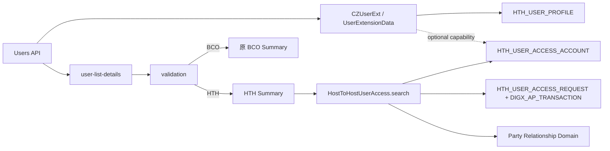

# BCOH2H-538 Technical Design

| 项目 | 内容 |
| --- | --- |
| Story | BCOH2H-538 |
| 功能 | HTH User Accounts & Services Access Summary |
| 文档状态 | As Implemented |
| 实现基线 | 当前分支 BCOH2H-538 / BCOH2H-595 最终实现 |
| 依赖 Story | BCOH2H-595 提供 HTH User Access 生效表、Request Snapshot 和查询服务 |
| 更新时间 | 2026-08-26 |

## 1. 目标和范围

在现有 `User Accounts & Services Access` 用户列表中识别 HTH 用户，并把 HTH 用户路由到独立的 HTH Access Summary；BCO 用户继续使用原有 Account Access 流程。

已实现范围：

- 用户列表返回并展示 `userChannelType`、`closeId` 和 HTH Access Setup 状态。
- 点击 Username 时按 `HTH` / `BCO` 分流。
- HTH Summary 显示用户、企业 HTH 状态、Related 和 Associated 公司上下文。
- Summary 只统计审批后生效的 CSA Account Grant。
- Pending Create/Edit/Delete 单独显示，不提前计入生效数量。
- `To link` 把完整 HTH Context 传入 BCOH2H-595 维护流程。
- 保留原 BCO API、账户类型、Task Mapping 和页面逻辑。

不在本 Story 内处理：

- Account/API Checkbox、Review、Maker/Checker 和生效数据写入，这些由 BCOH2H-595 实现。
- 企业 HTH Enable/Disable、Certificate、UAM Client 和 API Master Maintenance。
- CloseID 生成规则；本功能只读取已有 `HTH_USER_PROFILE`。
- 修改 BCO `DIGX_AM_*` 数据结构。

## 2. 最终设计结论

1. HTH 用户由 `HTH_BEA.HTH_USER_PROFILE` 中的 `(PARTY_ID, CLOSE_ID)` Profile 识别。
2. 当前既有流程保存 `CLOSE_ID = UserExtensionData.userID`，因此使用 Party + User ID 匹配 Profile。
3. 标准 User List DTO 不新增固定字段；HTH 扩展值写入 `dictionaryArray`，降低对原响应 Contract 的影响。
4. `hthAccessSetupDone` 来自有效账户授权，不使用 Enterprise HTH Enable 状态，也不使用 Profile 是否存在代替。
5. HTH Summary 使用独立的 `hostToHostUserAccess/search` 服务，不查询 BCO Account Access API。
6. Related 固定代表主 Party 本身；Associated 只来自当前 Party Relationship Domain 返回的关联 Party。
7. BCO 是默认兼容分支。HTH 用户缺少 CloseID 时停止跳转，不允许错误地回退到 BCO 页面。
8. BCOH2H-538 没有新增独立业务表；Summary 使用 BCOH2H-595 的五张表中的生效账户表和 Request Header。

## 3. 组件和数据流



### 3.1 主要代码位置

| 层 | 文件/组件 | 最终职责 |
| --- | --- | --- |
| User List Service Extension | `CZUserExt.java` | 把 Channel Type、CloseID、HTH Setup 状态加入 Dictionary。 |
| User Extension Repository | `LocalUserExtensionDataRepositoryAdapter.java` | 批量读取 Profile，并以可选能力读取 Active CloseIDs。 |
| HTH Profile Repository | `LocalHthUserProfileRepositoryAdapter.java` | 按 Party 读取 Profile；提供 Active CloseID 查询实现。 |
| User List UI | `common/user-list-details/user-list-details.js` | 解析 Dictionary，标准化 HTH/BCO User View Model。 |
| Routing | `account-access-management/validation/validation.js` | 构建 HTH Policy，校验 CloseID，选择 Summary 分支。 |
| Summary UI | `account-access-management/summary/summary.js/.html` | 渲染 HTH Related/Associated、数量和 Pending 状态。 |
| Summary Model | `account-access-management/summary/model.js` | 调用 `hostToHostUserAccess/search`。 |
| REST | `appx.hosttohost.service.HostToHostUserAccess` | 暴露 `/search`。 |
| Application Service | `app.hosttohost.service.HostToHostUserAccess` | 校验 Profile、聚合生效数据和 Pending 状态。 |
| Effective Repository | `LocalHthUserAccessAccountRepositoryAdapter` | 在数据库中按 Context 聚合 Active Account 数量。 |
| Request Repository | `LocalHthUserAccessRequestRepositoryAdapter` | 联查 Approval Transaction，返回 Pending Context。 |

## 4. 用户列表设计

### 4.1 后端查询

当 `isAccessSetupCheckRequired=true` 时，`CZUserExt.postList()` 调用 `UserExtensionData.listUsers()`：

1. 按请求 Party 读取 `UserExtensionData`。
2. 一次读取该 Party 的 `HTH_USER_PROFILE`。
3. 使用长度前缀 Key `partyId + closeId` 建立 Profile Map，避免简单字符串拼接冲突。
4. Profile 匹配成功时设置 `userChannelType=HTH` 和 `closeId`，否则设置 `BCO`。
5. 若 Party 有 HTH Profile，再读取至少有一条 Active Effective Account Grant 的 CloseID 集合。
6. CloseID 在该集合中时设置 `hthAccessSetupDone=true`。

Profile 批量查询等价于：

```sql
SELECT PARTY_ID, CLOSE_ID
  FROM HTH_BEA.HTH_USER_PROFILE
 WHERE PARTY_ID = :partyId;
```

Setup 状态查询为：

```sql
SELECT DISTINCT CLOSE_ID
  FROM HTH_BEA.HTH_USER_ACCESS_ACCOUNT
 WHERE PARTY_ID = :partyId
   AND OBJECT_STATUS = 'A';
```

这里不检查 Pending Request。Maker 已提交但 Checker 未批准时，User List 仍显示未完成 Setup。

### 4.2 Dictionary Contract

HTH 用户写入：

```json
{
  "userChannelType": "HTH",
  "closeId": "CLOSE001",
  "hthAccessSetupDone": "true"
}
```

BCO 用户写入 `userChannelType=BCO`，CloseID 和 HTH Setup 字段为空。Dictionary 写入会优先复用已有同名项，避免多次 Extension 执行产生重复 Key。

User List 返回的 Username 可能是 `login@party`，而 Extension/Profile 使用 login 部分。`CZUserExt` 在 Join 前去掉 `@party` 后缀并使用大写进行匹配。

### 4.3 公共接口兼容设计

最终实现没有在公共接口 `IHthUserProfileAdapter` 增加 `listActiveAccessCloseIds()`。

该接口继续保持 Story 前的公共方法集合：

```text
createUserProfile(partyId, closeId)
listCloseIdsByUserKey(partyId)
userProfileKey(partyId, closeId)              // 原有 static helper
normalizeUserChannelType(userChannelType)     // 原有 static helper
```

Active CloseID 查询只作为 `LocalHthUserProfileRepositoryAdapter` 的可选实现能力存在。SMS 使用反射检查实现类是否有：

```text
listActiveAccessCloseIds(String partyId)
```

兼容行为：

| 运行组合 | 行为 |
| --- | --- |
| 新 SMS + 新 Host-to-Host 实现 | 调用查询并返回真实 HTH Setup 状态。 |
| 新 SMS + 旧 Host-to-Host 实现 | 方法不存在，返回空集合；HTH Setup 保守显示 `false`。 |
| 旧 SMS + 新 Host-to-Host 实现 | 旧 SMS 不调用新能力；不受影响。 |
| 查询能力存在但数据库失败 | 异常继续抛出，不伪装成旧 JAR。 |

因此编译后的 SMS 不包含对新增 Interface Method 的 `invokeinterface` 指令，不会由该能力产生 `AbstractMethodError` 或 `NoSuchMethodError`。这个兼容保护只针对 User List Setup Enrichment；包含新 DTO/Service 的完整 538/595 Release 仍应按同一发布单元部署。

## 5. 前端设计

### 5.1 User View Model

`user-list-details.js` 同时支持 Dictionary 和未来可能出现的直接字段，标准化为：

```javascript
{
    username: item.username,
    fullName: firstName + " " + lastName,
    partyID: item.partyId,
    userChannelType: "HTH",                  // 默认 BCO
    closeId: "CLOSE001",
    accountAccessSetupDone: hthAccessSetupDone
}
```

对于 BCO，`accountAccessSetupDone` 仍使用原字段；对于 HTH，改用后端返回的 `hthAccessSetupDone`。用户列表原有排序和 UI Contract 保持不变。

### 5.2 HTH/BCO 分流

`validation.buildAccessPolicy()` 产生：

```javascript
{
    channelMode: "HTH",
    closeId: "CLOSE001",
    allowedAccountTypes: ["CSA"],
    serviceMappingType: "HTH_API"
}
```

规则：

- 非 HTH 或空 Channel Type：使用 `BCO` 默认分支。
- HTH 且有 CloseID：向 Summary 传递 `channelMode`、`closeId`、User Channel Type 和 Full Name。
- HTH 但无 CloseID：显示 `hthMissingCloseId`，不加载任何 BCO/HTH Summary。

### 5.3 HTH Summary

Summary 在 `isHthMode()` 为 true 时只调用：

```http
GET cz/v1/hostToHostUserAccess/search?partyId={partyId}&closeId={closeId}
```

它不会执行原 BCO 的 CSA/TRD/LON/VER/VRA/LER Batch 查询。

UI 对每个 Summary 计算：

```text
casaAccountCount = accountCountByType.CSA or 0
hasPendingRequest = pendingAction exists or setupStatus starts with PENDING_
canMaintain = enterprise enabled AND no pending request AND status != ERROR
```

只有具备维护 UI 权限并且 `canMaintain=true` 时显示 `To link`。

### 5.4 Navigation Context

Related 和 Associated 使用相同结构：

```json
{
  "channelMode": "HTH",
  "partyId": "P100",
  "closeId": "CLOSE001",
  "username": "USER1",
  "fullName": "Example User",
  "userChannelType": "HTH",
  "linkageType": "ASSOCIATED",
  "accessPartyId": "P200",
  "accessPartyName": "Associated Limited",
  "setupStatus": "NOT_SETUP"
}
```

最终 Context 不包含 `objectVersionNumber`。Related 必须使用 `accessPartyId=partyId`；Associated 必须保留被点击的 Associated Party ID，后续页面不能重新从主 Party 推断。

## 6. Summary Service 设计

### 6.1 API Contract

```http
GET /hostToHostUserAccess/search?partyId={partyId}&closeId={closeId}
```

实际响应结构：

```json
{
  "user": {
    "partyId": "P100",
    "closeId": "CLOSE001",
    "username": "CLOSE001",
    "userChannelType": "HTH"
  },
  "enterpriseHthStatus": "ENABLE",
  "related": {
    "linkageType": "RELATED",
    "accessPartyId": "P100",
    "accessPartyName": "Example Limited",
    "setupStatus": "ACTIVE",
    "accountCountByType": {
      "CSA": 4
    },
    "pendingAction": null,
    "pendingReferenceNumber": null
  },
  "associated": [],
  "status": {
    "result": "SUCCESS"
  }
}
```

`fullName` 字段存在于 Context DTO，但当前 Search Service 不负责填充；页面 Header 使用 User List 已带入的 Full Name。

### 6.2 Service 顺序

1. `checkAccessPolicy(search)`。
2. Trim `partyId`、`closeId` 并检查必填。
3. 验证 `(partyId, closeId)` 存在于 `HTH_USER_PROFILE`。
4. 查询 `HTH_MANAGEMENT` 得到企业 `ENABLE` / `DISABLE` 状态。
5. 初始化一个 RELATED Summary。
6. 从 Party Relationship Domain 返回的当前关联 Party 初始化 ASSOCIATED Summary。
7. 一次 Aggregate Query 读取所有 Active Effective Account Count。
8. 一次 Join Query 读取所有 Pending Request Context。
9. 合并结果并执行 Response Policy。

Summary Search 在企业 Disable 时仍返回数据结构，但状态保持 `DISABLED`，不开放维护入口。

### 6.3 Setup Status

| Status | 产生条件 | Account Count |
| --- | --- | --- |
| `NOT_SETUP` | 企业 Enable，Context 没有 Active Account。 | 0 |
| `ACTIVE` | 企业 Enable，Context 至少有一条 Active Account。 | 只统计 Active Row。 |
| `PENDING_CREATE` | 当前 Context 有 Pending Create。 | 保留当前生效 Count，通常为 0。 |
| `PENDING_EDIT` | 当前 Context 有 Pending Edit。 | 保留 Edit 前的生效 Count。 |
| `PENDING_DELETE` | 当前 Context 有 Pending Delete。 | 删除审批前仍保留生效 Count。 |
| `DISABLED` | Enterprise HTH 不是 `ENABLE`。 | 可以返回 Count，但禁止维护。 |

Pending 状态来自 `HTH_USER_ACCESS_REQUEST` 联查 `DIGX_AP_TRANSACTION.APPR_STATUS IN ('PENDING_APPROVAL','MODIFICATION_REQUESTED')`。Request Row 本身不保存另一份 Approval Status。

## 7. Table 和查询设计

### 7.1 Profile 和 CloseID

BCOH2H-538 使用已有：

```text
HTH_BEA.HTH_USER_PROFILE
  PRIMARY KEY (PARTY_ID, CLOSE_ID)
```

本 Story 不修改 Profile 结构，也不向 `UserExtensionData` 持久化 CloseID。`UserExtensionData.closeId` 和 `hthAccessSetupDone` 只用于本次响应组装。

当前匹配依赖 `CLOSE_ID = UserExtensionData.userID`。若未来 CloseID 与 User ID 分离，需要另一个明确的 User/Profile Mapping；不能继续猜测。

### 7.2 Effective Summary

最终设计没有 `HTH_USER_ACCESS` Header。Context 和 Account 字段已合并进：

```text
HTH_BEA.HTH_USER_ACCESS_ACCOUNT
```

聚合 SQL：

```sql
SELECT A.ACCESS_PARTY_ID,
       A.LINKAGE_TYPE,
       A.ACCOUNT_TYPE,
       COUNT(A.ID)
  FROM HTH_BEA.HTH_USER_ACCESS_ACCOUNT A
 WHERE A.PARTY_ID = :partyId
   AND A.CLOSE_ID = :closeId
   AND A.OBJECT_STATUS = 'A'
 GROUP BY A.ACCESS_PARTY_ID, A.LINKAGE_TYPE, A.ACCOUNT_TYPE;
```

Repository 按 `linkageType#accessPartyId` 合并记录。若数据库中存在已经失效的 Associated Relationship 对应的历史 Grant，Service 不返回该公司，并记录 Warning。

### 7.3 Pending Summary

```sql
SELECT R.ACCESS_PARTY_ID,
       R.LINKAGE_TYPE,
       R.ACTION_TYPE,
       R.REFERENCE_NO
  FROM HTH_BEA.HTH_USER_ACCESS_REQUEST R
  JOIN DIGX_AP_TRANSACTION T
    ON T.TXN_ID = R.TRANSACTION_ID
 WHERE R.PARTY_ID = :partyId
   AND R.CLOSE_ID = :closeId
   AND R.OBJECT_STATUS = 'A'
   AND T.APPR_STATUS IN ('PENDING_APPROVAL', 'MODIFICATION_REQUESTED')
 ORDER BY R.CREATION_DATE DESC;
```

同一 Context 如果出现多条未结束记录，Repository 只采用最新一条进行 Summary 展示；写服务同时以 Pending Conflict 校验阻止正常情况下产生重复请求。

## 8. 权限和错误处理

Search Service ID：

```text
com.ofss.digx.cz.bea.app.hosttohost.service.HostToHostUserAccess.search
```

Entitlement：

```text
com.ofss.digx.cz.bea.app.hosttohost.service.HostToHostUserAccess.search_View
```

UI Authorization 把 Search `perform` 映射到：

```text
validation#user-list-details#summary
```

与 Summary 直接相关的错误：

| Error Code | 条件 | 当前 REST 映射 |
| --- | --- | --- |
| `DIGX_CZ_HTH_UA_001` | Profile/CloseID 不存在或必填 Context 缺失。 | 400 |
| Access Policy Exception | 当前操作人没有 Search 权限。 | 由 Framework/REST Error Contract 处理。 |
| Unexpected Repository Error | Profile、Effective 或 Pending 查询失败。 | 400；关闭 Channel Interaction 失败时为 500。 |

`DIGX_CZ_HTH_UA_008` 不作为 Summary Error 返回；Pending 是正常响应状态。

## 9. 非功能设计

### 9.1 安全

- Account Count 在数据库聚合，Summary 不加载或返回完整未遮罩账户号。
- Profile 和关联公司必须由后端验证；UI Context 不作为授权依据。
- HTH 用户缺少 CloseID 时 Fail Closed，不进入 BCO 维护流程。
- 不能在普通日志打印完整 Account Number、CloseID 或 Credential。

### 9.2 性能

- 每个 Party 批量读取 Profile，不为每个 User 单独查询。
- User List Active CloseID 只执行一次 `DISTINCT` 查询。
- Summary 的 Active Count 和 Pending Context 各执行一次查询，不按 Associated Party 循环查询。
- Summary 不缓存，避免 Checker Approve 后继续显示旧状态。

### 9.3 兼容性

- 原 BCO 分支及其 REST 调用保持不变。
- 公共 `IHthUserProfileAdapter` 的二进制方法集合与 Story 前一致。
- 旧 Host-to-Host 实现期间只影响 HTH Setup 排序/显示，不会把用户错误标记为已完成。
- 完整新功能部署仍要求新 common DTO、host-to-host service、endpoint、SQL 和 channel 资源版本一致。

## 10. 部署和回滚

部署顺序：

1. 执行 BCOH2H-595 Schema 和 OBDX Configuration SQL。
2. 部署 common DTO、host-to-host module、SMS module 和 REST endpoint。
3. 部署 Channel Components、NLS 和 UI Authorization。
4. 刷新 Authorization/Configuration Cache 或按环境要求重启 Managed Server。
5. 执行 HTH Smoke Test 和 BCO Regression Test。

代码回滚时恢复旧 Channel/SMS/Host-to-Host JAR。五张 HTH User Access 表和 Approval History 不应随代码回滚而删除；它们由数据库回滚计划单独处理。

当前实现没有 `HTH_USER_ACCESS_ENABLED` Feature Flag，文档和运行手册不能依赖不存在的开关。

## 11. 测试和验收

### 11.1 必测场景

- BCO 用户仍进入原 BCO Summary，原账户类型和审批流程不变。
- HTH 用户进入 HTH Summary，用户信息和 Channel Type 正确。
- HTH 用户缺少 CloseID 时停止跳转。
- Profile 存在但无 Active Grant 时 Setup 为 false、Summary 为 `NOT_SETUP`。
- Related 与多个 Associated Party 的 Count 不混用。
- Pending Create/Edit/Delete 不改变生效 Count，并禁止 `To link`。
- Enterprise Disable 时显示 `DISABLED`，不显示维护按钮。
- Invalid/Expired Associated Relationship 的历史 Grant 不暴露。
- 新 SMS + 旧 Host-to-Host 实现时无 Linkage Error，Setup 保守为 false。

### 11.2 已执行的结构验证

- Java 8 编译通过 common、host-to-host、SMS 和 HTH REST endpoint。
- 编译后的 `IHthUserProfileAdapter` 方法集合与 Story 前基线一致。
- SMS Bytecode 不包含对 `listActiveAccessCloseIds()` 的直接 Interface Invocation。

## 12. Story 验收对照

| Story 要求 | 最终实现 | 验证方式 |
| --- | --- | --- |
| 显示 User Channel Type | User Dictionary + User List View Model | UI/API Test |
| HTH/BCO 分流 | `buildAccessPolicy()` + `channelMode` | Unit/E2E Test |
| HTH User Setup 状态 | Active CloseID Optional Capability | Repository/Compatibility Test |
| HTH Summary | `HostToHostUserAccess.search` | API Test |
| Related Count | `HTH_USER_ACCESS_ACCOUNT` Aggregate | Repository Test |
| Associated Count | 当前 Party Relationship + Aggregate Result | Integration Test |
| Pending 状态 | Request Header + Approval Transaction | Approval Test |
| To link | 完整 Navigation Context | UI Test |
| BCO 不受影响 | 原 BCO Branch 保留 | Full Regression |
