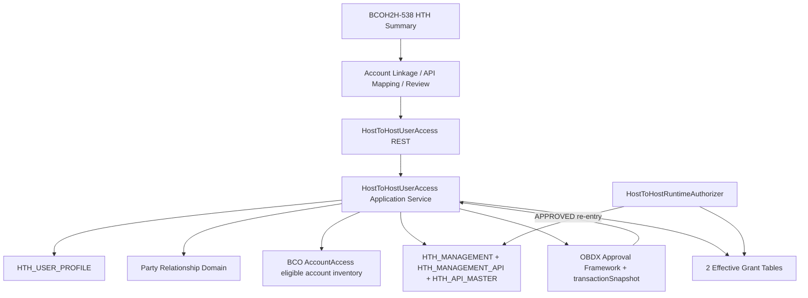
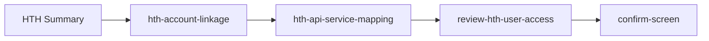
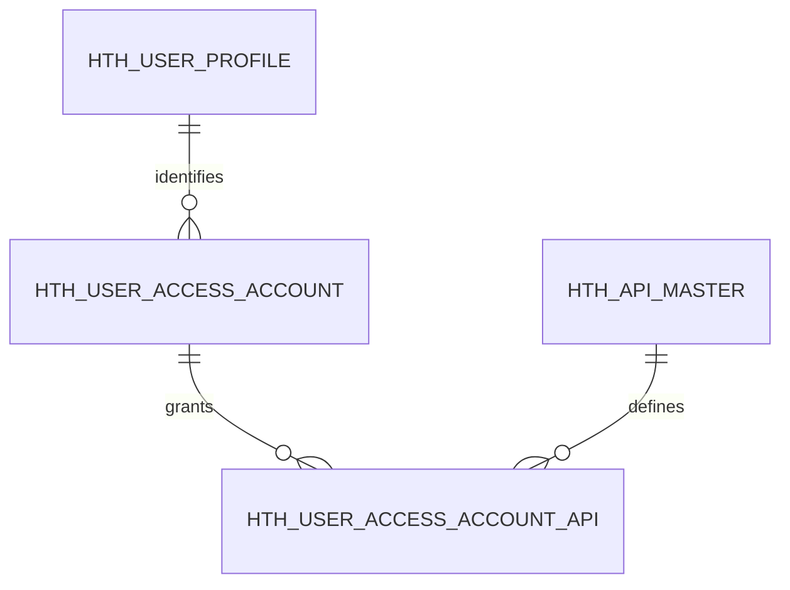

# BCOH2H-595 Technical Design

| 项目 | 内容 |
| --- | --- |
| Story | BCOH2H-595 |
| 功能 | HTH User Account Linkage and API Service Access |
| 文档状态 | As Implemented |
| 实现基线 | 当前分支 BCOH2H-538 / BCOH2H-595 最终实现 |
| 前置依赖 | `HTH_USER_PROFILE`、`HTH_MANAGEMENT`、`HTH_MANAGEMENT_API`、`HTH_API_MASTER` 已在 `HTH_BEA` |
| 关联 Story | BCOH2H-538 提供 HTH User Summary 和维护入口 |
| 更新时间 | 2026-08-31 |

## 1. 目标和范围

为一个 HTH 用户设置可访问的 Current and Savings Account 与 Time Deposit Account，以及每个账户允许调用的 HTH API Service。

已实现范围：

- Related 和 Associated 两种 Company Context。
- 只允许 CSA（Current and Savings）和 TD（Time Deposit）Account。
- Account Selection、按账户 API Mapping、Review、Create/Edit/Delete。
- 与 BCO 一致的 Platform `transactionSnapshot` 和 Approved Re-entry。
- 审批后生效的 Account/API Grant。
- Summary、Account Detail 和 Runtime Authorization Repository Contract。
- ORM、Repository Adapter、Permission、Task、Approval Assembler、Error NLS 和验证 SQL。
- 保留 BCO Account Access 原流程。

不在本 Story 内处理：

- 企业级 HTH Enable/Disable、Certificate、UAM Client 和 API Master Maintenance。
- BCO `taskIds` 或 `DIGX_AM_*` 数据模型修改。
- CSA/TD 以外的 Account Type。
- HTH API 的业务处理实现。
- User Scope API。最终数据模型按 Account Scope 实现，每项 API Grant 必须属于一个 Account Grant。
- CloseID 生成规则。

## 2. 最终架构



### 2.1 Access Context

所有页面、Service、Platform Snapshot 和 Effective Query 都使用完整 Context：

```text
(partyId, closeId, accessPartyId, linkageType)
```

| Field | 最终含义 |
| --- | --- |
| `partyId` | 拥有 HTH 用户的主 Corporate Party。 |
| `closeId` | 主 Party 下的 HTH User Identity。 |
| `accessPartyId` | 拥有被授权 Account 的 Party。 |
| `linkageType` | `RELATED` 或 `ASSOCIATED`。 |

规则：

- `RELATED`：`accessPartyId` 必须等于 `partyId`。
- `ASSOCIATED`：`accessPartyId` 必须存在于主 Party 当前的 Party-to-Party Relationship 结果中。
- `username`、`fullName`、`accessPartyName` 是显示快照，不是关联 Key。
- 最终实现没有 `objectVersionNumber`，前端和 DTO 都不传该字段。

## 3. 前端设计

### 3.1 组件流程



HTH Summary 直接注册并加载独立的 HTH 组件链；原 `mapping-modules` 继续只服务 BCO，避免 HTH Template 与旧 BCO Binding 同时初始化。

### 3.2 Account Linkage

`hth-account-linkage` 调用 Account Detail API，使用响应中的 `access.accounts`；若没有 `access.accounts` 才使用 `eligibleAccounts`。

行为：

- `setupStatus=ACTIVE` 时初始 Mode 为 `VIEW`，否则为 `CREATE`。
- 默认进入 Current and Savings Tab，只显示 CSA；可切换 Time Deposit Tab，只显示 TD。
- Pending Request 时禁止编辑。
- `Edit` 把 Mode 改为 `EDIT`。
- `Link All` 只修改 Account Selection。
- `Next` 至少要求一个 Selected Account。
- `Delete` 直接进入 Delete Review。
- `Cancel Edit` 使用进入页面时的 Deep Copy 恢复 Account/API Selection。
- `Back` 比较 Account Type、Account Number、Selected 和 API Code Selection；有未保存修改时提示确认。

### 3.3 API Mapping

`hth-api-service-mapping` 只显示 Account Linkage 中 Selected 的账户。页面默认 Current and Savings Tab，可切换 Time Deposit；每个 Account 的 `apiServices` 来源于后端 Enterprise-enabled API Catalogue。

规则：

- 每个 Selected Account 至少选择一个 API。
- 页面初始只读，点击 `Edit` 后才能选择；账户默认折叠，展开后以 Account 为根、API 为子项显示。
- API Selection 使用 `apiCode`，后端重新解析 `apiMasterId`、Name 和 Display Order。
- `Apply first to all` 按 API Code 复制第一项 Account 的选择，不能按数组下标复制。
- Back 返回 Account 页面时保留内存中的 Account/API Selection，不重新读取数据库。
- `Save` 完成选择校验并进入 Review；`Confirm` 才提交 Maker Request。

### 3.4 Review 和提交

`review-hth-user-access` 同时支持 Maker Review 和 Checker Read-only Detail：

- Maker 路径直接沿用 API Mapping 页面内存中的 Selected Account/API，不重新查询或替换选择。
- Approval 路径优先读取 Framework 保存的 `transactionSnapshot`，并兼容 `record`、`access`、`hostToHostUserAccess` 和 `hostToHostUserAccessDTO` Wrapper。
- Maker 与 Checker 使用同一套只读 Review 表格：CSA/TD Tab、Account Number、Currency、Account Type，以及每个 Account 下已选择的 API Service。
- Task Code 决定默认 Action：`UAT_N_HUA_NEW`、`UAT_N_HUA_EDT`、`UAT_N_HUA_DEL`。
- Delete Payload 的 `accounts` 为空。
- 非 Delete Payload 只包含 Selected Account 和每个账户下 Selected API。
- 提交成功加载标准 `confirm-screen`，Reference Number 取 `status.externalReferenceNumber`。

实际 Maker Payload：

```json
{
  "partyId": "P100",
  "closeId": "CLOSE001",
  "accessPartyId": "P100",
  "linkageType": "RELATED",
  "username": "USER1",
  "fullName": "Example User",
  "accessPartyName": "Example Limited",
  "accounts": [
    {
      "accountNumber": "123456789",
      "maskedAccountNumber": "*****6789",
      "displayName": "Operating Account",
      "accountType": "CSA",
      "currency": "HKD",
      "selected": true,
      "displayOrder": 0,
      "apiServices": [
        {
          "apiMasterId": "API-ID",
          "apiCode": "ACCOUNT_ACTIVITY",
          "apiName": "Account Activity",
          "selected": true,
          "displayOrder": 10
        }
      ]
    }
  ]
}
```

描述字段可以随 Payload 传入用于 Review，但后端不会把客户端的 Account Ownership、API Master ID 或 API Name 当作权威数据。

### 3.5 前端文件

| 文件/组件 | 最终职责 |
| --- | --- |
| `mapping-modules/mapping-modules.js` | 保留 BCO 分支，新增 HTH Entry Routing。 |
| `hth-account-linkage/*` | Account 读取、选择、View/Edit/Delete 和 Back State。 |
| `hth-api-service-mapping/*` | 每账户 API Selection。 |
| `review-hth-user-access/*` | Maker/Checker Review 和 Submit。 |
| `account-access-management/META-INF/UIAuthorization.json` | Search/Accounts/Write Component Mapping。 |
| `extensions/override/task-component-mapping.js` | 将 Create/Edit/Delete Task 映射到 Checker、Pending Approval 和 Activity Log 共用的只读 Review Component。 |
| `extensions/resources/nls/access-management.js` | HTH 页面、校验和 Pending 文案。 |

## 4. REST 和 DTO Contract

### 4.1 REST Endpoints

Base Path：

```text
cz/v1/hostToHostUserAccess
```

| Method | Path | 用途 | 当前成功 HTTP |
| --- | --- | --- | --- |
| GET | `/search?partyId=&closeId=` | 538 Related/Associated Summary。 | 200 |
| GET | `/accounts?partyId=&closeId=&accessPartyId=&linkageType=` | Eligible Account/API 和当前授权。 | 200 |
| POST | `/submit` | Create Approval。 | 201 |
| POST | `/edit` | Edit Approval。 | 201 |
| POST | `/delete` | Delete Approval。 | 201 |

Application `Exception` 当前由 REST Facade 映射为 400；关闭 Channel Interaction 失败映射为 500。当前实现没有把 Pending 返回为 202，也没有单独把 State Conflict 映射为 409。

### 4.2 Accounts Response

```json
{
  "enterpriseHthStatus": "ENABLE",
  "access": {
    "partyId": "P100",
    "closeId": "CLOSE001",
    "accessPartyId": "P100",
    "linkageType": "RELATED",
    "accounts": []
  },
  "eligibleAccounts": [],
  "eligibleApis": [],
  "pendingRequest": false,
  "pendingAction": null,
  "pendingReferenceNumber": null,
  "status": {
    "result": "SUCCESS"
  }
}
```

`eligibleAccounts` 和 `access.accounts` 使用同一类 Account DTO；已生效的 Account/API 通过 `selected=true` 回填。

### 4.3 DTOs

```text
HostToHostUserAccessSearchDTO
  partyId, closeId, accessPartyId, linkageType

HostToHostUserAccessDTO
  partyId, closeId, accessPartyId, linkageType
  username, fullName, accessPartyName, referenceNumber
  accounts[]

HostToHostUserAccessAccountDTO
  accountNumber, maskedAccountNumber, displayName
  accountType, currency, selected, displayOrder
  apiServices[]

HostToHostUserAccessApiDTO
  apiMasterId, apiCode, apiName, selected, displayOrder

HostToHostUserAccessResponseDTO
  user, enterpriseHthStatus, related, associated
  access, eligibleAccounts, eligibleApis
  pendingRequest, pendingAction, pendingReferenceNumber, status
```

没有 `accessId`、`objectVersionNumber`、`transactionId` 或独立 `transactionStatus` Response Field。Approval Reference 通过标准 Response Status 的 External Reference Number 返回。

## 5. Application Service 设计

### 5.1 Accounts Query

执行顺序：

1. `checkAccessPolicy(accounts)`。
2. Trim 并验证完整 Context。
3. 验证 HTH Profile。
4. 要求主 Party 的 `HTH_MANAGEMENT.HTH_STATUS=ENABLE`。
5. 验证 RELATED/ASSOCIATED Relationship。
6. 从 `HTH_MANAGEMENT_API` 和 Active `HTH_API_MASTER` 建立 Eligible API Catalogue。
7. 调用与 BCO Account Linkage 页面相同的 `IAccountAccess.listAccounts()`：`partyId` 始终作为 Primary Party；RELATED 使用空的 Linked Party List，ASSOCIATED 把 `accessPartyId` 放入 Linked Party List。服务返回对应公司的 Eligible Demand Deposit 与 Term Deposit 后，分别映射为 CSA 和 TD。HTH 丢弃 BCO Task Tree，仅保留 Account Metadata 并挂接 HTH API Catalogue。
8. 读取该 Context 下全部 Effective Account/API Row。
9. 将 Effective Selection 合并到 Eligible Account/API。
10. 从 `DIGX_AP_TRANSACTION` 读取 HTH Task 的可操作 Pending 交易，并反序列化其
    `transactionSnapshot` 匹配当前 Context。

BCO AccountAccess 当前 Eligible Inventory 中不存在但 Effective 中仍 Active 的 Account，会以 Masked Account Number 补入响应并标记 Selected，使 View 能显示历史授权；Maker/Checker 校验时仍会调用相同的 AccountAccess Inventory 重新验证，不能继续审批已失效账户。

### 5.2 Write Service

`submit`、`edit`、`delete` 共用 `save()`：

```text
checkAccessPolicy
→ determine maker or APPROVED re-entry
→ maker: platform approval framework stores requestDTO as transactionSnapshot
→ approved: receive the same server-side transactionSnapshot as requestDTO
→ validate current Profile/Enterprise/Relationship/Account/API/State
→ approved: replace/deactivate Effective Grants
→ build standard response and response policy
```

Reference Number 使用平台 `DIGX_AP_TRANSACTION.TXN_ID`，不再生成第二套 HUA Reference。

所有 Table `ID` 使用 `UUID.randomUUID().toString()`；不使用 Oracle Sequence。

### 5.3 Server-side Validation

| 校验 | Create | Edit | Delete | Approved Re-entry |
| --- | --- | --- | --- | --- |
| Profile 存在 | Y | Y | Y | Y |
| Enterprise HTH Enable | Y | Y | Y | Y |
| RELATED/ASSOCIATED Context 合法 | Y | Y | Y | Y |
| 无其他 Pending Request | Platform Generic Duplicate | Platform Generic Duplicate | Platform Generic Duplicate | 当前 Transaction 重入 |
| 当前 Active Context 不存在 | Y | N | N | 按 Action 重新检查 |
| 当前 Active Context 存在 | N | Y | Y | 按 Action 重新检查 |
| 至少一个 Account/API | Y | Y | N | Y/Y/N |
| Account Type 为 CSA 或 TD | Y | Y | N | Y |
| Account 属于当前 Access Party | Y | Y | N | Y，失效时报 012 |
| API 属于当前 Enterprise Catalogue | Y | Y | N | Y |
| Account Type + Account Number/API 无重复 | Y | Y | N | Y |

Checker Approve 时使用平台保存的 Maker Snapshot，但仍重新从当前 BCO AccountAccess Eligible Inventory 和 Enterprise API Catalogue 校验。Maker 提交后 Account 被关闭时，Approved Re-entry 失败并保留原 Effective Grant。

## 6. 数据库设计

### 6.1 最终结论

所有新业务表位于：

```text
HTH_BEA
```

Schema 历史脚本创建五张表；最终运行时主链路只使用两张 Effective Table：

```text
Effective
├── HTH_USER_ACCESS_ACCOUNT
└── HTH_USER_ACCESS_ACCOUNT_API

Legacy Request Snapshot（已部署环境兼容保留，不再写入或读取）
├── HTH_USER_ACCESS_REQUEST
├── HTH_USER_ACCESS_REQ_ACCOUNT
└── HTH_USER_ACCESS_REQ_API
```

没有 `HTH_USER_ACCESS` Header。原 Header Context 已直接合并到 `HTH_USER_ACCESS_ACCOUNT`，避免 Header 和唯一 Account Context 重复建模。

五张自定义业务表全部没有 `OBJECT_VERSION_NUMBER`。`OBJECT_VERSION_NUMBER` 只保留在本次 SQL 写入的 OBDX 平台公共表中，例如 `DIGX_AZ_*`、`DIGX_CM_*`、`DIGX_FW_CONFIG_ALL_B` 和 `DIGX_FW_ERROR_MESSAGES`，因为这些是平台既有 Column；本功能没有删除或修改公共表结构。

### 6.2 通用 Audit Column

五张表都有：

| Column | Type | 说明 |
| --- | --- | --- |
| `OBJECT_STATUS` | `VARCHAR2(1)` | `A` Active，`I` Inactive。 |
| `CREATED_BY` | `VARCHAR2(255)` | 创建用户。 |
| `CREATION_DATE` | `DATE` | 默认 `SYSDATE`。 |
| `LAST_UPDATED_BY` | `VARCHAR2(255)` | 最后更新用户。 |
| `LAST_UPDATE_DATE` | `DATE` | 默认 `SYSDATE`。 |

Schema SQL 对每张表和每个 Column 都有 `COMMENT ON`。

### 6.3 `HTH_USER_ACCESS_ACCOUNT`

这张表同时代表 User/Company Context 和一个 Effective CSA/TD Account Grant。

| Column | Type | 约束/用途 |
| --- | --- | --- |
| `ID` | `VARCHAR2(36)` | PK，Java UUID。 |
| `PARTY_ID` | `VARCHAR2(64)` | 主 Party。 |
| `CLOSE_ID` | `VARCHAR2(255)` | HTH User CloseID。 |
| `ACCESS_PARTY_ID` | `VARCHAR2(64)` | Account-owning Party。 |
| `LINKAGE_TYPE` | `VARCHAR2(16)` | `RELATED` / `ASSOCIATED`。 |
| `ACCOUNT_NUMBER` | `VARCHAR2(64)` | Canonical unmasked Account Number。 |
| `ACCOUNT_TYPE` | `VARCHAR2(8)` | Check Constraint 允许 `CSA`、`TD`。 |
| `CURRENCY` | `VARCHAR2(3)` | 显示快照。 |

关键约束：

```text
PK (ID)
UNIQUE (PARTY_ID, CLOSE_ID, ACCESS_PARTY_ID, LINKAGE_TYPE, ACCOUNT_TYPE, ACCOUNT_NUMBER)
FK (PARTY_ID, CLOSE_ID) → HTH_BEA.HTH_USER_PROFILE
CHECK LINKAGE_TYPE IN ('RELATED','ASSOCIATED')
CHECK ACCOUNT_TYPE IN ('CSA','TD')
CHECK OBJECT_STATUS IN ('A','I')
```

Indexes：

- `IX_HTH_UAA_ACCOUNT_NO (ACCOUNT_NUMBER)`：Runtime Authorization。
- `IX_HTH_UAA_CONTEXT (PARTY_ID, CLOSE_ID, ACCESS_PARTY_ID, LINKAGE_TYPE)`：Summary、Detail 和 Soft Replace。

### 6.4 `HTH_USER_ACCESS_ACCOUNT_API`

每行代表某个 Effective Account Grant 下的一项 Effective API Grant。

| Column | Type | 约束/用途 |
| --- | --- | --- |
| `ID` | `VARCHAR2(36)` | PK。 |
| `HTH_USER_ACCESS_ACCOUNT_ID` | `VARCHAR2(36)` | FK 到 Effective Account。 |
| `API_MASTER_ID` | `VARCHAR2(36)` | FK 到 `HTH_API_MASTER`。 |

关键约束：

```text
UNIQUE (HTH_USER_ACCESS_ACCOUNT_ID, API_MASTER_ID)
CHECK OBJECT_STATUS IN ('A','I')
```

Index `IX_HTH_UAAA_API (API_MASTER_ID)` 支持 API Disable Impact Query。

### 6.5 Legacy `HTH_USER_ACCESS_REQUEST`

旧设计的 Maker Request Header Snapshot。最终实现已由平台 `transactionSnapshot` 替代；表为兼容已执行的 Schema 保留，不能再作为 Pending、Checker Detail 或 Approved Re-entry 的数据源。

| Column | Type | 约束/用途 |
| --- | --- | --- |
| `ID` | `VARCHAR2(36)` | PK。 |
| `TRANSACTION_ID` | `VARCHAR2(64)` | OBDX Approval Transaction ID，Unique。 |
| `REFERENCE_NO` | `VARCHAR2(64)` | 对外 Reference，Unique。 |
| `ACTION_TYPE` | `VARCHAR2(16)` | `CREATE` / `EDIT` / `DELETE`。 |
| `PARTY_ID` | `VARCHAR2(64)` | Maker Context Snapshot。 |
| `CLOSE_ID` | `VARCHAR2(255)` | Maker Context Snapshot。 |
| `ACCESS_PARTY_ID` | `VARCHAR2(64)` | Maker Context Snapshot。 |
| `LINKAGE_TYPE` | `VARCHAR2(16)` | `RELATED` / `ASSOCIATED`。 |
| `USER_NAME` | `VARCHAR2(255)` | Review Display Snapshot。 |
| `FULL_NAME` | `VARCHAR2(255)` | Review Display Snapshot。 |
| `ACCESS_PARTY_NAME` | `VARCHAR2(255)` | Review Display Snapshot。 |

`TRANSACTION_ID` 与 `DIGX_AP_TRANSACTION` 是逻辑关联，没有跨 Schema FK。最终代码不再使用该表，避免 NONXA 双写不一致。

### 6.6 Legacy `HTH_USER_ACCESS_REQ_ACCOUNT`

旧设计的 Account Snapshot Child；最终代码不再写入或读取。

| Column | Type | 用途 |
| --- | --- | --- |
| `ID` | `VARCHAR2(36)` | PK。 |
| `HTH_USER_ACCESS_REQUEST_ID` | `VARCHAR2(36)` | FK 到 Request Header。 |
| `ACCOUNT_NUMBER` | `VARCHAR2(64)` | 提交时 Canonical Account。 |
| `ACCOUNT_TYPE` | `VARCHAR2(8)` | `CSA` 或 `TD`。 |
| `CURRENCY` | `VARCHAR2(3)` | 提交快照。 |
| `DISPLAY_ORDER` | `NUMBER` | Maker Review 顺序。 |

Unique Key：`(HTH_USER_ACCESS_REQUEST_ID, ACCOUNT_TYPE, ACCOUNT_NUMBER)`。BCO 可能把同一个 Account Number 同时放在 CSA 与 TD Tab，因此账户身份必须包含 Account Type。

### 6.7 Legacy `HTH_USER_ACCESS_REQ_API`

旧设计的 API Snapshot Child；最终代码不再写入或读取。

| Column | Type | 用途 |
| --- | --- | --- |
| `ID` | `VARCHAR2(36)` | PK。 |
| `HTH_USER_ACCESS_REQ_ACC_ID` | `VARCHAR2(36)` | FK 到 Request Account。 |
| `API_MASTER_ID` | `VARCHAR2(36)` | FK 到当前 API Master，用于审批重验。 |
| `API_CODE` | `VARCHAR2(64)` | Maker 提交时快照。 |
| `API_NAME` | `VARCHAR2(255)` | Maker 提交时快照，Master Rename 不改变历史 Review。 |
| `DISPLAY_ORDER` | `NUMBER` | Maker Review 顺序。 |

Unique Key：`(HTH_USER_ACCESS_REQ_ACC_ID, API_MASTER_ID)`；Index `IX_HTH_UARAPI_API` 支持 API Impact Query。

### 6.8 Table 关系

最终运行时关系只有 Profile、Effective Account 和 Effective API；三张 Legacy Request Table 的物理 FK 关系仅用于兼容旧 Schema，不属于新请求链路。



## 7. Maker/Checker 和落表流程

### 7.1 Maker Snapshot

Maker 路径：

1. Service 对浏览器 DTO 完成 Profile、Relationship、Account Ownership 与 API Catalogue 校验。
2. Approval Assembler 按完整 Context 生成 Entity Identifier Hash，与 BCO User Account Access 使用相同的平台 Duplicate Check。
3. Framework 建立 `DIGX_AP_TRANSACTION`，并把完整 Maker DTO 序列化到该 Transaction 的 `transactionSnapshot`。
4. Pending 阶段不写 Effective Table，也不写三张 Legacy Request Table。
5. Approval List、Activity Log、重复判断和 Checker Detail 均读取同一平台 Transaction。

Platform `transactionSnapshot` 代表 Maker 当时提交内容，之后不随 Effective Data 或 API Name 改变。

### 7.2 Approved Re-entry

只有 Framework Thread Attribute 明确为 `APPROVED` 时进入生效分支：

1. Framework 按 Transaction ID 读取平台 Transaction。
2. Framework 将其中的 `transactionSnapshot` 原样作为 Approved Service 的 DTO 参数传入。
3. 当前 Task/Service 决定 Create、Edit 或 Delete Action，不从另一张业务表推断。
4. Service 使用当前 Profile、Relationship、BCO AccountAccess Eligible Inventory 和 API Catalogue 重新校验。
5. Create/Edit 执行完整 Effective Replace；Delete 执行完整 Context Deactivate。

Reject 不进入 Approved Re-entry，因此不会修改 Effective Tables。

### 7.3 Effective Replace

最终实现不物理删除 Effective Row：

1. 先把 Context 下全部 API Grant 改为 `I`。
2. 再把 Context 下全部 Account Grant 改为 `I`。
3. 对新选择的 Account，按 Unique Business Key 查找旧 Row。
4. 已有 Row 更新为 `A` 并保留原 `ID/CREATED_BY/CREATION_DATE`；没有则插入 UUID Row。
5. API Grant 同样按 `(ACCOUNT_ID, API_MASTER_ID)` 复用或新建并设为 `A`。

Delete 只执行步骤 1-2。完整提交历史由平台 Transaction Snapshot 保留，Effective Row 的 A/I 状态支持重复启用同一 `Account Type + Account Number` Business Key。

## 8. ORM 和 Repository

### 8.1 Entity/ORM

最终运行时 Entity 为两组 Effective Entity：

```text
HthUserAccessAccount / Key
HthUserAccessAccountApi / Key
```

以下三组 Legacy Entity/ORM 继续注册，只为了兼容已经执行的 Schema 和旧版本回滚；新 Service 不调用：

```text
HthUserAccessRequest / Key
HthUserAccessRequestAccount / Key
HthUserAccessRequestApi / Key
```

`cz-hosttohost.cfg.xml` 已注册对应 ORM。新 ORM 以及本 Story 使用的既有 `HthUserProfile`、`HthApiMaster`、`HthManagement`、`HthManagementApi` 都指向 `HTH_BEA`。

Feature Entity 没有 `@Version` 或 `OBJECT_VERSION_NUMBER` Mapping。

### 8.2 Repository Adapter

最终运行时调用两个 Effective Adapter：

```text
HTH_USER_ACCESS_ACCOUNT_LOCAL_REPOSITORY_ADAPTER
HTH_USER_ACCESS_ACCOUNT_API_LOCAL_REPOSITORY_ADAPTER
```

以下三个 Legacy Adapter 仍保持注册以兼容旧部署，但新 Service 不调用：

```text
HTH_USER_ACCESS_REQUEST_LOCAL_REPOSITORY_ADAPTER
HTH_USER_ACCESS_REQ_ACCOUNT_LOCAL_REPOSITORY_ADAPTER
HTH_USER_ACCESS_REQ_API_LOCAL_REPOSITORY_ADAPTER
```

关键查询：

- `listByContext()` / `findByContextAndAccountNumber()`。
- `hasActiveByContext()`。
- `listActiveSummary()`。
- `isAuthorized()`。
- Application Service 按三个 HTH Task Code 查询可操作的 `DIGX_AP_TRANSACTION`，再由 Transaction Domain 反序列化 `transactionSnapshot` 生成 Pending Summary。

## 9. Runtime Authorization

`HostToHostRuntimeAuthorizer` 提供 Fail-closed Contract：

```text
isAuthorized(partyId, closeId, accountNumber, apiCode)
assertAuthorized(partyId, closeId, accountNumber, apiCode)
```

Allow 必须同时满足：

- Effective Account `OBJECT_STATUS='A'`。
- Effective Account API `OBJECT_STATUS='A'`。
- API Master `OBJECT_STATUS='A'` 且 API Code 匹配。
- Enterprise HTH Management Active 且 `HTH_STATUS='ENABLE'`。
- Enterprise Management API Mapping Active。

缺少输入、查询异常或 Runtime Exception 全部 Deny。

重要边界：当前代码提供了 Authorizer 和 Repository Query，但 Authorizer 必须由实际 HTH Request Ingress 在解析出 Party、CloseID、Canonical Account Number 和 API Code 后调用。仅部署 Helper Class 不会自动拦截所有 HTH API；Ingress 接线需要在对应 API Gateway/Dispatcher 集成范围中验证。

## 10. Permission、Task 和配置 SQL

SQL 交付目录：

```text
consulting/db/branch_change_history/20260825_HTH_User_Access/
```

执行顺序：

1. `1_HTH_User_Access_Schema.sql`
2. `2_HTH_User_Access_Permission.sql`
3. `2_HTH_User_Access_Permission_1_Maker.sql`
4. `2_HTH_User_Access_Permission_2_Checker.sql`
5. `3_HTH_User_Access_Process.sql`
6. `4_HTH_User_Access_Repository_Adapters.sql`
7. `5_HTH_User_Access_Error_Messages.sql`
8. 已执行过旧版 Schema 的环境执行 `7_HTH_User_Access_Time_Deposit_Upgrade.sql`；全新安装跳过。
9. 已执行过旧版 Process SQL 的环境执行 `8_HTH_User_Access_Approval_OTP_Upgrade.sql`；全新安装跳过。
10. `6_HTH_User_Access_Verification.sql`

### 10.1 Service 和 Entitlement

五个 Service Resource：

```text
HostToHostUserAccess.search
HostToHostUserAccess.accounts
HostToHostUserAccess.submit
HostToHostUserAccess.edit
HostToHostUserAccess.delete
```

八个 Entitlement：

- Search View、Accounts View。
- Submit Perform/Approve。
- Edit Perform/Approve。
- Delete Perform/Approve。

### 10.2 Maker/Checker Tasks

| Task | Action | Aspects |
| --- | --- | --- |
| `UAT_N_HUA_NEW` | Create | approval, audit, blackout, 2fa |
| `UAT_N_HUA_EDT` | Edit | approval, audit, blackout, 2fa |
| `UAT_N_HUA_DEL` | Delete | approval, audit, blackout, 2fa |

三项 Task 都挂在既有 `UAT` Parent，并在 `DIGX_CM_RESOURCE_TASK_REL` 映射到对应 Write Service。`SubmitHostToHostUserAccessApprovalAssembler` 同时注册到 Base 和 Override Configuration；`TAB_CHANGE_TASK_CODES` 与 `CRM_ALLOWED_TASK_CODES` 都以合并方式加入三项 Task Code。后者让 HTH 复用 BCO User Access 的 CRM/One-Man-Bank Admin High Risk 审批评估路径。

HTH Create/Edit/Delete 分别复制既有 BCO `UAT_N_CA/UAT_N_UA/UAT_N_DA` 的 `DIGX_AU_MAPPING` 和 `DIGX_AU_MAPPING_PARAM`。因此 Checker 点击 Approve 后沿用 BCO 当前环境配置的 Role、Determinant、Level 和 Signer OTP/iToken Challenge，不在 HTH 代码中另写 OTP 页面或硬编码 Authentication ID。

三个 Write Service 同时声明 `PERFORM` 和 `APPROVE` Entitlement；前端 Task Mapping 将三个 Task Code 统一解析为 `review-hth-user-access`，保证 Checker、Pending Approval 和 Activity Log 详情都能加载相同的只读请求快照。

Approval Assembler 按完整 Context（Party、CloseID、Access Party、Linkage Type）生成一个 Hash Entity Identifier。平台据此执行与 BCO User Account Access 相同的 Generic Duplicate Check；同一 Context 有 `PENDING_APPROVAL` Transaction 时返回平台 `DIGX_AP_0062`。HTH 不再维护第二套 Duplicate 状态。Summary 只展示三个 HTH Task 中处于 `approval/P` 的可操作 Transaction，并从其 `transactionSnapshot` 读取 Context 和 Action。

## 11. Error Catalogue

SQL 创建 12 个 Error Code，每项包含 English、Simplified Chinese 和 Traditional Chinese，共 36 行：

| Code | 用途 |
| --- | --- |
| `DIGX_CZ_HTH_UA_001` | Profile/CloseID 不可用。 |
| `DIGX_CZ_HTH_UA_002` | Enterprise HTH 未启用。 |
| `DIGX_CZ_HTH_UA_003` | RELATED/ASSOCIATED Context 无效。 |
| `DIGX_CZ_HTH_UA_004` | 非 CSA/TD Account。 |
| `DIGX_CZ_HTH_UA_005` | Account 不属于 Access Party 或 Runtime 未授权。 |
| `DIGX_CZ_HTH_UA_006` | API 无效或企业未启用。 |
| `DIGX_CZ_HTH_UA_007` | Stale Version 文案保留；最终无 OVN 实现未抛出此 Code。 |
| `DIGX_CZ_HTH_UA_008` | Legacy 保留；最终 Duplicate 由平台返回 `DIGX_AP_0062`。 |
| `DIGX_CZ_HTH_UA_009` | 未选择 Account 或某 Account 未选择 API。 |
| `DIGX_CZ_HTH_UA_010` | Create/Edit/Delete 当前状态不允许。 |
| `DIGX_CZ_HTH_UA_011` | Legacy 保留；最终 Approved Re-entry 直接使用平台 Transaction Snapshot。 |
| `DIGX_CZ_HTH_UA_012` | Pending 期间 Account 已关闭或失效。 |

## 12. 安全、性能和并发

### 12.1 Security

- 后端重新验证 Profile、Relationship、Account Ownership 和 API Eligibility。
- Account Number 在数据库保存 Canonical Value；授权 BM/CM 维护页面与原 BCO 页面一致显示 Canonical Value，日志仍不得打印完整 Account Number。
- Platform Transaction Snapshot 不能代替 Checker 时的当前状态校验。
- Runtime Authorization Fail Closed。
- UI 权限只控制显示，Service Access Policy 才是后端控制边界。

### 12.2 Performance

- Eligible API Catalogue 每次 Detail/Write 读取一次。
- 复用 BCO `AccountAccess` 服务一次读取 Primary/Linked Party 的 Demand Deposit 与 Term Deposit，保证 HTH 与 BCO 在 RELATED/ASSOCIATED 场景中的可选账户范围一致。
- Effective Account 按完整 Context 批量读取，API 按 Account ID 读取。
- Summary 在数据库按 Context/Account Type 聚合，不返回账户明细。
- Pending Summary 先查询 HTH Approval Transaction，再反序列化少量可操作 Transaction Snapshot；不联查 Legacy Request Table。

### 12.3 Concurrency

Feature Tables 不使用乐观锁版本号。当前并发保护由以下机制组成：

- 平台 Entity Identifier + Generic Pending Duplicate Check。
- Effective Account 和 API Business Key Unique Constraint。
- Maker/Checker Task、Approval 和 Blackout Framework。
- Approved Re-entry 前重新验证当前 Active State。

因此文档、Payload 和 SQL 中不得继续写 `expectedVersion`、`submittedVersion` 或 `OBJECT_VERSION_NUMBER` Update 条件。

## 13. 部署、验证和回滚

### 13.1 Deployment Order

1. 确认 `HTH_BEA` 中 Profile、Management 和 API Master 前置对象存在。
2. 按第 10 节顺序执行 SQL；旧 Schema 环境额外执行 TD Upgrade。
3. 部署 common DTO、host-to-host module、REST endpoint 和 SMS 兼容更新。
4. 部署 Channel Components、NLS 和 UI Authorization。
5. 刷新 Framework Configuration/Authorization Cache 或重启 Managed Server。
6. 执行 `6_HTH_User_Access_Verification.sql`。
7. 执行 HTH Maker/Checker Smoke Test 和 BCO Regression Test。

Verification 预期：

- 5 张 HTH_BEA Table。
- 2 个 Account Type Check Constraint 均允许 `CSA`、`TD`。
- 8 项 Entitlement 及 Group Mapping。
- 5 个 SVC Resource、16 个 Resource Action Mapping。
- 3 个 Task，每个 3 个 Aspect。
- 3 组 Base/Override Approval Assembler。
- 5 组 Base/Override Repository Adapter。
- 12 个 Error Code × 3 Locale。

### 13.2 Rollback

- 代码回滚恢复旧 Channel/JAR，但不自动删除 Feature Data。
- Configuration DML 使用 Feature-owned Key 可按脚本 Delete Block 回退。
- Oracle DDL 自动提交；业务数据产生后不得直接 Drop Table，应走批准的 Migration/Archive。
- 尚无业务数据时，Schema SQL 已注明从 Child 到 Parent 的 Drop 顺序。
- 不修改或删除平台公共表的 Column，包括其 `OBJECT_VERSION_NUMBER`。

## 14. 测试设计

### 14.1 Unit/UI

- HTH Entry 不进入 BCO Task Mapping。
- Account/API Selection、Apply First to All、Back 和 Cancel State 正确。
- 每个 Selected Account 至少一项 API。
- Delete Payload 不带 Account Child。
- Review 支持 Maker 和 Approval Wrapper。

### 14.2 Repository

- 两张 Effective Entity/ORM CRUD 和 A/I Filter。
- Effective Context Unique Key 和 Reactivation。
- Active Summary Aggregate。
- Pending Approval 按 HTH Task/Workflow State 查询，并从 Platform Snapshot 还原 Context。
- 三张 Legacy Request Table 保留时不被新 Service 写入。
- Runtime Authorization 全链路 Allow/Deny。

### 14.3 Maker/Checker

- Create/Edit/Delete Maker 只创建 Platform Transaction Snapshot，不提前改 Effective。
- Approve Create/Edit 完整替换 Effective Selection。
- Approve Delete 先停用 API，再停用 Account。
- Reject 不改 Effective。
- Pending 期间重复提交由平台返回 `DIGX_AP_0062`。
- Maker 后 Account/API/Relationship 失效时 Approve Fail Closed。
- Reject 不写 Effective；再次提交由平台当前 Transaction 状态决定。

### 14.4 Regression

- BCO User/Party Account Access 全流程不调用 HTH Service。
- 既有 `HTH_MANAGEMENT`、Certificate、API Master Maintenance 不受影响。
- 公共 `DIGX_*` 表结构和版本字段不变。
- Java 8 编译 common、host-to-host、SMS 和 HTH REST endpoint 通过。

## 15. Story 验收对照

| Story 要求 | 最终实现 | 验证方式 |
| --- | --- | --- |
| CSA/TD-only | BCO AccountAccess Demand/Term Deposit Inventory + Server `CSA`/`TD` Validation | API/E2E |
| Account Linkage | `hth-account-linkage` + Effective Account Table | UI/Repository |
| 每账户 API Mapping | Nested `apiServices` + Account API Table | UI/API |
| View/Edit/Delete | HTH Component State + 3 Write Services | E2E |
| Maker/Checker | 3 Tasks + Assembler + Platform Transaction Snapshot | Approval Test |
| Approved Effective Access | Soft Deactivate/Reactivate Replace | Repository Test |
| Related/Associated | 完整四字段 Context + Relationship Validation | Integration Test |
| Runtime Contract | Fail-closed Authorizer Query | Integration/Ingress Test |
| SQL 规范 | HTH_BEA、5 表、全字段 Comment、Feature Table 无 OVN | DBA Review |
| BCO 不受影响 | 独立 HTH Branch 和 Table | Full Regression |
