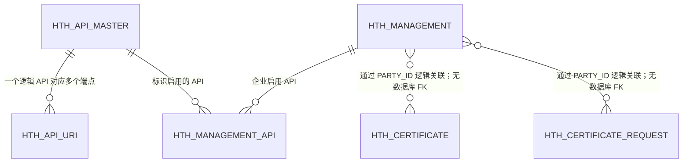
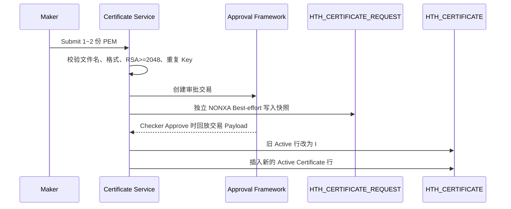

# HTH/H2H 核心表字段数据字典与优化建议

| 项目 | 内容 |
| --- | --- |
| 文档状态 | 与当前代码实现一致（As Implemented），并标注旧版对象、命名冲突与待数据库核验项 |
| 最后检查日期 | 2026-09-01 |
| 范围 | HTH/H2H API 目录、企业配置、证书、审批快照及 Audit Log 相关对象 |
| 主要证据 | Oracle DDL、EclipseLink ORM、Persistence Mapping 清单、Java Entity/Repository/Service、Seed SQL、JDBC Insert |

## 1. 文档目的和范围

本文档说明用户列出的以下数据对象中每个字段的业务目的、数据粒度、约束、主要读写路径和生命周期：

1. `hth_api_master`
2. `h2h_api_uri`
3. `h2h_audit_log`
4. `hth_certificate`
5. `h2h_certificate_request`
6. `h2h_management`
7. `h2h_management_api`

字段含义根据本代码库中的 Schema SQL、EclipseLink ORM Mapping、Java Entity、Repository Query 和 Application Service 综合分析，不是仅根据字段名称推测。

### 1.1 结论摘要

1. 当前代码库存在两代命名：旧版是 `DIGX_CZ_H2H_*`，新版是 `HTH_*`。两代对象字段高度相似，但不是同一张物理表。
2. 当前 `cz-hosttohost.cfg.xml` 只注册新版 `Hth*` ORM；旧版 `H2h*` Entity、Repository 和 Mapping 文件虽然仍在仓库中，但没有加入当前 Persistence Mapping 清单，原则上不应再作为当前运行时数据源。
3. 用户所称 `h2h_api_uri`、`h2h_management`、`h2h_management_api`，如果是描述当前业务，应分别对应新版 `HTH_API_URI`、`HTH_MANAGEMENT`、`HTH_MANAGEMENT_API`；旧版物理表只应视为待迁移/待退役对象。
4. 仓库中没有 `H2H_AUDIT_LOG` 或 `HTH_AUDIT_LOG` 的建表 DDL、ORM、Entity 或 Repository。`H2H_API_AUDIT_LOG` / `HTH_API_AUDIT_LOG` 是 API Master 的 `ID`，不是审计表名。
5. 当前能确认的 HTH Host 审计落点是 `DIGX_CZ_HOSTAUDITLOG`，但仓库缺少其 DDL，只能根据 JDBC Insert 说明字段用途，不能确认数据类型、主键、Nullability 和索引。
6. 仓库没有旧版 `H2H_CERTIFICATE` / `H2H_CERTIFICATE_REQUEST`。证书当前实现只使用新版 `HTH_CERTIFICATE` 和 `HTH_CERTIFICATE_REQUEST`。
7. `HTH_MANAGEMENT*` 和 `HTH_CERTIFICATE*` 都采用“当前生效表 + 审批交易/快照”的模式；但 Request Snapshot 目前使用独立 `NONXA` Transaction 和 Best-effort 保存，失败不会阻止审批交易创建，存在审批列表有记录但详情快照缺失、重复判断与审批列表短暂不一致的风险。

### 1.2 证据可信度说明

| 等级 | 含义 | 本文使用方式 |
| --- | --- | --- |
| A | 同时有 DDL、ORM 和实际 Service/Repository 读写路径 | 可确认字段类型、约束和运行行为。 |
| B | 有 DDL/ORM，但实际业务调用有限或没有找到完整调用链 | 可确认结构；业务用途需标注实现边界。 |
| C | 只有 JDBC SQL 或 Seed Data，没有建表 DDL | 只能说明观察到的字段和值来源，不能下结论到类型、PK、FK、索引。 |
| D | 只出现为常量、API ID 或用户口头名称 | 不能当成物理表，必须先查询目标数据库。 |

## 2. 用户名称、物理对象和当前运行时对象的对应关系

| 用户名称 | 仓库中找到的旧版对象 | 当前新版对象 | 当前运行时判断 | 证据等级 |
| --- | --- | --- | --- | --- |
| `hth_api_master` | `DIGX_CZ_H2H_API_MASTER` | `HTH_API_MASTER` | 当前 Persistence 配置注册 `HthApiMaster`；应以新版为准。 | A |
| `h2h_api_uri` | `DIGX_CZ_H2H_API_URI` | `HTH_API_URI` | 当前 Persistence 配置注册 `HthApiUri`；旧版 Mapping 未注册。 | B |
| `h2h_audit_log` | 未找到同名表 | 未找到同名表 | `H2H_API_AUDIT_LOG`/`HTH_API_AUDIT_LOG` 是 API ID；最接近的物理落点为 `DIGX_CZ_HOSTAUDITLOG`。 | C/D |
| `hth_certificate` | 无 | `HTH_CERTIFICATE` | 当前证书 Search/Download/Approve 生效配置均使用新版。 | A |
| `h2h_certificate_request` | 无 | `HTH_CERTIFICATE_REQUEST` | 当前 Maker/Checker 证书快照使用新版；不存在已找到的旧版证书 Request 表。 | A |
| `h2h_management` | `DIGX_CZ_H2H_MANAGEMENT` | `HTH_MANAGEMENT` | 当前 Management、Certificate 和 User Access Service 使用新版 `HthManagement`。 | A |
| `h2h_management_api` | `DIGX_CZ_H2H_MANAGEMENT_API` | `HTH_MANAGEMENT_API` | 当前企业 API 授权和 User Access 上限使用新版。 | A |

后文以当前新版 `HTH_*` 为主进行逐字段说明；对于确实存在的旧版 `DIGX_CZ_H2H_*`，会在每节列出差异。这样既覆盖用户原始名称，也不会把旧表误认为当前运行表。

## 3. 需要注意的物理名称问题

当前代码库存在以下 Schema 或表名不一致。部署前应明确并修正，不能只通过文档掩盖。

| 对象 | Schema SQL | 当前 ORM 或数据脚本 | 结论 |
| --- | --- | --- | --- |
| `HTH_API_MASTER` | `HTH_BEAUAT` | ORM：`HTH_BEA` | 建表 SQL 与运行时 Mapping 不一致。 |
| `HTH_API_URI` | `HTH_BEAUAT` | ORM：`HTH_BEAUAT`；Seed Script：`DIGX_CZ_HTH_API_URI` | DDL/ORM 表名与 Seed Script 表名不一致。 |
| `HTH_MANAGEMENT` | `HTH_BEAUAT` | ORM：`HTH_BEA` | 建表 SQL 与运行时 Mapping 不一致。 |
| `HTH_MANAGEMENT_API` | `HTH_BEAUAT` | ORM：`HTH_BEA` | 建表 SQL 与运行时 Mapping 不一致。 |
| `HTH_CERTIFICATE` | `HTH_BEAUAT` | ORM：`HTH_BEAUAT` | DDL 与 ORM 一致。 |
| `HTH_CERTIFICATE_REQUEST` | `HTH_BEAUAT` | ORM：`HTH_BEAUAT` | DDL 与 ORM 一致。 |
| `HTH_AUDIT_LOG` | 未找到 | 未找到 ORM、Entity 或 Repository | 代码库中没有这个确切名称的物理表，详见第 7 节。 |

下文字段定义以当前可找到的 DDL 和 ORM Column 为准。实际部署前必须先确定每个对象的权威 Schema Owner 和物理表名。

### 3.1 这些不一致为什么是高风险问题

- Oracle 对未指定 Schema 的表名会按当前登录用户解析；同一 SQL 在不同 Datasource User 下可能访问不同对象。
- DDL 在 `HTH_BEAUAT`，部分 ORM 却写死 `HTH_BEA`，会造成“脚本执行成功但应用查不到数据”或在两个 Schema 中形成两份配置。
- URI Seed 写入 `DIGX_CZ_HTH_API_URI`，而 DDL/ORM 使用 `HTH_API_URI`，可能导致 Seed Data 已存在但 Repository 返回空集合。
- 旧版 `DIGX_CZ_H2H_*` 类仍保留，容易让后续开发人员引用错误 Entity/Repository，形成双写或读写分离。
- Schema 名带环境后缀 `UAT` 不应固化在通用代码和正式 DDL 中，否则跨环境部署需要改源码，而不是只切换配置。

## 4. 数据关系



几类表的主要区别是：

- `HTH_API_MASTER` 和 `HTH_API_URI`：定义系统中有哪些 HTH API。
- `HTH_MANAGEMENT` 和 `HTH_MANAGEMENT_API`：定义某个企业可以使用哪些 HTH API。
- `HTH_CERTIFICATE`：保存当前已审批生效的 Public Certificate/Public Key。
- `HTH_CERTIFICATE_REQUEST`：保存 Maker/Checker 提交时的证书快照。

## 5. 公共生命周期字段

六张物理 `HTH_*` 表使用相同的生命周期字段：

| 字段 | 通用用途 |
| --- | --- |
| `ID` | 技术主键，是 ORM 和外键使用的稳定标识，不是显示名称。 |
| `OBJECT_STATUS` | 记录软状态。当前 Service 和 Repository 使用 `A` 表示 Active，`I` 表示 Inactive。置为 Inactive 可以保留历史并避免破坏外键引用。 |
| `CREATED_BY` | 创建记录的用户 ID 或系统账号。ORM 将该字段标记为不可更新。 |
| `CREATION_DATE` | 创建时间，Oracle 默认值为 `SYSDATE`。ORM 将该字段标记为不可更新。 |
| `LAST_UPDATED_BY` | 最后一次修改记录的用户 ID 或系统账号。 |
| `LAST_UPDATE_DATE` | 最后更新时间；新建时默认值为 `SYSDATE`。 |
| `OBJECT_VERSION_NUMBER` | EclipseLink 乐观锁版本号。ORM 使用 `<version>` Mapping，每次更新时递增，防止旧数据覆盖较新的修改。这些既有表仍然需要该字段。 |

现有 DDL 没有为每张表的 `OBJECT_STATUS` 都建立 Check Constraint，因此 `A`/`I` 规则主要由 Application 和 Repository Contract 保证。

## 6. API 目录表

### 6.1 `HTH_API_MASTER`

用途：每行定义一项逻辑 HTH API 能力，供 HTH Management 和 User Access 页面展示和授权。一个逻辑 API 可以包含多个实际 URI。

数据粒度：每个稳定的 `API_CODE` 一行。

| 字段 | 类型和约束 | 用途和行为 |
| --- | --- | --- |
| `ID` | `VARCHAR2(36)`，PK，非空 | API Master 技术标识，被 `HTH_API_URI`、`HTH_MANAGEMENT_API`、Request Snapshot 和 User Access 表引用。Seed Data 使用类似 `HTH_API_AUDIT_LOG` 的稳定 ID。 |
| `API_CODE` | `VARCHAR2(64)`，Unique，非空 | Java 业务逻辑和授权使用的稳定业务代码，例如 `BALANCE_INQUIRY`、`AUDIT_LOG`。即使显示名称改变，该值也应保持稳定。 |
| `API_NAME` | `VARCHAR2(255)`，非空 | HTH Management 和 User Access 页面显示的 API 名称。修改显示名称不会改变 API 身份。 |
| `DISPLAY_ORDER` | `NUMBER`，可空 | API Catalogue/UI 显示顺序。Active List Repository 按该字段排序。使用 10、20、30 等间隔值便于后续插入新 API。 |
| `OBJECT_STATUS` | `VARCHAR2(1)`，默认 `A`，非空 | `A` 表示 API 可选且有效；`I` 表示停用，但保留历史引用。 |
| `CREATED_BY` | `VARCHAR2(255)`，非空 | 创建或初始化 API 定义的用户/系统账号。 |
| `CREATION_DATE` | `DATE`，默认 `SYSDATE`，非空 | API 定义的创建时间。 |
| `LAST_UPDATED_BY` | `VARCHAR2(255)`，非空 | 最后修改 API 名称、顺序或状态的用户/系统账号。 |
| `LAST_UPDATE_DATE` | `DATE`，默认 `SYSDATE`，非空 | API Master 最后修改时间。 |
| `OBJECT_VERSION_NUMBER` | `NUMBER`，默认 `1`，非空 | EclipseLink 乐观锁版本，防止并发更新时丢失其他人的修改。 |

关键规则：

- `API_CODE` 是业务标识；`ID` 是关系型数据库标识。
- 停用 API 应设置 `OBJECT_STATUS='I'`，不能物理删除仍被其他表引用的记录。
- 当前 Seed Data 包括 Account Activity、Balance Inquiry、Download Report、Local Payment Inquiry、Exchange Rate Inquiry、FX Transaction Inquiry 和 Audit Log。

主要读写路径：

- `HostToHostManagement.search` 通过 `listActive()` 查询 `OBJECT_STATUS='A'` 的 API，按 `DISPLAY_ORDER`、`API_NAME` 排序后生成企业 HTH API 选择列表。
- `HostToHostManagement` 在提交和审批时通过 `listActiveByApiCodes()` 把前端提交的稳定 `API_CODE` 解析为 `ID`；任一选中的 Code 无法解析都会拒绝保存。
- `HTH_MANAGEMENT_API` 保存的是 `API_MASTER_ID`，而不是 `API_CODE`。因此修改 `API_MASTER.ID` 会破坏关系，修改 `API_NAME` 则只影响展示。
- HTH User Access 会先读取企业的 Active `HTH_MANAGEMENT_API`，再读取对应 Active API Master，把它作为用户级 API 授权的上限。
- API Master 的 Seed Script 使用 `MERGE ... ON (API_CODE)`，重复执行会更新名称、顺序、状态和版本号，不会按 `ID` 重复插入。

### 6.2 `HTH_API_URI`

用途：将一个逻辑 API Master 映射到一个或多个具体的相对 Endpoint Path。

数据粒度：某个 API Master 下的一个 URI 一行。

| 字段 | 类型和约束 | 用途和行为 |
| --- | --- | --- |
| `ID` | `VARCHAR2(36)`，PK，非空 | URI Mapping 的技术标识。 |
| `API_MASTER_ID` | `VARCHAR2(36)`，FK，非空 | 引用 `HTH_API_MASTER.ID`，说明该 Endpoint 属于哪项逻辑 API。 |
| `API_URI` | `VARCHAR2(512)`，非空 | 相对 Endpoint Path，例如 `auditLog/v1/logs`，不包含 Host Name。当前模型没有 HTTP Method 字段，因此无法通过此表区分同一路径下不同 Method。 |
| `DISPLAY_ORDER` | `NUMBER`，可空 | 同一 API Master 下多个 Endpoint 的显示/配置顺序。`listActiveByApiMasterId` 按该字段排序；它不是授权优先级。 |
| `OBJECT_STATUS` | `VARCHAR2(1)`，默认 `A`，非空 | `A` 表示参与 Active Query；`I` 表示停用 Mapping，但不删除记录。 |
| `CREATED_BY` | `VARCHAR2(255)`，非空 | 创建或初始化 URI Mapping 的用户/系统账号。 |
| `CREATION_DATE` | `DATE`，默认 `SYSDATE`，非空 | URI Mapping 创建时间。 |
| `LAST_UPDATED_BY` | `VARCHAR2(255)`，非空 | 最后修改 URI、顺序或状态的用户/系统账号。 |
| `LAST_UPDATE_DATE` | `DATE`，默认 `SYSDATE`，非空 | URI Mapping 最后修改时间。 |
| `OBJECT_VERSION_NUMBER` | `NUMBER`，默认 `1`，非空 | URI Mapping 并发更新使用的乐观锁版本。 |

关键约束：

- PK：`ID`。
- FK：`API_MASTER_ID -> HTH_API_MASTER.ID`。
- Unique：`(API_MASTER_ID, API_URI)`，防止同一逻辑 API 下重复配置同一个 Endpoint。

当前实现边界：Repository 可以按 API Master 查询 Active URI，但 BCOH2H-595 Runtime Authorization 接收的是已经解析好的 `API_CODE`；当前代码还没有显示 HTH Request Ingress 如何通过 `HTH_API_URI` 将请求 URI 解析为 `API_CODE`。

主要读写路径：

- `LocalHthApiUriRepositoryAdapter.listActiveByApiMasterId()` 按 `API_MASTER_ID + OBJECT_STATUS='A'` 查询，并按 `DISPLAY_ORDER` 排序。
- 当前 Application Service 中没有发现把 Incoming Request URI 反查为 `API_MASTER_ID/API_CODE` 的调用；因此此表目前更像配置目录，而不是已经闭环的 Runtime Authorization Source。
- 当前 URI Seed 包含余额查询、Audit Log 和汇率查询等路径，但 Seed 写入的是 `DIGX_CZ_HTH_API_URI`，与 ORM 的 `HTH_BEAUAT.HTH_API_URI` 不一致。必须在数据库确认二者是否通过 Synonym/View 指向同一对象。

### 6.3 旧版 `DIGX_CZ_H2H_API_MASTER` / `DIGX_CZ_H2H_API_URI` 差异

旧版两张表的字段、类型和约束与新版基本一致，因此上述逐字段解释同样适用，但有以下差异：

| 项目 | 旧版 H2H | 当前 HTH | 影响 |
| --- | --- | --- | --- |
| 表名 | `DIGX_CZ_H2H_API_MASTER`、`DIGX_CZ_H2H_API_URI` | `HTH_API_MASTER`、`HTH_API_URI` | 是不同物理对象，不能只因字段相同就混用。 |
| API Master Seed ID | `H2H_API_*` | `HTH_API_*` | 同一个 `API_CODE` 在两套表中的外键 ID 不同。 |
| ORM Entity | `H2hApiMaster`、`H2hApiUri` | `HthApiMaster`、`HthApiUri` | 当前 Persistence Config 仅注册 `Hth*`。 |
| Schema | 旧 DDL 未显式指定 Owner | 新 DDL 使用 `HTH_BEAUAT`，部分 ORM 使用 `HTH_BEA` | 迁移时必须显式指定 Source/Target Owner。 |

结论：如目标是当前 HTH 功能，不能继续向旧 `DIGX_CZ_H2H_API_URI` 写数据。迁移应以 `API_CODE` 为业务匹配键，再转换成新版 `HTH_API_MASTER.ID`，不能直接复制旧外键 ID 后假定一定有效。

## 7. HTH Audit Log 说明

### 7.1 未找到物理 `HTH_AUDIT_LOG` / `H2H_AUDIT_LOG` 表

代码库中没有找到 `CREATE TABLE HTH_AUDIT_LOG`、EclipseLink Mapping、Java Entity 或 Repository Adapter。

当前代码库实际包含：

1. `HTH_API_MASTER` 中的一条 Catalogue Record：
   - `ID = HTH_API_AUDIT_LOG`
   - `API_CODE = AUDIT_LOG`
   - `API_NAME = Audit Log`
2. 一条 URI Seed Record，将该 API Master 映射到 `auditLog/v1/logs`。

因此，`HTH_API_AUDIT_LOG` 是一个 API Master ID，不能据此认为数据库中存在物理 `HTH_AUDIT_LOG` 表。

### 7.2 最接近的 HTH 专用审计表：`DIGX_CZ_HOSTAUDITLOG`

`FRXReceiverMDB` 会把处理完成的 Host Request Audit Data 写入 `DIGX_CZ_HOSTAUDITLOG`。代码库中没有该表的 DDL，因此无法确认字段类型、Nullability、主键和索引。下列用途根据 Insert Statement 和传入值分析得出。

| 观察到的字段 | 根据代码分析的用途 |
| --- | --- |
| `IDSEQ` | 审计记录唯一序号，由 `yyMMddHHmmss` 加六位数据库 Sequence 组成。 |
| `IDHOST` | Host/系统标识，来源于 Audit Data 的 `HOST`。 |
| `IDREQUEST` | 请求标识，用于关联审计记录和已处理的 Host Request。 |
| `HOST_REQUEST` | 发送给 Host 的 Request Payload，可能包含敏感业务数据，日志和导出时需要保护或脱敏。 |
| `HOST_RESPONSE` | Host 返回的 Response Payload，可能包含敏感业务数据，日志和导出时需要保护或脱敏。 |
| `ERROR_CODE` | Host 或 Integration 处理失败时的错误码。 |
| `ERROR_DESC` | 与 `ERROR_CODE` 对应的可读错误说明。 |
| `EXECUTION_START_TIME` | Host Processing 开始时间。 |
| `EXECUTION_END_TIME` | Host Processing 结束时间；与开始时间一起用于计算处理耗时。 |
| `STATUS` | Integration Flow 提供的最终处理结果。代码库中没有定义完整允许值。 |
| `VERSION` | `FRXReceiverMDB` 固定写入 `1`；当前代码没有显示该表使用 ORM 乐观锁。 |
| `REFERENCENO` | 用于关联 Host Interaction 和客户/Application Transaction 的业务参考号；没有参考号时写入空白值。 |

系统还存在平台公共表 `DIGX_AL_API_AUDIT_LOGGING`，但它是 OBDX 通用 API Audit 表，不是物理 `HTH_AUDIT_LOG`。如果目标环境另外存在自定义 `HTH_AUDIT_LOG`，必须提供对应 DDL，才能对其字段做权威说明。

### 7.3 `DIGX_CZ_HOSTAUDITLOG` 的实际写入行为

`FRXReceiverMDB.logCompleteAuditInfo()` 的行为如下：

1. 从 `DIGX` Datasource 取得 JDBC Connection。
2. 调用 `getHostAuditSeqNo()` 生成 `IDSEQ`，格式是 `yyMMddHHmmss + 6 位 Sequence`。
3. 从 `auditData` Map 依次取出 Host、Request ID、Request/Response Payload、错误信息、开始/结束时间、状态和参考号。
4. 使用一条 Raw JDBC Insert 同步写入 `DIGX_CZ_HOSTAUDITLOG`。
5. `VERSION` 固定写 `1`；`REFNO` 为空时写一个空格字符串，而不是数据库 `NULL`。
6. 方法捕获并打印异常，不向调用者继续抛出；因此 Audit Insert 失败不会回滚主业务。
7. `finally` 中显式执行 `commit()`，说明这是独立 JDBC 提交，不受 HTH ORM 乐观锁管理。

当前实现风险：

- `System.out.println("Audit Logging with data as " + l_args)` 会把完整 Request/Response Payload 输出到应用日志，可能造成敏感数据二次泄露。
- 审计失败只打印异常，主流程仍继续，系统可能出现“业务成功但审计缺失”。
- `STATUS` 没有在当前仓库中找到值域定义；跨系统统计时可能出现同义不同值。
- `REFNO` 用单个空格代替 `NULL`，会破坏空值查询、唯一性和数据质量统计。
- 缺少 DDL，无法确认 `IDSEQ` 是否真的有 PK/Unique Constraint，也无法确认 Payload 列是否为 CLOB、是否加密、是否有长度截断风险。
- 代码没有显示数据保留期限、归档、分区或清理机制；Payload 审计表通常增长很快。

## 8. 证书表

### 8.1 `HTH_CERTIFICATE`

用途：保存 Maker/Checker 审批通过后，某个 Corporate Party 当前生效的 Public Certificate/Public Key 配置。

数据粒度：一个 Party 的一份生效证书文件一行。当前 Service 每次审批通过的配置最多允许两份文件。

| 字段 | 类型和约束 | 用途和行为 |
| --- | --- | --- |
| `ID` | `VARCHAR2(36)`，PK，非空 | Certificate 技术标识，Search/Download 使用该值。请求带有 Certificate ID 时 Service 会保留；否则生成 UUID。 |
| `PARTY_ID` | `VARCHAR2(64)`，非空 | 拥有并使用该 Public Certificate 的 Corporate Party。Certificate Search 和 Download 都按该值隔离。当前 DDL 没有到 Party 表的 FK。 |
| `REFERENCE_NO` | `VARCHAR2(64)`，可空 | Upload Request 的客户可见参考号，通常以 `HTHCERT` 开头，用于从生效证书追溯到提交确认记录。 |
| `EFFECTIVE_TRANSACTION_ID` | `VARCHAR2(64)`，可空 | 使该证书生效的 Approval Framework Transaction ID，用于审计追踪，不是该行主键。 |
| `SEQ_NO` | `NUMBER(2)`，非空 | 证书在审批通过的 Upload Payload 中的顺序。Service 从 `1` 开始连续写入，目前最大为 `2`。 |
| `FILE_NAME` | `VARCHAR2(255)`，非空 | 清理后的原始 `.pem` 文件名，用于显示和下载。Service 拒绝路径分隔符、控制字符和非 PEM Extension。 |
| `PEM_CONTENT` | `CLOB`，非空 | 当前生效的 PEM Public Material。支持 `CERTIFICATE`、`PUBLIC KEY`、`RSA PUBLIC KEY`；拒绝 Private Key。Service 限制为 64 KiB，并要求 RSA Key 至少 2048 Bit。 |
| `OBJECT_STATUS` | `VARCHAR2(1)`，默认 `A`，非空 | `A` 表示当前生效。新 Upload 审批通过时，Service 先将现有 Active Row 更新为 `I`，再插入新的 Active Row。 |
| `CREATED_BY` | `VARCHAR2(255)`，非空 | 创建生效记录的 Checker/Approval Execution User 或系统账号。 |
| `CREATION_DATE` | `DATE`，默认 `SYSDATE`，非空 | 审批通过的 Certificate Row 创建时间。 |
| `LAST_UPDATED_BY` | `VARCHAR2(255)`，非空 | 最后修改 Certificate Row 的用户/系统账号，包括执行软停用的账号。 |
| `LAST_UPDATE_DATE` | `DATE`，默认 `SYSDATE`，非空 | Certificate Row 最后修改时间。 |
| `OBJECT_VERSION_NUMBER` | `NUMBER`，默认 `1`，非空 | EclipseLink 乐观锁版本，防止并发 Certificate Update 静默覆盖。 |

索引 `IDX_HTH_CERTIFICATE_PARTY (PARTY_ID, OBJECT_STATUS, SEQ_NO)` 用于按顺序查询某个 Party 当前 Active Certificate Set。

安全说明：`PEM_CONTENT` 只允许保存 Public Material，但仍应避免无必要的日志记录和批量暴露。普通 Search Response 不返回 Content，只有单独授权的 Download Operation 才返回。

### 8.2 `HTH_CERTIFICATE_REQUEST`

用途：保存 Maker 提交的证书文件快照，供 Approval Lookup 和历史查看使用。

数据粒度：一个 Approval Transaction 中的一份证书文件一行。上传两份证书会生成两行，拥有相同的 Transaction/Reference，但 `SEQ_NO` 不同。

| 字段 | 类型和约束 | 用途和行为 |
| --- | --- | --- |
| `ID` | `VARCHAR2(36)`，PK，非空 | 一份 Request File Snapshot 的 UUID，与最终生效的 Certificate ID 相互独立。 |
| `TRANSACTION_ID` | `VARCHAR2(64)`，DDL 中可空 | Approval Framework Transaction ID，用于将一次 Request 的所有证书文件分组，并在审批/历史查询中读取。正常写入 Snapshot 前，Service 从 Thread Attribute 获取该值。没有到 `DIGX_AP_TRANSACTION` 的数据库 FK。 |
| `REFERENCE_NO` | `VARCHAR2(64)`，可空 | Maker 提交时复制的客户可见 `HTHCERT...` 参考号，审批通过后会复制到 Effective Row。 |
| `PARTY_ID` | `VARCHAR2(64)`，非空 | 本次证书提交所属的 Corporate Party，也用于检查该 Party 是否已经有 Pending Certificate Request。 |
| `ACTION_TYPE` | `VARCHAR2(32)`，非空 | 请求的 Certificate Operation。当前 Service 只写 `UPLOAD`；较宽的字段允许未来扩展，但当前没有实现其他类型。 |
| `SEQ_NO` | `NUMBER(2)`，非空 | 文件在 Maker Payload 中的原始顺序，从 `1` 开始，用于保持 Review Display Order。 |
| `FILE_NAME` | `VARCHAR2(255)`，非空 | Submit 时捕获的已验证 `.pem` 文件名，确保 Checker 看到 Maker 实际提交的文件信息。 |
| `PEM_CONTENT` | `CLOB`，非空 | Submit 时捕获的已验证 Public Certificate/Public Key Content，避免 Maker 提交后客户端再修改审批内容。 |
| `OBJECT_STATUS` | `VARCHAR2(1)`，默认 `A`，非空 | `A` 表示该 Transaction 当前使用的 Snapshot。Service 为同一 Transaction 重写 Snapshot 时，会先把旧 Active Row 更新为 `I`。 |
| `CREATED_BY` | `VARCHAR2(255)`，非空 | 创建 Request Snapshot 的 Maker 或系统账号。 |
| `CREATION_DATE` | `DATE`，默认 `SYSDATE`，非空 | Request File Snapshot 写入时间。 |
| `LAST_UPDATED_BY` | `VARCHAR2(255)`，非空 | 最后修改或停用 Snapshot Row 的用户/系统账号。 |
| `LAST_UPDATE_DATE` | `DATE`，默认 `SYSDATE`，非空 | Request Row 最后修改时间。 |
| `OBJECT_VERSION_NUMBER` | `NUMBER`，默认 `1`，非空 | Request Snapshot 并发更新使用的 EclipseLink 乐观锁版本。 |

索引：

- `IDX_HTH_CERTIFICATE_REQ_TXN (TRANSACTION_ID, OBJECT_STATUS, SEQ_NO)`：按审批 Transaction 查询当前有序 Snapshot。
- `IDX_HTH_CERTIFICATE_REQ_PARTY (PARTY_ID, OBJECT_STATUS)`：按 Corporate Party 检查 Pending Request。

实现说明：Maker Snapshot 使用独立 `NONXA` Transaction，并采用 Best-effort 保存。Snapshot 写入失败会记录 Error Log，但不会取消 Approval Request。因此该表是重要的历史/Review 数据，但 Approval Framework 才是 Workflow Status 的权威来源。

### 8.3 证书提交与生效生命周期



需要明确的业务边界：

- Search 和 Download 都先验证 `HTH_MANAGEMENT.HTH_STATUS='ENABLE'`，并按 Session Party 隔离数据。
- 普通 Search 只返回 `ID + FILE_NAME`，不返回 `PEM_CONTENT`；单独的 Download 才返回内容。
- Submit 最多接收两份 PEM；支持 X.509 Certificate、SubjectPublicKeyInfo Public Key 和 PKCS#1 RSA Public Key。
- Service 计算 SHA-256 Public Key Fingerprint，用来拦截同一次 Upload 内重复 Key，以及与当前 Active Key 重复；但 Fingerprint 没有持久化，每次都要重新解析 CLOB。
- Maker Submit 前的重复判断不是单看 `HTH_CERTIFICATE_REQUEST`，而是把该表按 `TRANSACTION_ID` Join `DIGX_AP_TRANSACTION`，只把 `PENDING_APPROVAL`、`MODIFICATION_REQUESTED` 视为 Pending。
- `HTH_CERTIFICATE_REQUEST.TRANSACTION_ID` 在 DDL 中可空，但正常写入路径要求它存在；这种结构与业务规则不一致。
- Approve 时不是把 Request Row 直接搬到 Effective Table，而是由 Approval Framework 回放 DTO 后重新校验、再写 `HTH_CERTIFICATE`。Request Snapshot 主要用于审批详情/历史查阅。

### 8.4 为什么没有旧版 `H2H_CERTIFICATE_REQUEST`

仓库没有 `CREATE TABLE DIGX_CZ_H2H_CERTIFICATE_REQUEST`、`H2hCertificateRequest` Entity 或对应 ORM。用户所称 `h2h_certificate_request` 在当前实现中应解释为 `HTH_BEAUAT.HTH_CERTIFICATE_REQUEST`。如果某个目标数据库确实存在旧版同名表，需要用第 12 节 SQL 从 `ALL_TABLES/ALL_TAB_COLUMNS` 获取真实定义后再补充，不能依据当前代码臆测。

## 9. 企业 HTH 管理表

### 9.1 `HTH_MANAGEMENT`

用途：保存某个 Corporate Party 当前生效的 HTH Channel 配置。

数据粒度：每个 `PARTY_ID` 一行。

| 字段 | 类型和约束 | 用途和行为 |
| --- | --- | --- |
| `ID` | `VARCHAR2(36)`，PK，非空 | Management Configuration 技术 ID，由 `HTH_MANAGEMENT_API.HTH_MANAGEMENT_ID` 引用。 |
| `PARTY_ID` | `VARCHAR2(64)`，Unique，非空 | 该 HTH Channel Configuration 所属的 Corporate Party，是主要业务查询键。 |
| `UAM_CLIENT_ID` | `VARCHAR2(128)`，Unique，可空 | 通过 DSP/UAM Client API 验证的外部/关联 UAM Client ID。HTH Enable 时保存，Disable 时从 Effective Table 清空。永久禁止复用由独立的 `HTH_UAM_CLIENT_REGISTRY` 处理。 |
| `HTH_STATUS` | `VARCHAR2(16)`，非空 | 企业 HTH Channel 当前状态。Service 使用 `ENABLE` 和 `DISABLE`；BCOH2H-538/595 只把 `ENABLE` 视为可以维护和授权。 |
| `APPROVAL_FLOW_TYPE` | `VARCHAR2(32)`，可空 | 企业 API Transaction Approval 行为。当前 UI/Service 默认值为 `STRAIGHT_THROUGH`，HTH Disable 时清空。现有 DDL 没有 Allowed Value Check Constraint。 |
| `OBJECT_STATUS` | `VARCHAR2(1)`，默认 `A`，非空 | Configuration Row 自身的生命周期。即使 `HTH_STATUS='DISABLE'`，该字段通常仍为 `A`；判断业务是否启用必须同时检查两个字段。 |
| `CREATED_BY` | `VARCHAR2(255)`，非空 | 首次创建 Party Configuration 的用户/系统账号。 |
| `CREATION_DATE` | `DATE`，默认 `SYSDATE`，非空 | Party Configuration 首次创建时间。 |
| `LAST_UPDATED_BY` | `VARCHAR2(255)`，非空 | 最后执行 HTH Enable、Edit 或 Disable 的用户/系统账号。 |
| `LAST_UPDATE_DATE` | `DATE`，默认 `SYSDATE`，非空 | Effective Configuration 最后修改时间。 |
| `OBJECT_VERSION_NUMBER` | `NUMBER`，默认 `1`，非空 | 保护企业配置并发修改的 EclipseLink 乐观锁版本。 |

关键规则：

- `PARTY_ID` Unique，保证每个企业只有一行 Effective HTH Configuration。
- `UAM_CLIENT_ID` Unique，防止两个当前配置使用相同的非空 Client ID。Oracle 允许多行 Null，符合 Disabled Row 的需求。
- `OBJECT_STATUS` 与 `HTH_STATUS` 不能混用：前者管理记录生命周期，后者管理 HTH 业务 Channel 状态。

### 9.2 `HTH_MANAGEMENT_API`

用途：企业层当前已启用 API 的关联表，是 User Access 的授权上限；用户级授权只能是这些 API 的子集。

数据粒度：一个 HTH Management Configuration 下启用的一项 API Master 一行。

| 字段 | 类型和约束 | 用途和行为 |
| --- | --- | --- |
| `ID` | `VARCHAR2(36)`，PK，非空 | Enterprise-to-API Link 的技术标识。 |
| `HTH_MANAGEMENT_ID` | `VARCHAR2(36)`，FK，非空 | 引用 `HTH_MANAGEMENT.ID`，说明 API Selection 属于哪个企业配置。 |
| `API_MASTER_ID` | `VARCHAR2(36)`，FK，非空 | 引用 `HTH_API_MASTER.ID`，说明企业启用了哪项逻辑 API。 |
| `OBJECT_STATUS` | `VARCHAR2(1)`，默认 `A`，非空 | `A` 表示企业当前启用该 API。Edit/Disable 时 Service 会软停用旧 Link，并重新激活或创建新选择的 Link。 |
| `CREATED_BY` | `VARCHAR2(255)`，非空 | 首次创建 Enterprise API Link 的用户/系统账号。 |
| `CREATION_DATE` | `DATE`，默认 `SYSDATE`，非空 | Enterprise API Link 创建时间。 |
| `LAST_UPDATED_BY` | `VARCHAR2(255)`，非空 | 最后激活或停用该 Link 的用户/系统账号。 |
| `LAST_UPDATE_DATE` | `DATE`，默认 `SYSDATE`，非空 | Link 状态最后修改时间。 |
| `OBJECT_VERSION_NUMBER` | `NUMBER`，默认 `1`，非空 | 保护 Link 并发修改的 EclipseLink 乐观锁版本。 |

关键约束：

- PK：`ID`。
- FK：`HTH_MANAGEMENT_ID -> HTH_MANAGEMENT.ID`。
- FK：`API_MASTER_ID -> HTH_API_MASTER.ID`。
- Unique：`(HTH_MANAGEMENT_ID, API_MASTER_ID)`，保证每个 Enterprise/API Pair 只有一条可复用 Link Record。

授权判断：

1. `HTH_MANAGEMENT.OBJECT_STATUS` 必须为 Active。
2. `HTH_MANAGEMENT.HTH_STATUS` 必须为 `ENABLE`。
3. 对应的 `HTH_MANAGEMENT_API` Link 必须为 Active。
4. 引用的 `HTH_API_MASTER` 也必须为 Active。
5. 对于 BCOH2H-595，还必须存在 User/Account API Grant；企业启用 API 本身不会自动授予某个用户权限。

### 9.3 Management 的实际读写生命周期

1. 查询页面按 `PARTY_ID + OBJECT_STATUS='A'` 读取 `HTH_MANAGEMENT`。
2. 若企业已启用，再按 `HTH_MANAGEMENT_ID + OBJECT_STATUS='A'` 读取 `HTH_MANAGEMENT_API`。
3. API 选择列表来自 Active `HTH_API_MASTER`；已选择状态通过 Management API Link 反查。
4. Maker 提交 Enable/Edit/Disable 时，先校验当前状态、UAM Client ID 和至少一个 API；此时不应直接修改 Effective Table。
5. Approval Framework 建立交易后，Service 另开 `NONXA` Transaction Best-effort 写 `HTH_REQUEST/HTH_REQUEST_API` 快照。这两张 Request 表不在用户本次七表范围内，但它们直接影响重复提交判断和审批详情。
6. Checker Approve 时才 Upsert `HTH_MANAGEMENT`：Enable/Edit 写 `ENABLE` 和 UAM Client ID；Disable 写 `DISABLE`，并清空 UAM Client ID 与 Approval Flow。
7. Approve 时先把现有 Active `HTH_MANAGEMENT_API` 全部改为 `I`，再把新选择的 Link 创建或重新激活为 `A`。
8. 新版还通过 `HTH_UAM_CLIENT_REGISTRY` 记录 UAM Client ID 的永久使用历史，防止 Disable 后被其他 Party 重用；旧版 H2H 结构没有该机制。

### 9.4 旧版 `DIGX_CZ_H2H_MANAGEMENT*` 与当前 `HTH_MANAGEMENT*` 差异

| 项目 | 旧版 `DIGX_CZ_H2H_*` | 当前 `HTH_*` | 业务影响 |
| --- | --- | --- | --- |
| 状态字段 | `H2H_STATUS` | `HTH_STATUS` | 迁移 SQL 必须显式映射列名。 |
| Link FK 字段 | `H2H_MANAGEMENT_ID` | `HTH_MANAGEMENT_ID` | 不能直接复用旧 SQL/ORM 属性名。 |
| Party 唯一性 | `PARTY_ID` Unique | `PARTY_ID` Unique | 语义一致：每个 Party 一条 Effective Row。 |
| UAM Client 唯一性 | 旧 DDL 没有 Unique | 新 DDL 有 `UK_HTH_MANAGEMENT_UAM_CLIENT` | 旧数据可能存在重复 UAM Client，迁移前必须清洗。 |
| 永久防复用 | 未找到 Registry | `HTH_UAM_CLIENT_REGISTRY` | 旧数据迁移后应回填 Registry，否则历史用过的 Client ID 仍可能被复用。 |
| 当前 Persistence 注册 | 未注册旧 `H2h*` Mapping | 注册新版 `Hth*` Mapping | 当前代码应只读写新版。 |

旧版字段逐项含义与第 9.1/9.2 基本一致，只需将 `HTH_STATUS` 替换为 `H2H_STATUS`，将 `HTH_MANAGEMENT_ID` 替换为 `H2H_MANAGEMENT_ID`。最重要的结构差异不是字段说明，而是新版新增的 UAM Client 唯一性和永久 Registry 规则。

## 10. 各对象的 Source of Truth

| 数据问题 | 权威来源 | 非权威/辅助来源 | 原因 |
| --- | --- | --- | --- |
| 系统有哪些可授权 API | `HTH_API_MASTER` | 前端写死列表、旧 `DIGX_CZ_H2H_API_MASTER` | `API_CODE`、名称、状态和顺序都由 Master 定义。 |
| 一个逻辑 API 包含哪些 Endpoint | `HTH_API_URI`，前提是命名/Schema 已统一 | `DIGX_CZ_HTH_API_URI` Seed、旧 `DIGX_CZ_H2H_API_URI` | 当前存在命名冲突，未统一前不能确认哪个表实际完整。 |
| 企业 HTH 当前是否启用 | Active `HTH_MANAGEMENT.HTH_STATUS` | Pending Request、页面缓存 | 只有 Checker Approve 后才更新 Effective Row。 |
| 企业当前允许哪些 HTH API | Active `HTH_MANAGEMENT_API` + Active `HTH_API_MASTER` | `HTH_REQUEST_API`、旧 H2H Link | Request 是历史快照，不是当前权限。 |
| 当前生效证书 | Active `HTH_CERTIFICATE` | `HTH_CERTIFICATE_REQUEST` | Request 是提交内容；Effective 表是审批结果。 |
| 审批交易当前状态 | `DIGX_AP_TRANSACTION.APPR_STATUS` | `HTH_REQUEST.OBJECT_STATUS`、`HTH_CERTIFICATE_REQUEST.OBJECT_STATUS` | Request 的 `OBJECT_STATUS` 只代表快照行生命周期，不代表审批状态。 |
| 审批详情中的 Maker 原始内容 | 首选平台 Transaction Snapshot；当前证书另有 `HTH_CERTIFICATE_REQUEST` | Effective 表 | Effective 表可能已被后续审批替换，不能还原当时提交内容。 |
| Host 调用审计 | 已观察到 `DIGX_CZ_HOSTAUDITLOG` | `HTH_API_AUDIT_LOG` API Master Row | 后者只是授权目录项，不保存审计事件。 |

最容易犯的错误是把所有 `OBJECT_STATUS='A'` 都理解为“审批中”或“已启用”。实际含义分别是：

- Master/URI/Link/Certificate 中的 `A`：该记录在应用查询中有效。
- `HTH_MANAGEMENT.HTH_STATUS='ENABLE'`：企业业务 Channel 已启用。
- `DIGX_AP_TRANSACTION.APPR_STATUS='PENDING_APPROVAL'`：审批交易正在等待 Checker。
- Request Snapshot 的 `A`：这是该 Transaction 当前使用的快照版本，不代表审批状态。

## 11. 优化建议

### 11.1 P0：统一 HTH/H2H 命名、Schema Owner 和运行时 Mapping

问题：同一业务在仓库中同时存在 `H2H`、`HTH`、`DIGX_CZ_HTH`、`HTH_BEA`、`HTH_BEAUAT` 多套名称。它会直接导致写入一张表、读取另一张表。

建议：

1. 选定唯一规范名称，建议当前功能统一为 `HTH_*`；`DIGX_CZ_H2H_*` 标记 Legacy，只读迁移后退役。
2. Schema Owner 不要使用带环境含义的硬编码 `HTH_BEAUAT`。建议通过部署变量、Datasource 默认 Schema 或稳定 Synonym 解析，例如所有环境的代码都访问 `HTH_BEA.HTH_*`，实际 Owner 由部署层决定。
3. 修正 `HTH_API_MASTER`、`HTH_MANAGEMENT*` 的 DDL/ORM Owner 不一致。
4. 修正 URI Seed：Seed、DDL 和 ORM 必须写同一对象；如果 `DIGX_CZ_HTH_API_URI` 是 View/Synonym，应把定义纳入版本库并写清楚。
5. 从 `cz-hosttohost.cfg.xml` 已经不再注册的旧 `H2h*` Entity/Repository/Mapping 开始做依赖扫描；确认无反射和外部配置引用后删除，避免误用。
6. 迁移旧数据时以 `API_CODE`、`PARTY_ID` 等业务键匹配，重新生成或转换新版 FK，不能直接假定旧 `H2H_API_*` ID 与新 `HTH_API_*` ID 相同。
7. 发布流水线增加 Schema Drift Check：校验目标库中对象 Owner、列、约束、索引与版本库 DDL 一致，不一致则阻止部署。

验收标准：

- 同一个环境中每个逻辑对象只有一个可写物理表。
- 应用日志打印的 SQL Owner 与部署清单一致。
- Seed 重复执行幂等，且执行后 Repository 能立即读到相同记录。
- 旧表停止新增数据，迁移前后 Count 和业务键核对通过。

### 11.2 P0：以平台 Transaction Snapshot 为审批内容主来源

当前问题：Management 和 Certificate Submit 在 Approval Framework 建立交易后，再用独立 `NONXA` Transaction Best-effort 写自建 Request Snapshot。快照失败被记录为 Non-fatal，审批仍成功创建；但重复提交判断和部分审批详情又依赖这些快照。

这会产生以下异常组合：

- `DIGX_AP_TRANSACTION` 有 Pending 交易，但 `HTH_REQUEST`/`HTH_CERTIFICATE_REQUEST` 没有记录。
- Pending Approval List 能看到交易，但详情页无法重建业务数据。
- 重复判断通过，因为 Join 缺少 Request Row，Maker 可以再次提交。
- 快照有记录但 Approval Framework 交易回滚/失败，形成孤儿快照。
- `NONXA` 独立提交和主交易没有原子性，短时间内不同查询看到不同状态。

推荐方案，与 BCO 同类功能保持一致：

1. 把平台 Transaction Snapshot 作为 Maker 提交内容和审批详情的唯一主来源。
2. Pending/重复判断直接查询平台交易，并使用 Task ID、Party ID、业务 Discriminator 等 Snapshot 字段定位，而不是要求先 Join 自建 Request 表。
3. Checker Approve 从平台 Snapshot 反序列化 DTO，重新做服务器端校验后更新 Effective 表。
4. 自建 `HTH_REQUEST*` / `HTH_CERTIFICATE_REQUEST` 如仅为报表或历史检索，可改成审批后异步投影，失败可重试，不参与交易正确性判断。
5. 如果法规要求必须同步保存独立快照，则应与审批交易放入同一 XA Transaction；或使用 Transactional Outbox + 幂等 Consumer，不能继续“失败不影响审批”但又依赖该表判断业务。
6. 为快照投影增加唯一幂等键，例如 `TRANSACTION_ID + ITEM_SEQ`，重试时 Upsert，而不是产生重复行。

### 11.3 P0：补齐 Audit Log 的权威 DDL 和失败策略

当前 `DIGX_CZ_HOSTAUDITLOG` 只有 Insert Code，没有 DDL。建议：

1. 从目标数据库导出 `DBMS_METADATA.GET_DDL`，纳入版本库，明确 PK、Sequence、数据类型、长度、Nullability、索引、分区和 Tablespace。
2. `IDSEQ` 建立 PK/Unique；如果继续使用时间字符串 + Sequence，应确认跨节点、跨时区、Sequence Reset 时仍不冲突。更简单的方案是独立数值/UUID PK，业务时间另存。
3. 不要在 `finally` 无条件 `commit()`；只有 Insert 成功才 Commit，失败应 Rollback，并安全处理 Connection 获取失败时的 Null。
4. 明确审计失败策略：强审计场景应阻止业务或进入可靠消息/补偿队列；弱审计场景也应有告警、指标和重试，不应只 `printStackTrace()`。
5. `REFERENCENO` 缺失时存 `NULL`，不要存单个空格。
6. `STATUS`、`ERROR_CODE` 建立值域/代码表或 Check Constraint，避免自由文本。
7. 增加 `CORRELATION_ID`、`TRACE_ID`、`PARTY_ID`、`USER_ID`、`API_CODE`、`HTTP_METHOD`、`RESPONSE_CODE`、`DURATION_MS` 等结构化字段，减少依赖 Payload 搜索。

### 11.4 P0：增加关键数据约束

现有 Application 做了很多校验，但直接 SQL、批处理或其他同事的程序仍可写入非法数据。建议把不可违反的规则下沉到数据库：

| 表 | 建议约束 | 目的 |
| --- | --- | --- |
| 所有 Effective/Mapping 表 | `CHECK (OBJECT_STATUS IN ('A','I'))` | 防止出现 Repository 永远查不到的未知状态。 |
| `HTH_MANAGEMENT` | `CHECK (HTH_STATUS IN ('ENABLE','DISABLE'))` | 固化业务状态值域。 |
| `HTH_MANAGEMENT` | `CHECK ((HTH_STATUS='ENABLE' AND UAM_CLIENT_ID IS NOT NULL) OR HTH_STATUS='DISABLE')`，视历史数据决定 | 避免启用状态没有 Client ID。 |
| `HTH_CERTIFICATE` | `CHECK (SEQ_NO BETWEEN 1 AND 2)` | 与 Service 最大两份文件规则一致。 |
| `HTH_CERTIFICATE_REQUEST` | `CHECK (SEQ_NO BETWEEN 1 AND 2)`、`CHECK (ACTION_TYPE='UPLOAD')` | 固化当前实现边界。 |
| `HTH_CERTIFICATE_REQUEST` | Active 行唯一 `TRANSACTION_ID + SEQ_NO` | 防止同一交易出现两份当前快照。 |
| `HTH_CERTIFICATE` | Active 行唯一 `PARTY_ID + SEQ_NO` | 防止并发审批产生两套同时 Active 的证书。 |
| `HTH_API_MASTER` | `CHECK (API_CODE=UPPER(TRIM(API_CODE)))` | 避免大小写/空格导致授权失配。 |
| `HTH_API_URI` | 规范化路径约束 | 避免 `/path`、`path/`、大小写等形式产生逻辑重复。 |

对于“只限制 Active Row 唯一”的场景，可使用 Oracle Function-based Unique Index，而不是普通 `(TRANSACTION_ID, OBJECT_STATUS, SEQ_NO)`；普通索引会使多条历史 `I` 行也互相冲突。

### 11.5 P1：优化证书模型和安全控制

1. 增加 `PUBLIC_KEY_FINGERPRINT_SHA256` 并建立索引/唯一策略。当前每次重复检查都要读取并解析所有 Active CLOB，数据量上升后成本高。
2. 增加结构化 Metadata：`KEY_ALGORITHM`、`KEY_SIZE`、`PEM_TYPE`、`CERT_SERIAL_NO`、`SUBJECT_DN`、`ISSUER_DN`、`VALID_FROM`、`VALID_TO`。纯 Public Key 没有证书有效期时允许为空。
3. 对 X.509 Certificate 校验当前有效期、Basic Constraints/Key Usage/Extended Key Usage 是否符合 HTH 要求；当前代码主要验证 RSA 类型和 Key Size。
4. 明确 Rotation 模型。当前 Approve 会先停用全部旧证书再插入新证书；若业务需要 Grace Period，应增加 Certificate Set/Generation 与有效时间，而不是只靠 `A/I`。
5. Public Certificate 虽不等于 Private Key，仍属于安全配置；CLOB 应加密存储、最小权限授权、下载审计，严禁出现在普通日志和错误响应。
6. `REFERENCE_NO` 和 `EFFECTIVE_TRANSACTION_ID` 对 Approved Effective Row 实际上应为必填；清洗历史数据后改为 `NOT NULL`，提升可追溯性。
7. Request 和 Effective 表都存完整 PEM 是有意的快照冗余，但应明确保存期限：Request 可按法规期限归档；Effective 历史可只保留必要 Metadata 和加密内容。

### 11.6 P1：优化 API URI 授权模型

当前 `HTH_API_URI` 只有路径，没有 HTTP Method、版本策略和匹配类型，无法完整表达 Endpoint 权限。建议增加：

- `HTTP_METHOD`：GET/POST/PUT/DELETE 等；唯一键改为 `API_MASTER_ID + HTTP_METHOD + NORMALIZED_URI`。
- `NORMALIZED_URI`：统一开头/结尾斜杠、大小写、Query String 和 Path Parameter 表达。
- `MATCH_TYPE`：`EXACT`、`TEMPLATE`、`PREFIX`，防止实现方自行用 contains/startsWith 造成越权。
- `API_VERSION`：例如 `v1`，支持版本退役和并行。
- `PRIORITY`：当 Template 有重叠时定义明确匹配顺序；不要复用 UI 的 `DISPLAY_ORDER`。
- `VALID_FROM/VALID_TO`：支持 Endpoint 灰度启停。

同时必须补全从 Incoming Request 到 URI Row，再到 API Master、Enterprise Grant、User/Account Grant 的闭环授权代码和测试。当前仓库只证明 Repository 能查 URI，尚未证明它被实际请求入口使用。

### 11.7 P1：索引和查询性能

| 表 | 当前已知索引/约束 | 建议补充 |
| --- | --- | --- |
| `HTH_API_MASTER` | PK `ID`、Unique `API_CODE` | `(OBJECT_STATUS, DISPLAY_ORDER, API_NAME)`，支持 Active UI 列表。 |
| `HTH_API_URI` | PK、Unique `(API_MASTER_ID, API_URI)` | `(API_MASTER_ID, OBJECT_STATUS, DISPLAY_ORDER)`；未来加入 Method 后调整 Unique。 |
| `HTH_MANAGEMENT` | PK、Unique `PARTY_ID`、Unique `UAM_CLIENT_ID` | 如常按 Enable 查询，可评估 `(HTH_STATUS, OBJECT_STATUS, PARTY_ID)`；先看执行计划，避免冗余索引。 |
| `HTH_MANAGEMENT_API` | PK、Unique Pair | `(HTH_MANAGEMENT_ID, OBJECT_STATUS)`；若按 API 反查企业，再加 `(API_MASTER_ID, OBJECT_STATUS)`。 |
| `HTH_CERTIFICATE` | `(PARTY_ID, OBJECT_STATUS, SEQ_NO)` | 已覆盖主要查询；另加 Fingerprint 索引。 |
| `HTH_CERTIFICATE_REQUEST` | Transaction 和 Party 两个复合索引 | 将唯一幂等规则加入 Active Function-based Index；定期归档旧 `I` 行。 |
| `DIGX_CZ_HOSTAUDITLOG` | 未知 | 按查询模式考虑 `REFERENCENO`、`IDREQUEST`、`STATUS + EXECUTION_START_TIME`；按时间分区。 |

所有新增索引都应以目标环境 `DBMS_XPLAN` 和真实数据量验证，不能只因字段常用就无限增加索引。

### 11.8 P1：状态、时间和审计字段标准化

1. 建立统一 Status Dictionary：`OBJECT_STATUS`、`HTH_STATUS`、Approval Status、Audit Status 各自含义不同，不要跨域复用字符串。
2. `DATE` 在 Oracle 中包含秒但不含时区。跨地域系统建议使用 `TIMESTAMP(6) WITH LOCAL TIME ZONE`，或统一 UTC 并在文档中明确。
3. `LAST_UPDATE_DATE` 如果只依赖数据库默认值，Update 时不会自动变化；应确认 Framework Listener 每次更新都设置时间，否则用统一 Entity Listener/Trigger。
4. `OBJECT_VERSION_NUMBER` 只在 ORM 更新时能发挥乐观锁作用；直接 SQL/Seed 必须显式递增，当前 Master Seed 已这样做，但其他运维脚本也需遵循。
5. `CREATED_BY/LAST_UPDATED_BY` 建议区分真实 User ID、System Principal 和 Batch Job，并避免存显示名。

### 11.9 P2：领域模型与可维护性

1. `HTH_API_MASTER.ID` 字段长度和注释像 UUID，但 Seed 实际使用可读常量 `HTH_API_*`。应明确选择“UUID Surrogate Key”还是“稳定语义 ID”；若保留语义 ID，长度和值域需按规范管理。
2. `API_NAME` 目前只有英文单列；如果 UI 支持多语言，建议以 Message Key 或独立 Translation Table 管理，不要直接修改 Master 造成历史展示变化。
3. `DISPLAY_ORDER` 建议 `NOT NULL` 并设置默认值；同序时保留 `API_NAME/API_CODE` 稳定次序。
4. `HTH_MANAGEMENT` 目前保存 Current State，没有每次 Enable/Edit/Disable 的完整历史。历史由 Approval Framework 负责；如果报表需要状态变化时间线，应建立不可变 History/Event 表，不要把 Effective 表当日志。
5. `HTH_MANAGEMENT_API` 的软停用 + 重新激活设计与 Unique Pair 相容，应继续复用同一 Link Row；不要每次 Edit 都插新行，否则会违反 Unique Constraint。
6. 删除仓库中没有注册的旧 H2H 类之前，应做静态依赖、反射配置、数据库 Adapter Config 和生产日志四重检查。

### 11.10 P2：测试、监控与数据治理

必须补充以下自动化测试和运行指标：

- DDL/ORM Schema Owner 一致性测试。
- Seed SQL 幂等测试及 Seed 后 Repository 可见性测试。
- Management Enable/Edit/Disable Maker/Checker 全流程及并发审批测试。
- Certificate 1/2 文件、重复文件名、重复 Public Key、Private Key、弱 RSA、非法 PEM、超大文件测试。
- 快照落库失败、Approval 创建失败、Approve 回放失败的故障注入测试。
- 同一 Party 并发 Submit 的重复控制测试。
- 同一 UAM Client ID 大小写、前后空格、历史 Retired 后重用测试。
- Audit DB 不可用、Payload 超长、敏感字段脱敏、重试/告警测试。
- 指标：Pending 交易数、Snapshot 缺失数、孤儿 Snapshot 数、Approve 失败率、Audit 写入失败率、证书到期分布。

## 12. 目标数据库核验 SQL

由于仓库存在多套命名且缺少 `DIGX_CZ_HOSTAUDITLOG` DDL，发布或出具最终数据库设计前，建议在目标库执行以下只读 SQL。

### 12.1 查找实际对象和 Owner

```sql
SELECT owner, table_name
FROM all_tables
WHERE UPPER(table_name) IN (
  'HTH_API_MASTER', 'DIGX_CZ_H2H_API_MASTER',
  'HTH_API_URI', 'DIGX_CZ_HTH_API_URI', 'DIGX_CZ_H2H_API_URI',
  'H2H_AUDIT_LOG', 'HTH_AUDIT_LOG', 'DIGX_CZ_HOSTAUDITLOG',
  'HTH_CERTIFICATE', 'HTH_CERTIFICATE_REQUEST',
  'HTH_MANAGEMENT', 'DIGX_CZ_H2H_MANAGEMENT',
  'HTH_MANAGEMENT_API', 'DIGX_CZ_H2H_MANAGEMENT_API'
)
ORDER BY table_name, owner;
```

同时检查 View 和 Synonym，确认 `DIGX_CZ_HTH_API_URI` 是否只是别名：

```sql
SELECT owner, view_name FROM all_views
WHERE UPPER(view_name) IN ('HTH_API_URI', 'DIGX_CZ_HTH_API_URI');

SELECT owner, synonym_name, table_owner, table_name
FROM all_synonyms
WHERE UPPER(synonym_name) IN (
  'HTH_API_MASTER', 'HTH_API_URI', 'DIGX_CZ_HTH_API_URI',
  'HTH_MANAGEMENT', 'HTH_MANAGEMENT_API'
)
ORDER BY synonym_name, owner;
```

### 12.2 获取字段、默认值和 Nullability

```sql
SELECT owner, table_name, column_id, column_name,
       data_type, data_length, data_precision, data_scale,
       nullable, data_default
FROM all_tab_columns
WHERE owner IN ('HTH_BEA', 'HTH_BEAUAT')
  AND table_name IN (
    'HTH_API_MASTER', 'HTH_API_URI', 'HTH_CERTIFICATE',
    'HTH_CERTIFICATE_REQUEST', 'HTH_MANAGEMENT', 'HTH_MANAGEMENT_API'
  )
ORDER BY owner, table_name, column_id;
```

对于 `DIGX_CZ_HOSTAUDITLOG`，不要限制 Owner，先找出实际 Owner 后再查字段。

### 12.3 获取约束和索引

```sql
SELECT c.owner, c.table_name, c.constraint_name, c.constraint_type,
       cc.position, cc.column_name, c.search_condition, c.r_owner,
       c.r_constraint_name, c.status
FROM all_constraints c
LEFT JOIN all_cons_columns cc
  ON cc.owner = c.owner
 AND cc.constraint_name = c.constraint_name
WHERE c.table_name IN (
  'HTH_API_MASTER', 'HTH_API_URI', 'HTH_CERTIFICATE',
  'HTH_CERTIFICATE_REQUEST', 'HTH_MANAGEMENT', 'HTH_MANAGEMENT_API',
  'DIGX_CZ_HOSTAUDITLOG'
)
ORDER BY c.owner, c.table_name, c.constraint_name, cc.position;

SELECT i.owner, i.table_name, i.index_name, i.uniqueness,
       ic.column_position, ic.column_name, ie.column_expression
FROM all_indexes i
LEFT JOIN all_ind_columns ic
  ON ic.index_owner = i.owner AND ic.index_name = i.index_name
LEFT JOIN all_ind_expressions ie
  ON ie.index_owner = i.owner
 AND ie.index_name = i.index_name
 AND ie.column_position = ic.column_position
WHERE i.table_name IN (
  'HTH_API_MASTER', 'HTH_API_URI', 'HTH_CERTIFICATE',
  'HTH_CERTIFICATE_REQUEST', 'HTH_MANAGEMENT', 'HTH_MANAGEMENT_API',
  'DIGX_CZ_HOSTAUDITLOG'
)
ORDER BY i.owner, i.table_name, i.index_name, ic.column_position;
```

### 12.4 导出权威 DDL

```sql
SELECT DBMS_METADATA.GET_DDL('TABLE', 'DIGX_CZ_HOSTAUDITLOG', '<ACTUAL_OWNER>')
FROM dual;
```

其余对象同样导出，并与版本库 SQL 做 Diff。若对象是 View/Synonym，应改用对应的 `GET_DDL` Object Type。

### 12.5 检查新旧表数据漂移

```sql
SELECT 'LEGACY_API_MASTER' source_name, COUNT(*) row_count
FROM DIGX_CZ_H2H_API_MASTER
UNION ALL
SELECT 'CURRENT_API_MASTER', COUNT(*)
FROM HTH_BEA.HTH_API_MASTER;

SELECT API_CODE, API_NAME, DISPLAY_ORDER, OBJECT_STATUS
FROM DIGX_CZ_H2H_API_MASTER
MINUS
SELECT API_CODE, API_NAME, DISPLAY_ORDER, OBJECT_STATUS
FROM HTH_BEA.HTH_API_MASTER;

SELECT PARTY_ID, UAM_CLIENT_ID, H2H_STATUS, APPROVAL_FLOW_TYPE, OBJECT_STATUS
FROM DIGX_CZ_H2H_MANAGEMENT
MINUS
SELECT PARTY_ID, UAM_CLIENT_ID, HTH_STATUS, APPROVAL_FLOW_TYPE, OBJECT_STATUS
FROM HTH_BEA.HTH_MANAGEMENT;
```

如果目标 Owner 不是 `HTH_BEA`，必须替换成第 12.1 节查到的实际 Owner。以上 `MINUS` 只用于定位差异，不能直接作为迁移脚本。

### 12.6 检查快照与平台交易不一致

```sql
-- 平台交易存在，但 Management Snapshot 缺失；需按真实 Task ID 条件进一步收窄。
SELECT t.txn_id, t.appr_status
FROM digx_ap_transaction t
LEFT JOIN hth_beauat.hth_request r
  ON r.transaction_id = t.txn_id
 AND r.object_status = 'A'
WHERE t.appr_status IN ('PENDING_APPROVAL', 'MODIFICATION_REQUESTED')
  AND r.id IS NULL;

-- Certificate Snapshot 存在，但平台交易不存在。
SELECT r.transaction_id, r.party_id, COUNT(*) snapshot_rows
FROM hth_beauat.hth_certificate_request r
LEFT JOIN digx_ap_transaction t
  ON t.txn_id = r.transaction_id
WHERE r.object_status = 'A'
  AND t.txn_id IS NULL
GROUP BY r.transaction_id, r.party_id;
```

生产执行时必须加入 HTH Task/Discriminator 条件，否则第一条会把其他业务的 Pending 交易也列出来。

## 13. 代码来源

- 当前 HTH Management DDL：`consulting/db/branch_change_history/20260416_HTH_Management/1_HTH_Management_Schema.sql`
- 旧版 H2H Management DDL：`consulting/db/branch_change_history/20260416_H2H_Management/1_H2H_Management_Schema.sql`
- Certificate DDL：`consulting/db/branch_change_history/20260622_HTH_Certificate_Upload/1_HTH_Certificate_Upload_Schema.sql`
- URI Seed：`consulting/db/branch_change_history/20260626_HTH_HTH_URL/1.HTH_URL.sql`
- 当前 Persistence Mapping 清单：`consulting/config/orm/eclipselink/cfg/cz-hosttohost.cfg.xml`
- 全部 HTH/H2H ORM：`consulting/config/orm/eclipselink/mappings/cz/hosttohost/*.orm.xml`
- Management Application Service：`consulting/middleware/projects/module/com.ofss.digx.cz.bea.module.hosttohost/src/com/ofss/digx/cz/bea/app/hosttohost/service/HostToHostManagement.java`
- Certificate Application Service：`consulting/middleware/projects/module/com.ofss.digx.cz.bea.module.hosttohost/src/com/ofss/digx/cz/bea/app/hosttohost/service/HostToHostCertificateManagement.java`
- Repository 查询实现：`consulting/middleware/projects/module/com.ofss.digx.cz.bea.module.hosttohost/src/com/ofss/digx/cz/bea/domain/hosttohost/entity/repository/adapter/LocalHth*RepositoryAdapter.java`
- Host Audit JDBC Writer：`consulting/middleware/applications/com.ofss.digx.cz.bea.extxface.mdb/src/com/ofss/digx/cz/bea/extxface/mdb/FRXReceiverMDB.java`

## 14. 最终结论与建议实施顺序

### 14.1 最终结论

1. 本次七个用户名称并不等于七张已确认的当前物理表。当前代码可以确认六张新版 `HTH_*` 表；所谓 `h2h_audit_log` 没有同名 DDL/ORM，最接近的审计落点是 `DIGX_CZ_HOSTAUDITLOG`。
2. 当前运行代码应以 `HTH_API_MASTER`、`HTH_API_URI`、`HTH_MANAGEMENT`、`HTH_MANAGEMENT_API`、`HTH_CERTIFICATE`、`HTH_CERTIFICATE_REQUEST` 为准。旧 `DIGX_CZ_H2H_*` 结构仍在仓库，但没有注册到当前 Persistence Mapping，不应继续作为新功能的数据源。
3. 现阶段最大的风险不是单个字段设计，而是物理对象名称和 Schema Owner 不统一。DDL、ORM、Seed 分别出现 `HTH_BEA`、`HTH_BEAUAT`、`DIGX_CZ_HTH_*`，足以造成应用写入和查询不是同一对象。
4. `HTH_MANAGEMENT*` 和 `HTH_CERTIFICATE` 是审批通过后的 Effective State；审批中的内容和状态应分别以平台 Transaction Snapshot 和 `DIGX_AP_TRANSACTION.APPR_STATUS` 为准，不能用 Request 表的 `OBJECT_STATUS` 代替审批状态。
5. 当前自建 Request Snapshot 采用独立 `NONXA` Best-effort 写入，和平台审批交易不具备原子性。这是 Pending List、重复判断、审批详情偶发不一致的结构性风险，应优先改为以平台 Snapshot 为主。
6. `DIGX_CZ_HOSTAUDITLOG` 的写入代码存在敏感 Payload 打印、异常吞掉、空值写空格和缺少权威 DDL 等问题。它属于审计完整性和数据安全问题，优先级应与审批一致性同为 P0。
7. 现有 Effective/Mapping 表的软停用、唯一 Pair、乐观锁方向合理，但关键状态值域、Active-only 唯一性、URI Method/匹配规则和证书 Fingerprint 等约束还主要依赖应用代码，建议逐步下沉到数据库与统一领域模型。

### 14.2 推荐实施顺序

| 阶段 | 工作 | 完成标志 |
| --- | --- | --- |
| 第 1 阶段：确认现状 | 在目标数据库执行第 12 节只读 SQL，确认 Owner、Synonym/View、字段、约束和真实 Audit DDL。 | 形成一份生产/UAT 实际对象清单，所有对象能对应到唯一 Owner。 |
| 第 2 阶段：消除双轨 | 统一 DDL、ORM、Seed 与 Datasource Schema；冻结旧 `DIGX_CZ_H2H_*` 写入并完成数据核对/迁移。 | 新增数据只进入新版表，Seed 后 Repository 立即可见。 |
| 第 3 阶段：修复审批一致性 | 以平台 Transaction Snapshot 为主完成 Pending、重复检查和详情回放；自建 Request 表降级为可重建投影。 | 人为注入 Request Snapshot 写入失败时，审批列表、详情和重复控制仍然正确。 |
| 第 4 阶段：补齐审计治理 | 纳管 `DIGX_CZ_HOSTAUDITLOG` DDL，清理 Payload 日志，确定失败策略、告警、保留和分区。 | 审计写入失败可观测、可重试或按策略阻断，敏感内容不再进入普通日志。 |
| 第 5 阶段：强化模型 | 增加状态 Check、Active-only Unique、证书 Fingerprint/Metadata、URI Method/Normalized Path 和必要索引。 | 非法数据无法绕过应用写入；授权与证书查询有稳定执行计划。 |
| 第 6 阶段：持续验证 | 建立 Schema Drift、Maker/Checker、并发、故障注入、安全和数据质量自动化测试。 | 发布流水线能在部署前发现 Schema/Mapping 漂移和审批一致性回归。 |
