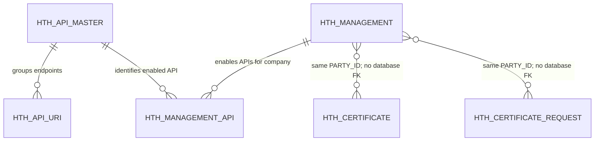

# HTH Core Table Field Dictionary

| Item | Value |
| --- | --- |
| Document status | As implemented in the current codebase |
| Last reviewed | 2026-08-26 |
| Scope | HTH API catalogue, enterprise configuration, certificates, and HTH audit-log references |

## 1. Purpose and scope

This document explains the purpose and lifecycle of every field in the following requested data areas:

1. `HTH_API_MASTER`
2. `HTH_API_URI`
3. HTH Audit Log
4. `HTH_CERTIFICATE`
5. `HTH_CERTIFICATE_REQUEST`
6. `HTH_MANAGEMENT`
7. `HTH_MANAGEMENT_API`

The descriptions are based on the schema SQL, EclipseLink ORM mappings, Java entities, repository queries, and application services in this repository. They describe the actual code contract rather than relying only on column names.

## 2. Important physical-name findings

The repository currently contains the following schema-name differences. These should be resolved before deployment rather than hidden by documentation.

| Object | Schema SQL | Current ORM or data script | Finding |
| --- | --- | --- | --- |
| `HTH_API_MASTER` | `HTH_BEAUAT` | ORM: `HTH_BEA` | Schema SQL and runtime mapping differ. |
| `HTH_API_URI` | `HTH_BEAUAT` | ORM: `HTH_BEAUAT`; seed script: `DIGX_CZ_HTH_API_URI` | The DDL/ORM table name and seed-script table name differ. |
| `HTH_MANAGEMENT` | `HTH_BEAUAT` | ORM: `HTH_BEA` | Schema SQL and runtime mapping differ. |
| `HTH_MANAGEMENT_API` | `HTH_BEAUAT` | ORM: `HTH_BEA` | Schema SQL and runtime mapping differ. |
| `HTH_CERTIFICATE` | `HTH_BEAUAT` | ORM: `HTH_BEAUAT` | DDL and ORM agree. |
| `HTH_CERTIFICATE_REQUEST` | `HTH_BEAUAT` | ORM: `HTH_BEAUAT` | DDL and ORM agree. |
| `HTH_AUDIT_LOG` | Not found | No ORM/entity/repository found | There is no physical table with this exact name in the repository. See section 6. |

The field definitions below use the columns declared by the available DDL and ORM files. A deployment must first decide the authoritative owner and physical name for each object.

## 3. Data relationships

The main distinction is:

- `HTH_API_MASTER` and `HTH_API_URI` define what APIs exist.
- `HTH_MANAGEMENT` and `HTH_MANAGEMENT_API` define which APIs an enterprise may use.
- `HTH_CERTIFICATE` stores the current effective public certificates.
- `HTH_CERTIFICATE_REQUEST` stores the maker/checker submission snapshot.

## 4. Common lifecycle fields

All six physical `HTH_*` tables use the same lifecycle fields:

| Field | Standard purpose |
| --- | --- |
| `ID` | Technical primary key. It is the stable identifier used by ORM and foreign keys; it is not a display name. |
| `OBJECT_STATUS` | Soft record state. Current services and repositories use `A` for active and `I` for inactive. Inactivation preserves audit/history and avoids breaking references. |
| `CREATED_BY` | User ID or system principal that created the row. ORM marks it non-updatable. |
| `CREATION_DATE` | Creation timestamp, defaulted by Oracle to `SYSDATE`. ORM marks it non-updatable. |
| `LAST_UPDATED_BY` | User ID or system principal responsible for the latest change. |
| `LAST_UPDATE_DATE` | Timestamp of the latest change, defaulted to `SYSDATE` for a new row. |
| `OBJECT_VERSION_NUMBER` | EclipseLink optimistic-lock version. ORM maps this field as `<version>` and increments it on update so a stale writer cannot silently overwrite a newer change. These existing tables still require this column. |

The DDL does not consistently define check constraints for `OBJECT_STATUS`; therefore the application and repository contract currently enforces the `A`/`I` convention.

## 5. API catalogue tables

### 5.1 `HTH_API_MASTER`

Purpose: one row defines one logical HTH API capability shown in management and authorization screens. A logical API may cover multiple endpoint URIs.

Row grain: one row per stable `API_CODE`.

| Field | Type and constraint | Purpose and behaviour |
| --- | --- | --- |
| `ID` | `VARCHAR2(36)`, PK, not null | Technical API-master identifier. It is referenced by `HTH_API_URI`, `HTH_MANAGEMENT_API`, request snapshots, and user-access tables. Seed values use stable IDs such as `HTH_API_AUDIT_LOG`. |
| `API_CODE` | `VARCHAR2(64)`, unique, not null | Stable business code used by Java logic and authorization, for example `BALANCE_INQUIRY` or `AUDIT_LOG`. This should remain stable even if the display name changes. |
| `API_NAME` | `VARCHAR2(255)`, not null | Human-readable API name displayed in HTH management and user-access screens. It may be renamed without changing the API identity. |
| `DISPLAY_ORDER` | `NUMBER`, nullable | Sort order for catalogue/UI display. The active-list repository returns API masters in this order. Gaps such as 10, 20, and 30 allow later insertion without renumbering every row. |
| `OBJECT_STATUS` | `VARCHAR2(1)`, default `A`, not null | `A` makes the API selectable and valid; `I` retires it without deleting historical references. |
| `CREATED_BY` | `VARCHAR2(255)`, not null | Principal that created or seeded the API definition. |
| `CREATION_DATE` | `DATE`, default `SYSDATE`, not null | Time the API definition was created. |
| `LAST_UPDATED_BY` | `VARCHAR2(255)`, not null | Principal that last changed the API name, order, or status. |
| `LAST_UPDATE_DATE` | `DATE`, default `SYSDATE`, not null | Time of the latest API-master change. |
| `OBJECT_VERSION_NUMBER` | `NUMBER`, default `1`, not null | Optimistic-lock version used by EclipseLink to protect catalogue updates from lost updates. |

Key rules:

- `API_CODE` is the business identifier; `ID` is the relational identifier.
- Disabling an API should set `OBJECT_STATUS='I'`; it should not physically delete a row that other tables reference.
- The current seed data defines Account Activity, Balance Inquiry, Download Report, Local Payment Inquiry, Exchange Rate Inquiry, FX Transaction Inquiry, and Audit Log capabilities.

### 5.2 `HTH_API_URI`

Purpose: maps one logical API master to one or more concrete relative endpoint paths.

Row grain: one URI belonging to one API master.

| Field | Type and constraint | Purpose and behaviour |
| --- | --- | --- |
| `ID` | `VARCHAR2(36)`, PK, not null | Technical identifier of the URI mapping. |
| `API_MASTER_ID` | `VARCHAR2(36)`, FK, not null | References `HTH_API_MASTER.ID` and identifies the logical API capability to which the endpoint belongs. |
| `API_URI` | `VARCHAR2(512)`, not null | Relative endpoint path, for example `auditLog/v1/logs`. It does not contain the host name. The current model also has no HTTP-method column, so method-specific distinction is not represented in this table. |
| `DISPLAY_ORDER` | `NUMBER`, nullable | Order of endpoints within one API master. `listActiveByApiMasterId` sorts by this value. It is presentation/configuration order, not authorization priority. |
| `OBJECT_STATUS` | `VARCHAR2(1)`, default `A`, not null | `A` includes the URI in active lookups; `I` retires the mapping without deleting it. |
| `CREATED_BY` | `VARCHAR2(255)`, not null | Principal that created or seeded the URI mapping. |
| `CREATION_DATE` | `DATE`, default `SYSDATE`, not null | Time the URI mapping was created. |
| `LAST_UPDATED_BY` | `VARCHAR2(255)`, not null | Principal that last changed the URI, ordering, or status. |
| `LAST_UPDATE_DATE` | `DATE`, default `SYSDATE`, not null | Time of the latest URI-mapping change. |
| `OBJECT_VERSION_NUMBER` | `NUMBER`, default `1`, not null | Optimistic-lock version for concurrent URI-mapping updates. |

Key constraints:

- PK: `ID`.
- FK: `API_MASTER_ID -> HTH_API_MASTER.ID`.
- Unique: `(API_MASTER_ID, API_URI)`, preventing the same endpoint from being registered twice under one logical API.

Current implementation boundary: the repository can list active URI rows by API master, but BCOH2H-595 runtime authorization currently accepts an already resolved `API_CODE`; the codebase does not yet show the request ingress resolving that code from `HTH_API_URI`.

## 6. HTH Audit Log clarification

### 6.1 No physical `HTH_AUDIT_LOG` table was found

The repository does not contain a `CREATE TABLE HTH_AUDIT_LOG`, EclipseLink mapping, Java entity, or repository adapter for a table with that exact name.

What the repository does contain is:

1. An `HTH_API_MASTER` catalogue row with:
   - `ID = HTH_API_AUDIT_LOG`
   - `API_CODE = AUDIT_LOG`
   - `API_NAME = Audit Log`
2. A URI seed row mapping that API master to `auditLog/v1/logs`.

`HTH_API_AUDIT_LOG` is therefore an API-master ID, not evidence of a physical audit-log table.

### 6.2 Closest HTH-specific audit storage found: `DIGX_CZ_HOSTAUDITLOG`

`FRXReceiverMDB` inserts completed host request audit data into `DIGX_CZ_HOSTAUDITLOG`. Its DDL is not present in this repository, so types, nullability, keys, and indexes cannot be confirmed here. The following purposes are derived from the insert statement and source values.

| Observed field | Purpose inferred from code |
| --- | --- |
| `IDSEQ` | Unique audit sequence generated as `yyMMddHHmmss` plus a six-digit database sequence value. |
| `IDHOST` | Host/system identifier from the incoming audit data key `HOST`. |
| `IDREQUEST` | Request identifier used to correlate the audit row with the handled host request. |
| `HOST_REQUEST` | Request payload sent to the host. This may contain sensitive business data and should be protected and masked in logs/exports. |
| `HOST_RESPONSE` | Response payload returned by the host. This may contain sensitive business data and should be protected and masked in logs/exports. |
| `ERROR_CODE` | Host or integration error code when processing fails. |
| `ERROR_DESC` | Human-readable error description associated with `ERROR_CODE`. |
| `EXECUTION_START_TIME` | Timestamp at which host processing began. |
| `EXECUTION_END_TIME` | Timestamp at which host processing ended; together with the start time it supports duration analysis. |
| `STATUS` | Final request-processing outcome supplied by the integration flow. The allowed value set is not defined in this repository. |
| `VERSION` | Inserted as `1` by `FRXReceiverMDB`; the repository does not show an ORM optimistic-lock contract for this table. |
| `REFERENCENO` | Business reference number used to correlate the host interaction with a customer/application transaction. A blank value is inserted when no reference is supplied. |

There is also a platform table named `DIGX_AL_API_AUDIT_LOGGING`, but it is the generic OBDX API audit table and is not a physical `HTH_AUDIT_LOG` table. If the requested environment contains another custom `HTH_AUDIT_LOG`, its DDL is required before its field dictionary can be documented authoritatively.

## 7. Certificate tables

### 7.1 `HTH_CERTIFICATE`

Purpose: stores the current effective public certificate/public-key configuration for a corporate party after maker/checker approval.

Row grain: one effective certificate file for one party. The service currently permits at most two files in one approved configuration.

| Field | Type and constraint | Purpose and behaviour |
| --- | --- | --- |
| `ID` | `VARCHAR2(36)`, PK, not null | Certificate technical identifier used by search/download. The service keeps a supplied certificate ID when present; otherwise it generates a UUID. |
| `PARTY_ID` | `VARCHAR2(64)`, not null | Corporate party that owns and uses the public certificate. Certificate search and download are scoped by this value. There is no database FK to a Party table in the provided DDL. |
| `REFERENCE_NO` | `VARCHAR2(64)`, nullable | Customer-facing reference generated for the upload request, normally prefixed with `HTHCERT`. It lets support users trace the effective certificate back to the submission confirmation. |
| `EFFECTIVE_TRANSACTION_ID` | `VARCHAR2(64)`, nullable | Approval-framework transaction ID whose approval caused the certificate to become effective. This is an audit trace, not the row PK. |
| `SEQ_NO` | `NUMBER(2)`, not null | Certificate order within the approved upload payload. The service writes sequential values starting at `1`; currently the maximum is `2`. |
| `FILE_NAME` | `VARCHAR2(255)`, not null | Sanitized original `.pem` file name used for display and download. Path separators, control characters, and non-PEM extensions are rejected. |
| `PEM_CONTENT` | `CLOB`, not null | Effective PEM public material. Accepted labels are `CERTIFICATE`, `PUBLIC KEY`, and `RSA PUBLIC KEY`; private keys are rejected. The service limits input to 64 KiB and requires an RSA key of at least 2048 bits. |
| `OBJECT_STATUS` | `VARCHAR2(1)`, default `A`, not null | `A` means currently effective. When a new upload is approved, existing active rows are changed to `I` before new active rows are inserted. |
| `CREATED_BY` | `VARCHAR2(255)`, not null | Checker/approval execution user, or system principal, that created the effective row. |
| `CREATION_DATE` | `DATE`, default `SYSDATE`, not null | Time the approved certificate row was created. |
| `LAST_UPDATED_BY` | `VARCHAR2(255)`, not null | Principal that last updated the certificate, including soft deactivation. |
| `LAST_UPDATE_DATE` | `DATE`, default `SYSDATE`, not null | Time of the latest certificate-row update. |
| `OBJECT_VERSION_NUMBER` | `NUMBER`, default `1`, not null | EclipseLink optimistic-lock version that prevents concurrent certificate updates from silently overwriting each other. |

Index `IDX_HTH_CERTIFICATE_PARTY (PARTY_ID, OBJECT_STATUS, SEQ_NO)` supports ordered retrieval of the active certificate set for a party.

Security note: `PEM_CONTENT` contains public material only, but it should still be protected from unnecessary logging and bulk exposure. The normal search response omits content; a separately authorized download operation returns it.

### 7.2 `HTH_CERTIFICATE_REQUEST`

Purpose: stores the certificate files submitted by the maker as a request/history snapshot for approval lookup.

Row grain: one submitted certificate file within one approval transaction. A two-certificate upload creates two rows with the same transaction/reference and different `SEQ_NO` values.

| Field | Type and constraint | Purpose and behaviour |
| --- | --- | --- |
| `ID` | `VARCHAR2(36)`, PK, not null | UUID identifying one request-file snapshot row. It is independent of the eventual effective certificate ID. |
| `TRANSACTION_ID` | `VARCHAR2(64)`, nullable in DDL | Approval-framework transaction identifier used to group all files from one request and retrieve them during approval/history lookup. The service expects it from thread attributes before writing a normal snapshot. There is no database FK to `DIGX_AP_TRANSACTION`. |
| `REFERENCE_NO` | `VARCHAR2(64)`, nullable | Customer-facing `HTHCERT...` reference copied from the maker submission. It is later copied to effective rows after approval. |
| `PARTY_ID` | `VARCHAR2(64)`, not null | Corporate party for which the certificates were submitted. It is also used to detect an existing pending certificate request. |
| `ACTION_TYPE` | `VARCHAR2(32)`, not null | Requested certificate operation. The current service writes only `UPLOAD`; the wider column length allows future action types but none are implemented in the current service. |
| `SEQ_NO` | `NUMBER(2)`, not null | Original file position within the maker payload, starting at `1`. It preserves review display order. |
| `FILE_NAME` | `VARCHAR2(255)`, not null | Validated `.pem` file name captured at submit time so the checker reviews the exact submitted metadata. |
| `PEM_CONTENT` | `CLOB`, not null | Validated public certificate/public-key content captured at submit time. This snapshot prevents later client-side changes from altering what the checker reviews. |
| `OBJECT_STATUS` | `VARCHAR2(1)`, default `A`, not null | `A` is the current snapshot for the transaction. If the service rewrites a snapshot for the same transaction, previous active rows are changed to `I`. |
| `CREATED_BY` | `VARCHAR2(255)`, not null | Maker or system principal that created the request snapshot. |
| `CREATION_DATE` | `DATE`, default `SYSDATE`, not null | Time the request-file snapshot was written. |
| `LAST_UPDATED_BY` | `VARCHAR2(255)`, not null | Principal that last updated or inactivated the snapshot row. |
| `LAST_UPDATE_DATE` | `DATE`, default `SYSDATE`, not null | Time of the latest request-row update. |
| `OBJECT_VERSION_NUMBER` | `NUMBER`, default `1`, not null | EclipseLink optimistic-lock version for concurrent request-snapshot updates. |

Indexes:

- `IDX_HTH_CERTIFICATE_REQ_TXN (TRANSACTION_ID, OBJECT_STATUS, SEQ_NO)` supports loading the current ordered snapshot for approval.
- `IDX_HTH_CERTIFICATE_REQ_PARTY (PARTY_ID, OBJECT_STATUS)` supports pending-request checks by corporate party.

Implementation note: maker snapshot persistence is deliberately best-effort and uses a separate `NONXA` transaction. A snapshot-write failure is logged but does not cancel the approval request. Therefore this table is valuable history/review data, but the approval framework remains the authoritative workflow state.

## 8. Enterprise HTH management tables

### 8.1 `HTH_MANAGEMENT`

Purpose: stores the current effective HTH channel configuration for one corporate party.

Row grain: one row per `PARTY_ID`.

| Field | Type and constraint | Purpose and behaviour |
| --- | --- | --- |
| `ID` | `VARCHAR2(36)`, PK, not null | Technical management-configuration ID. `HTH_MANAGEMENT_API.HTH_MANAGEMENT_ID` references it. |
| `PARTY_ID` | `VARCHAR2(64)`, unique, not null | Corporate party whose HTH channel configuration this row represents. It is the main business lookup key. |
| `UAM_CLIENT_ID` | `VARCHAR2(128)`, unique, nullable | External/correlated UAM client identifier validated through the DSP/UAM client API. It is populated while HTH is enabled and cleared from this effective table on disable. Permanent non-reuse is handled separately by `HTH_UAM_CLIENT_REGISTRY`. |
| `HTH_STATUS` | `VARCHAR2(16)`, not null | Effective enterprise channel state. Current service values are `ENABLE` and `DISABLE`. BCOH2H-538/595 treats only `ENABLE` as usable for HTH maintenance and authorization. |
| `APPROVAL_FLOW_TYPE` | `VARCHAR2(32)`, nullable | API transaction approval behaviour for the enterprise. The current UI/service default is `STRAIGHT_THROUGH`; the value is cleared when HTH is disabled. The provided DDL has no check constraint for its allowed values. |
| `OBJECT_STATUS` | `VARCHAR2(1)`, default `A`, not null | Lifecycle of the configuration row itself. Normally remains `A` even when `HTH_STATUS='DISABLE'`; business enablement must therefore be decided from both fields. |
| `CREATED_BY` | `VARCHAR2(255)`, not null | Principal that first created the party configuration. |
| `CREATION_DATE` | `DATE`, default `SYSDATE`, not null | Time the party configuration was first created. |
| `LAST_UPDATED_BY` | `VARCHAR2(255)`, not null | Principal that last enabled, edited, or disabled HTH. |
| `LAST_UPDATE_DATE` | `DATE`, default `SYSDATE`, not null | Time of the latest effective configuration change. |
| `OBJECT_VERSION_NUMBER` | `NUMBER`, default `1`, not null | EclipseLink optimistic-lock version protecting concurrent enterprise configuration changes. |

Key rules:

- Unique `PARTY_ID` ensures one effective HTH configuration per enterprise.
- Unique `UAM_CLIENT_ID` prevents two current rows from using the same non-null client ID. Oracle permits multiple nulls, which is required for disabled rows.
- `OBJECT_STATUS` and `HTH_STATUS` are not interchangeable: one controls row lifecycle; the other controls the HTH business channel.

### 8.2 `HTH_MANAGEMENT_API`

Purpose: intersection table containing the APIs currently enabled at enterprise level. This is the upper authorization boundary; user-level access must be a subset of these rows.

Row grain: one API master enabled for one HTH management configuration.

| Field | Type and constraint | Purpose and behaviour |
| --- | --- | --- |
| `ID` | `VARCHAR2(36)`, PK, not null | Technical identifier of the enterprise-to-API link. |
| `HTH_MANAGEMENT_ID` | `VARCHAR2(36)`, FK, not null | References `HTH_MANAGEMENT.ID` and identifies the enterprise configuration owning the API selection. |
| `API_MASTER_ID` | `VARCHAR2(36)`, FK, not null | References `HTH_API_MASTER.ID` and identifies the logical API enabled for the enterprise. |
| `OBJECT_STATUS` | `VARCHAR2(1)`, default `A`, not null | `A` means the API is currently enabled for the enterprise. Edit/disable processing soft-deactivates old links and reactivates or creates the selected set. |
| `CREATED_BY` | `VARCHAR2(255)`, not null | Principal that first created the enterprise API link. |
| `CREATION_DATE` | `DATE`, default `SYSDATE`, not null | Time the enterprise API link was created. |
| `LAST_UPDATED_BY` | `VARCHAR2(255)`, not null | Principal that last activated or inactivated the link. |
| `LAST_UPDATE_DATE` | `DATE`, default `SYSDATE`, not null | Time of the latest link-state change. |
| `OBJECT_VERSION_NUMBER` | `NUMBER`, default `1`, not null | EclipseLink optimistic-lock version protecting concurrent link updates. |

Key constraints:

- PK: `ID`.
- FK: `HTH_MANAGEMENT_ID -> HTH_MANAGEMENT.ID`.
- FK: `API_MASTER_ID -> HTH_API_MASTER.ID`.
- Unique: `(HTH_MANAGEMENT_ID, API_MASTER_ID)`, ensuring one reusable link row for each enterprise/API pair.

Authorization interpretation:

1. `HTH_MANAGEMENT.OBJECT_STATUS` must be active.
2. `HTH_MANAGEMENT.HTH_STATUS` must be `ENABLE`.
3. The matching `HTH_MANAGEMENT_API` link must be active.
4. The referenced `HTH_API_MASTER` must also be active.
5. For BCOH2H-595, a user/account API grant must additionally exist; enterprise enablement alone does not grant a user access.

## 9. Source references

- `consulting/db/branch_change_history/20260416_HTH_Management/1_HTH_Management_Schema.sql`
- `consulting/db/branch_change_history/20260622_HTH_Certificate_Upload/1_HTH_Certificate_Upload_Schema.sql`
- `consulting/db/branch_change_history/20260626_HTH_HTH_URL/1.HTH_URL.sql`
- `consulting/config/orm/eclipselink/mappings/cz/hosttohost/*.orm.xml`
- `HostToHostManagement.java`
- `HostToHostCertificateManagement.java`
- `FRXReceiverMDB.java`
