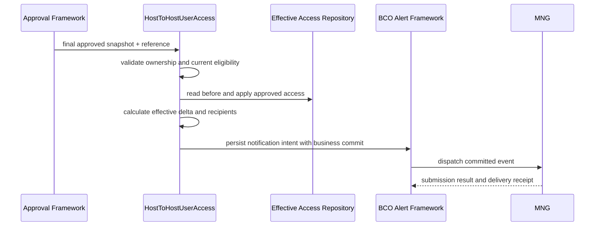

# BCOH2H-1216 Technical Design

| 项目 | 内容 |
| --- | --- |
| Story / TD | BCOH2H-1216 / BCOH2H-1303 |
| 功能 | CM - User Accounts & Service access - Notification |
| 状态 | Proposed for Review；本文件不代表功能已实现或通过 UAT |
| 需求基线 | 2026-09-14 导出的 Story PDF；通知矩阵 Pending Review 的 #3、#4、#5 |
| 代码基线 | hth-application `be5abc68`，2026-09-14 阅读现有源码 |
| 依赖 | HTH User Access 最终审批；BCO Alert / MNG / Bounce；851 的共用通知适配 |

## 1. 设计结论

保留普通 BCO User Account Access 的现有通知。HTH User Access 在最终审批、有效账户及服务权限更新成功后，接入同一套 Alert / Email / SMS 基础设施。消息样式及已批准的业务文案对齐 BCO，收件人按 HTH 通知矩阵确定。

**当前不能判定本 Story 只需要测试。** BCO 的通知位于 `UserAccountAccessExt.postCreate()`，HTH 的 `HostToHostUserAccess.submit/edit/delete` 则通过自己的 `applyApprovedAccess()` 更新权限；本次检查未发现后者调用 BCO 通知方法或注册对应 Activity/Event。复用通知框架与模板不等于复用了业务触发点。

不改原 BCO REST 契约，不新增前端发送通知接口，不由浏览器决定收件地址。HTH 业务编排使用独立事件，避免为了新增 HTH 收件人而改变 BCO `USER_ACCOUNT_ACCESS_UPDATE` 的全局行为。

## 2. 范围与 AC 映射

| AC / 范围 | 设计 | 验收 |
| --- | --- | --- |
| AC1 To link | HTH API 用户的账户/服务关联经过所有审批并生效后产生 LINK 通知 | Maker / 中间审批不发；最终批准后实际收件清单、模板及回执正确 |
| AC2 Edit | 同一用户的有效账户/服务权限确实发生变化后产生 UPDATE 通知 | 账户或 API 服务新增、删除、变更均覆盖；仅顺序变化不重复发 |
| AC4 Bounce Back | 指定 API Email 确认失败、且不同于 BCO Account Profile 联系人时执行受控 fallback | 原通知、失败回执及 fallback 可关联；不循环 |
| 保留 BCO 原通知 | 原 BCO 路径、事件、模板、收件人及次数不变 | BCO 回归基线比较 |

原 Story 没有 AC3，本文保留原编号。

### 2.1 必须明确的业务边界

补充矩阵 #3/#4/#5 同时使用 “Corporate HTH disable / edit API Access / enable” 和 “User Accounts & Services Access” 名称。代码存在两种不同业务：

| 业务 | 现有 Service | 本设计处理 |
| --- | --- | --- |
| 指定 HTH 用户的 Related / Associated Account & API Service Access | `HostToHostUserAccess` | AC1/AC2 的主要实现路径 |
| 公司整体启用、停用 HTH 及企业 API 配置 | `HostToHostManagement` | 与前者独立；若 PO 确认 #3 包含公司停用，另加该服务的最终生效事件，不能把用户取消关联当作公司停用 |

HTH 用户权限页面的 `delete` 是整组权限移除，与 Edit 中删除部分账户/服务不同。建议纳入 REMOVE 通知，但独立列为范围确认项；在 PO 明确前不把矩阵 #3 的公司 disable 自动映射为该操作。

`HostToHostManagement` 当前包含通知辅助代码，实际启用分支使用 `CORPORATEPLUS_WELCOME_MAIL`；这不能证明用户权限变更已具备本 Story 的完整通知或 fallback。

## 3. 现有实现与复用方式

| 单元 | 现状 | 设计动作 |
| --- | --- | --- |
| BCO `UserAccountAccessExt.postCreate()` | 有 BCO 权限、eAdvice 等业务；在特定 isAdmin 上下文组装 `UserManagementActivityLogDTO`，注册 `USER_ACCOUNT_ACCESS_UPDATE` | 参考通知 DTO / 模板语义，不直接调用整个扩展方法，避免重复执行 BCO 权限及 eAdvice 副作用 |
| BCO 通知 Activity | 现有代码通过 `CURRENTLY_EXECUTING_SERVICE` 指定 BCO UserAccountAccess.update | HTH 注册自己真实的 Activity，不伪装成 BCO Service，不污染线程上下文 |
| HTH `saveResponse()` / `saveStatus()` | 校验审批上下文；仅 approvedExecution 调用 `applyApprovedAccess()`；随后执行 response policy | 在最终批准分支获取 before/after 与 reference，按真实提交结果持久化通知意图 |
| HTH 生效数据 | `HTH_USER_ACCESS_ACCOUNT`、`HTH_USER_ACCESS_ACCOUNT_API` | 沿用现有 Repository 和事务，不新增另一套权限数据 |
| 审批数据 | 平台 Transaction / Workflow Snapshot | 使用服务器批准快照和原审批 reference，不新建 HTH 审批表 |
| Email / SMS Dispatcher | 已存在 MNG 派送、用户归属与号码配置逻辑 | 核对 HTH event 的身份与地址处理，复用派送适配；不得只加模板 |

## 4. 生效变更模型

拟新增内部通知上下文 `HthUserAccessActivityLogDTO extends ActivityLog`。它只描述已批准的操作，不提供修改权限的能力。

| 字段 | 来源 / 用途 |
| --- | --- |
| schemaVersion、approvalReference、eventType | 固定版本、平台业务 reference、LINK / UPDATE / REMOVE |
| partyId、closeId、targetUserId | 从批准快照及服务器 HTH Profile 校验得到 |
| accessPartyId、linkageType | 明确权限属于本公司还是已授权的 Associated 公司 |
| finalApproverId、approvedAt | 从平台最终审批上下文取得；与被维护用户区分 |
| userNameId、compName、userSysDate | 与 BCO 已有通知占位符对齐，时间使用最终生效时间 |
| changeSummary | 账户/服务新增、删除数量；详细差异交给 791 的审计上下文 |
| NotificationDetail[]、recipientRole | 已解析目的地址、通道、模板角色；不从浏览器接收 |
| originalEventReference、fallbackDepth | 重试及 fallback 关联 |

权限比较以服务器允许的稳定主键集合为基础：`(partyId, closeId, accessPartyId, linkageType, accountId, apiId)`。先统一现有 ACTIVE 状态语义，再比较 approved-before 与 effective-after；不能对请求 JSON 字符串、数组次序或页面显示名称做比较。

LINK / UPDATE 由批准的业务动作决定，不能因为编辑后暂时没有账户就自动变成公司 disable。无实际变化的批准请求仍保留正常审批/审计记录；本设计建议不重复发送“权限已更新”通知，须随收件矩阵一并确认。

Associated 场景的通知公司上下文默认为维护该 HTH 用户的 owner party。`accessPartyId` 用于说明被授权数据归属，不自动把另一家公司的联系人加入收件人；跨公司收件规则需有明确授权。

## 5. 收件人和模板

### 5.1 角色来源

| 角色 | 技术候选来源 | 约束 |
| --- | --- | --- |
| API Notification Contact | 被维护 HTH User 的服务器 Profile Email/Mobile | 当前未发现独立 HTH 联系方式字段；如业务指独立联系人，依赖资料维护功能先明确，见 851 |
| Company Contact | owner party 的 `getPartyPreferences()` / officeEmailId、officeTelNo | 不使用 accessPartyId 的公司联系人替代 |
| Final Approver | 平台最终批准者 User profile | 不取 Maker，不把 targetUserId 当 Approver |

矩阵 #3 的替换文字是 Company Email **or** Mobile、Approver Email **or** Mobile、API Contact Email **or** Mobile；#4/#5 存在 Email + SMS 和 Email or Mobile 并存的编辑痕迹。**不能据此承诺每个角色都同时收到邮件和短信。**

实现以明确的 `(eventType, recipientRole, channel, template)` 配置为准，评审需签定每个角色是双通道还是优先通道及缺失地址策略。技术上支持 EMAIL 和 SMS，不自行把 “or” 实现为两个都发。与 851 共用同一套联系人校验、目的地址归一化和去重规则。

### 5.2 事件建议

以下为拟新增名称；部署前检查目标库 event ID 长度及既有冲突：

| Event ID | 触发 | 模板 |
| --- | --- | --- |
| `HTH_USER_ACCESS_LINKED` | 用户权限 To link 最终生效 | 矩阵 #5，BCO User Account and Service Access Update(s) 样式 |
| `HTH_USER_ACCESS_UPDATED` | 用户权限 Edit 最终生效 | 矩阵 #4，同一 BCO 样式 |
| `HTH_USER_ACCESS_REMOVED` | 用户整组权限移除最终生效，范围待确认 | 正式确认的移除文案；不冒用公司停用或 PIN 文案 |

Activity 分别对应 `com.ofss.digx.cz.bea.app.hosttohost.service.HostToHostUserAccess.submit/edit/delete` 的真实调用；按实际启用事件注册父记录及映射。若角色需要不同文案，使用平台 recipient-template 路由；不支持该路由的目标版本改用明确角色子事件，并固定清单。

补充矩阵第 3 页 #3 Email 仍是 **PIN Activation Success**，旁边要求 IT 澄清模板。该文案与权限停用不符，不可直接部署。#4/#5 包含 `#userSysDate#`、`#userNameId#`、`#compName#`；语言组合及完整中文文本仍需确认。短信沿用“公司已更新用户账户及服务权限”的通知语义，不包含完整账户、服务权限清单或 Password Code。

如业务最终确认 HTH 完全采用 BCO 原收件人和模板，也应在 HTH 路径增加可验证的事件接入；是否直接复用旧 event ID 再单独评估，不能修改旧事件的全局收件人来兼容新规则。

## 6. 时序、事务及幂等

不能仅根据 HTTP 200、`result=SUCCESSFUL`、`isAdmin` 或 Session User 判断已完成最终批准；平台 `ACCEPTED`/待批与已生效不同。使用现有 approvedExecution 契约并验证多级/批量审批运行结果。

通知意图与已生效业务建立持久关联，派送发生在业务提交之后。现有 `Interaction.close()` 和外层 response policy 的真实事务边界需先用平台集成测试确认；不得将发送放入 finally。通知事务和去重实现验证门槛见 README。

同一 approvalReference + eventType + 权限业务主键只能产生同一份通知意图。收件人派送再按角色、地址、通道和模板去重。两个节点并发或审批回调重入必须由持久化唯一约束或平台等价机制保证，不能只靠 JVM 内存集合。

MNG 失败只影响派送状态，不重新执行权限保存；重试保留原批准时间和收件快照。新的一次合法 Edit 使用新 reference，可以产生新通知。无有效 reference 的执行必须先由平台分配持久业务标识，不能为每次重试随机生成一个新标识绕过幂等。

## 7. Bounce Back

复用 851 的收件身份、原通知 reference 和一次 fallback 机制：仅 API Contact Email 的确认失败进入该策略；Company/Approver 通知失败不自动扩大收件范围。

1216 AC4 只说 “may” fallback，未明确二次失败行为。本设计建议与 851 一致：最多转发一次至不同的 BCO Company Email，失败后记录终态，不继续转发 SMS/Webmail/AP/SYSADM；该终止规则属于设计建议，需业务确认。

现有 MNG 提交记录不是最终送达证明；先关联 `LoadMNGmsgCCBEMAIL/CCBSMS` 导入的回执，再由实际部署的 `ValidateAndSendBounceNotify` 路径处理。对提交超时、结果未知先对账，避免原邮件已收到却立即多发一份 fallback。

## 8. 数据库和部署

默认不新增用户权限表、审批表或独立 Notification Store。复用 `DIGX_EP_ACT_LOG_B` 保存平台 ActivityLog 上下文；平台是否满足持久化去重及重试为发布前验证项。

拟新增 `20260914_BCOH2H-1216_HTH_User_Access_Notification/` 变更目录，文件按以下顺序组织；名称为设计建议，当前未生成 SQL：

1. `1_Activity_Events.sql`：Activity 父记录、PM_EVENT、ACT_EVT、ACT_EVT_ACN。
2. `2_Recipients_Templates.sql`：已确认角色/EMAIL/SMS/语言模板和 recipient 映射；补齐 `DIGX_EP_MSG_ATTR_B`、`DIGX_EP_MSG_SRC_B`、`DIGX_MD_SERVICE_ATTR` 及对应通用属性元数据。以实际模板渲染验证替换结果，不能只检查 DTO getter。
3. `3_Dispatch_Bounce_Config.sql`：范围明确的 event 集合追加及 bounded fallback 配置。
4. `4_Verification.sql`：只读校验父子关系、模板变量、角色通道完整性与重复配置。

SQL 必须可重复执行，不覆盖 BCO 模板、整份 event 列表或共用 Activity 元数据；不删除业务流水。不要向带计算列的配置视图直接插入，按本项目已确认的底表结构操作。回滚脚本仅撤销本 Story 新增且无共享依赖的配置；历史通知记录保留。

## 9. 修改清单与 BCO 影响

| 修改单元 | 内容 | BCO 影响控制 |
| --- | --- | --- |
| HostToHostUserAccess Service | 最终生效事件接入、before/after、reference | HTH 独立 Service；不调用 BCO 整个 postCreate 方法 |
| HTH ActivityLog DTO / notification helper | 收件角色、模板变量、重复处理 | 与 851 共用小范围辅助逻辑，避免重复两套派送实现 |
| BCO Alert / Dispatcher 适配 | 必要的 HTH 身份及显式地址支持 | 仅按 HTH event allowlist 分支；原 event 行为不变 |
| Bounce Batch | HTH 一次 fallback、对账关联 | 与 851 一次交付；不全局改变 BCO fallback |
| SQL / 模板 | 新事件及完整映射 | 不复用 PIN Activation 文案，不改旧 BCO 内容 |
| 前端 | 原则上无需修改 | 保持现有权限维护和审批流程 |

## 10. SIT / UAT

| 测试 | 必须观察到的结果 |
| --- | --- |
| Related / Associated To link、Edit | 所有审批完成且权限生效后，正确事件、角色、通道、模板 |
| Edit 新增账户、移除账户、只变更 API 服务 | 有效差异正确；不因只判断账户数量而漏掉服务变化 |
| 数组重排、同值重提 | 建议无重复变更通知；正常审批/审计仍可追踪 |
| Maker、多级审批、拒绝、取消、过期请求 | 均不得提前发“已更新”成功通知 |
| 重复最终批准、批量审批、两节点并发 | 单份意图；审批人身份不串用；不同用户互不串消息 |
| 事务失败、派送前重启、MNG 超时/拒绝 | 无虚假成功通知；已提交权限不回滚；通知可恢复且未知结果先对账 |
| API / Company / Approver 同地址或缺地址 | 去重和缺失策略符合已签定矩阵；不擅自扩大收件人 |
| API Email 失败、fallback 同地址/失败 | 仅允许的角色执行一次 fallback；终态明确 |
| HTH 与普通 BCO 同时使用 | BCO 通知、权限、eAdvice、审批及模板无变化 |
| 审计关联 | 通知 reference 可关联 791 的生效操作，不因重试多记一次权限变更 |

测试报告应包含批准 reference、权限 before/after、活动意图、实际 destination（受控展示）、MNG submission、Email/SMS delivery receipt 和实际收件验证。不能把收到 Email 推导为 SMS 也成功。

## 11. 评审待确认

1. #3 是否属于公司 HTH 停用；用户整组权限删除是否纳入本 Story。
2. #3/#4/#5 每个角色的 EMAIL/SMS 规则、地址缺失策略及 Associated 公司通知边界。
3. “API Notification Contact” 与 “BCO Account Profile Contact” 的准确数据归属。
4. #3 正确 Email 模板、#4/#5 语言组合和最终文案；无实际变化时是否不发通知。
5. 1216 fallback 是否接受与 851 相同的一次终止规则；平台持久化/重试实现验证。
6. BCO Code 通知的参考实现读取全部实际审批人。1216 是否使用全部签署人而非最终一位，需要随本 Story 矩阵明确；不能直接把 Code 通知截图当作 1216 的最终 AC。

## 12. 需求与源码索引

[Story PDF](</Users/devs/CProj/hth-application/story/notification & audit log/[BCOH2H-1216] CM - User Accounts & Service access - Notification - Jira.pdf>)：第 1 页：AC1、AC2、AC4；第 2 页：开发子任务；补充矩阵第 1、3、5 页：#3/#4/#5。

[通知矩阵 Pending Review](</Users/devs/CProj/hth-application/story/notification & audit log/292819003_42a73221555b491c9269d186f430d7bc-140926-0744-3.pdf>)；本设计保留其中尚未确认的规则，不把修改痕迹当作最终批准。

| 源码证据 | 支持内容 |
| --- | --- |
| [BCO UserAccountAccessExt](</Users/devs/CProj/hth-application/consulting/middleware/projects/module/com.ofss.digx.cz.bea.module.access/src/com/ofss/digx/cz/bea/app/access/service/account/party/user/ext/UserAccountAccessExt.java:207>) | isAdmin=false 分支、DTO 字段及 USER_ACCOUNT_ACCESS_UPDATE 注册。 |
| [HTH User Access 生效入口](</Users/devs/CProj/hth-application/consulting/middleware/projects/module/com.ofss.digx.cz.bea.module.hosttohost/src/com/ofss/digx/cz/bea/app/hosttohost/service/HostToHostUserAccess.java:321>) | 批准后 applyApprovedAccess；saveStatus 使用同类路径。 |
| [HTH 企业维护通知](</Users/devs/CProj/hth-application/consulting/middleware/projects/module/com.ofss.digx.cz.bea.module.hosttohost/src/com/ofss/digx/cz/bea/app/hosttohost/service/HostToHostManagement.java:334>) | 与指定用户账户服务权限独立的维护及通知辅助代码。 |
| [HTH User Access Process SQL](</Users/devs/CProj/hth-application/consulting/db/branch_change_history/20260825_HTH_User_Access/final/3_HTH_User_Access_Process.sql:15>) | 已有 task、resource 及 aspect 配置。 |
| [ActivityData ORM](</Users/devs/CProj/hth-application/consulting/config_core/orm/eclipselink/mappings/alert/eventGeneration/ActivityData.orm.xml:4>) | DIGX_EP_ACT_LOG_B、ActivityLog BLOB 及 TXN_REF_NO。 |
| [EmailDispatcher](</Users/devs/CProj/hth-application/consulting/middleware/projects/module/com.ofss.digx.cz.bea.domain.service.dispatch/src/com/ofss/digx/cz/bea/domain/service/dispatch/EmailDispatcher.java:1051>) | 既有派送入口、收件人处理及 MNG 路径。 |
| [SMSDispatcher](</Users/devs/CProj/hth-application/consulting/middleware/projects/module/com.ofss.digx.cz.bea.domain.service.dispatch/src/com/ofss/digx/cz/bea/domain/service/dispatch/SMSDispatcher.java:327>) | 事件对应的用户/手机号码解析配置。 |
| [UAT Bounce Batch](</Users/devs/CProj/hth-application/consulting/middleware/batchJobs/UAT/inboundbatchprocessor/ValidateAndSendBounceNotify.java:122>) | 高风险事件和 MNG 回执关联；实施需确认真实部署源码。 |

共用代码影响、发布控制和评审决策见 [总览](</Users/devs/CProj/hth-application/story/notification & audit log/README.md>)。源码行号对应本次读取基线，后续代码变化应重新核对。
