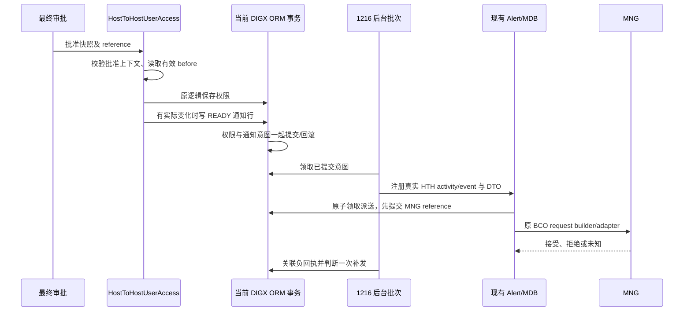

# BCOH2H-1216 — User Accounts & Service Access Notification

**实现更新：2026-09-16。** 本次从 `ce2d2587`（851 已实现）继续实现 1216。Link/Edit 最终生效通知和本地验证已完成，开关默认关闭；真实 UAT 和收件矩阵签定仍待完成。成套文件、SQL、开关、故障状态及 UAT 步骤见 [部署说明](</Users/devs/CProj/hth-application/consulting/db/branch_change_history/20260916_HTH_User_Access_1216/README.md>)。

## 1. AC 与实现边界

| AC | 实现 |
| --- | --- |
| AC1：To link 完成全部审批 | HTH `HostToHostUserAccess.submit` 最终批准且生效 grants 发生变化，产生 `HTH_USER_ACCESS_LINKED` |
| AC2：Edit 完成全部审批 | `.edit` 最终生效产生 `HTH_USER_ACCESS_UPDATED`，覆盖账户与 API 服务差异 |
| AC4：API Email 失败的 bounce back | 明确提交失败/负回执后判断公司邮箱，最多一次 fallback；未知结果先对账 |
| BCO 原流程 | 不修改 BCO `UserAccountAccessExt`、业务权限/eAdvice 或旧模板；共用派送只增加两个精确 HTH event 分支 |

原 Story 没有 AC3。矩阵 #3 的 Corporate HTH disable 属于 `HostToHostManagement`，与用户整组权限 Delete 不同；这两条当前未纳入，不能把它们冒充 AC1/AC2 的 Link/Edit。Edit 中删除部分账户/API 已覆盖。

当前规则按实现假设明确记录：HTH 用户、最终审批人和 owner 公司 Email + SMS；相同通道/地址只发一份相同消息；无实际变化不发；仅 API Email 一次公司 fallback。已提出 1216 范围确认，尚未收到答复。851 的历史确认、API Password Code 的全部审批人规则均不自动扩展到 1216。正式启用前须签定第 8 节。

## 2. 服务挂钩与批准上下文

在 `HostToHostUserAccess.saveResponse/saveStatus` 已有 `approvedExecution` 分支中，仅增加 capture → 原 `applyApprovedAccess` → stage。保留原校验、权限保存、response policy、Interaction 与审批流程。

`HthUserAccessNotification.capture` 同时检查 OBDX_BU、功能开关、非 VALIDATE、CREATE/EDIT、平台 Transaction APPROVED、真实 submit/edit serviceId、批准快照 `(party, closeId, accessParty, linkage)` 与请求一致、HTH Profile 身份及最终 signedBy。目标用户取验证过的 closeId；不信任浏览器 username 或目的地址。缺乏必要批准上下文不生成成功消息，身份上下文不一致则失败。

有效差异取服务器仓库中 ACTIVE account/API 的集合，账户以 canonical accountType/accountNumber 标识，API 以 apiMasterId 标识。比较忽略数据库行 ID 和数组次序，避免 replace/reinsert 导致虚假变更。比较值只留在调用内，通知不保存账号/权限明细；本次不实现 791 审计功能。

## 3. 收件与模板

| 角色 | 来源 | 当前通道 |
| --- | --- | --- |
| API | 目标 HTH 用户的 CM User email/mobile + extension mobileCode | Email + SMS |
| AP | 获批 Transaction.signedBy 最后一位非空 User 的 profile | Email + SMS |
| COMPANY | HTH owner party 的 getPartyPreferences officeEmailId/officeTelNo | Email + SMS |

去重按相同消息的 `(channel,address)`，API → AP → COMPANY；Associated 只通知用户所属公司，不将 accessParty 的联系人加入。缺地址跳过，号码不猜国家码。APPROVAL_REF、closeId、accessParty、linkage 保留在派送记录用于关联，收件地址不写普通日志。

2 个事件 × 2 通道 × 3 locale（en、zh-Hant、zh-Hans-CN）共 12 个模板。Email 沿用 BCO `userNameId`（短 ID）、`userSysDate`（香港生效时间）、`compName`（原 BCO 公司名掩码）；值在输出前 HTML escape。真实 service metadata 绑定新 DTO getter，模板 attr/src 配置全部补齐。英文短信来自矩阵 #4/#5，中文及中英邮件为待业务签定的可运行文案。

## 4. 事务、持久状态和平台复用

新增 `DIGX_CZ_HTH_ACCESS_NOTIFY` 是最小通知意图/派送状态表，未新增权限或审批表。原设计仅依赖 ActivityLog 的方案不能保证最外层提交前不派送和业务唯一性，实施改为复用 851 的 ledger 状态机，按 Story 独立表、开关和 HA reference。

同一批准 reference + owner/closeId/accessParty/linkage + 操作 + 通道/地址具有稳定唯一 ID。业务 stage 使用当前 DIGX Session；后台短事务使用既有可独立提交的 dispatchDataSource（默认 NONXA），只负责通知和 MNG，不改原权限业务事务。MNG 调用前持久化 reference，超时/空响应/中断标记 UNKNOWN，禁止盲目重发。SUBMITTED 只代表网关接受。

## 5. Bounce Back

只接收两个精确事件的 EMAIL 负回执/明确拒绝，按 `HA` + ledger ID 关联。API 原始邮件失败时读取当前 owner officeEmail，与失败地址不同才考虑补发；若公司已在本次原收件中，不再发相同内容。新公司地址可建立唯一 PARENT_ID 子记录，失败终止。AP、COMPANY、SMS、补发本身均不再级联。

root/UAT/PRD 通用 `ValidateAndSendBounceNotify` 排除这两个事件，避免原高风险 fallback 再接管并转发给其他角色。UNKNOWN 等待网关对账，不当作确认失败。

## 6. 公共代码与 BCO 影响

| 文件/模块 | 本次修改 | 隔离方式 |
| --- | --- | --- |
| HTH service/helper | 两个批准生效分支挂钩、差异与角色解析 | 只在 HTH Link/Edit，关闭开关不增通知仓库查询 |
| xface | 新 Plan/ActivityLogDTO | 独立 HTH 类型，不改公共响应 DTO |
| HthContactNotificationRepository/Dispatch | 复用 851 派送状态机，选择独立 1216 表/metadata | 旧构造默认为 851，原事件与 HC reference 不变；BCO 精确事件外仍走原路径 |
| 新 HthUserAccessNotificationService | 消费已提交 1216 意图 | 独立开关、OBDX_BU、还原 session party/locale |
| BatchExecutionScheduler | 原 BCO/851 后执行 1216，各自异常捕获 | 不改变原业务批次；仍需共享 UAT 容量回归 |
| Preferences.xml | 增加新 DB provider | 不覆盖 851/BCO 配置 |
| 三份 Bounce Batch | 精确排除两个新事件 | 原 BCO 事件集合语义保留 |
| SQL | 新表、两组 activity/event、12 模板、6 service attr、18 attr/src | 可重跑，保留 BCO generic 定义/旧模板/其他 BU/历史流水 |

本次未修改前端、BCO 权限 postCreate、Login PIN/API Password、DSP 或审计 Handler。共用组件有实际变化，不能称为零 BCO 风险；851 本地回归已通过，真实 BCO 派送/退信/批次性能需 UAT 验证。

## 7. 验证结果与限制

- Java 8 目标编译实际 HTH service/helper、DTO、共享 dispatcher/scheduler 与 root/UAT/PRD batch。
- 生产 851/1216 helper/repository/dispatcher + H2 和真实 EclipseLink/OBDX ORM：批准过滤、差异、联系方式去重、提交/回滚、并发领取、MNG-before-IO、失败及 fallback。
- 生产发布 DTO + 真实 OBDX metadata getter 对 12 个实际 SQL 模板取值/替换，无残留变量。
- SQL DML 重跑、晚期失败回滚、flag 保留、851/BCO/其他 BU 保留、配置数量/变量绑定检查。

银行仓库、JNDI、Event 注册和网络使用 fixture；真实 Oracle PL/SQL、WebLogic/JTA/MDB、最终批量审批时序、实际 Email/SMS 送达尚未验证。详细 UAT 用例和启用 SQL 见部署说明；不得以本地成功代替 UAT 签收。

## 8. 待业务确认

1. 三方双通道或优先通道；当前为可用的 Email + SMS，缺通道跳过。
2. 最终一位审批人或全部实际审批人；当前为最终一位。
3. API 联系人取用户资料、fallback 取 owner officeEmail、Associated 不通知被关联公司。
4. 无实际变化不通知、API 邮件最多一次 fallback、公司原收件去重的具体语义。
5. 公司整体 disable 与用户整组 Delete 是否另扩范围；#3 PIN Activation 文案不能直接用于权限删除。
6. 三语正式模板、共用 UAT 启用时间及真实送达证据。

## 9. 需求来源

- [1216 Story PDF](</Users/devs/CProj/hth-application/story/notification & audit log/[BCOH2H-1216] CM - User Accounts & Service access - Notification - Jira.pdf>)：AC1、AC2、AC4；原文无 AC3。
- [通知矩阵 Pending Review](</Users/devs/CProj/hth-application/story/notification & audit log/292819003_42a73221555b491c9269d186f430d7bc-140926-0744-3.pdf>)：#3/#4/#5 收件与模板，编辑痕迹仍保留为待确认事项。
- [三 Story 总览](</Users/devs/CProj/hth-application/story/notification & audit log/README.md>)：共用代码、BCO 月度发布及 791 评审边界。
