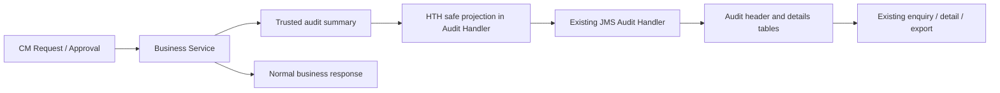

# BCOH2H-791 Technical Design

| 项目 | 内容 |
| --- | --- |
| Story / TD | BCOH2H-791 / BCOH2H-1299 |
| 功能 | Enhance BCO Audit Log to Support HTH API Onboarding Activities |
| 状态 | Implemented locally；已完成本地验证，待共享 UAT 验收 |
| 需求基线 | 2026-09-14 导出的 Story PDF，第 1–2 页 |
| 代码基线 | hth-application `c97d9260` 上实现，2026-09-16；未包含既有 .project 修改 |
| 范围 | CM 用户维护、Code 生成/重新生成、HTH 账户服务权限、API Password setup/reset、既有审计查询及导出 |


## 0. 2026-09-16 实际交付与验证

部署和 UAT 操作见 [791 部署说明](../../consulting/db/branch_change_history/20260916_HTH_Audit_791/README.md)。下文保留 AC/评审设计；以本节说明实际实现和未验证边界。

- 业务采集：UserExtensionData create/update（包含 HTH→BCO）、Code generate/re-generate（查原 Code 记录）、Access 最终生效的账户/API 差异、setup/reset 成功失败及 replay。审批待处理使用 PENDING_APPROVAL，用户维护完成使用 COMPLETED，密码成功使用 SUCCESS；都不引入新的主表状态枚举。
- 公共 helper 放在 **com.ofss.digx.cz.bea.common** 已有依赖中。业务 scope 只写安全 summary 到已有 audit stack；Handler 在原始日志/stack/JMS 前投影，REST finally 清理该 stack。没有额外线程上下文，业务请求/响应不修改。
- `CZAsyncAuditHandler` 保留高风险、BCM/bulk 分支和原 JMS 路由；HTH 才进行字段 allowlist、Header/URL 脱敏和 JMS ChannelContext 安全副本。主表 ERROR 结果不因外层 SUCCESSFUL 而显示成功。
- `CZVoidAuditExt` 保留原过滤与 FMO，之后才投影 HTH 读/列表结果，缺 task 保留原 activity。历史记录不会补造业务摘要，也不会批量删除。
- 原详情组件 `channel/components/audit/audit-log-results` 新增 HTH 条件区及 CSV 下载，复用同一次获准的详情数据；普通 BCO 继续原布局。当前组件没有通用导出入口，未猜改无调用依据的 AuditListResponseDTO.xsl。
- Access 使用独立差异采集，因为 1216 受开关、事件类型和最终审批条件限制，且其 hash 集合不能直接展示账户。增加的读操作只发生在 HTH 最终执行路径；普通 BCO 不增加这些查询。后续可在性能基线确认后复用无开关的原始快照。

本地验证：

```sh
export JAVA_HOME=/opt/homebrew/opt/openjdk@21/libexec/openjdk.jdk/Contents/Home
python3 devtools/backend-compile/tests/verify_hth_audit_compile.py
python3 devtools/backend-compile/tests/verify_hth_audit_runtime.py
H2_JAR=/tmp/hth-h2-1.4.200.jar python3 devtools/backend-compile/tests/verify_hth_password_transactions.py
python3 devtools/backend-compile/tests/verify_hth_contact_runtime.py
node devtools/backend-compile/tests/hth-audit-ui.test.js
```

已通过：Java 8 定向编译；真实框架 AuditDTO + Java JMS 序列化；独立 ChannelContext 不泄漏请求/响应 nonce；HOST/SERVICE/REST 敏感字段和伪造摘要排除；真实 setup/reset 方法编排与 H2/OBDX ORM 的成功、失败、幂等审计；1000 条同数量服务替换差异；851/1216 派送、事务、metadata 回归；前端 600 项差异导出、公式转义、false 值和 BCO 显示隔离；ESLint/OBDX 规则。

没有连接 UAT Oracle、WebLogic 审批/AOP 或 JMS 队列。配置、会话服务、银行仓库及外部 DSP/MNG 边界是测试 fixture。最终事务状态、查询权限、实际页面、SQL 重跑和落库结果保留为部署验收项，不能以本地成功替代。

## 1. 设计结论

沿用 BCO Audit Framework、`CZAsyncAuditHandler`、异步 JMS 持久化、现有 Audit Log 页面及权限控制，不另建 HTH Audit Log 表或查询页面。

实现重点有三项：补全 HTH task/resource/audit 映射和名称；用安全的业务摘要记录 actor、target、动作、时间、结果及权限差异；让这些内容在既有查询与导出中可见。`audit=Y` 只代表接入条件之一，不能证明业务信息完整、没有敏感数据或已经能正确导出。

**Password、Password Code、输入密文、传输密钥及会话凭证不进入审计 payload。** 对生成/查看 Code 的接口，审计使用独立的脱敏副本；不能清空真实响应，影响用户获准使用的眼睛查看功能。

不修改本 Story 之外的密码传输协议、存储后端、Code 验证顺序或通知模板。

## 2. AC 对应关系

原 PDF 的 Scenario 4、5 各出现两次。下表使用 A1–A8 区分，保留原编号对应。

| 本文编号 | 原 Scenario | 需要记录 | 验证 |
| --- | --- | --- | --- |
| A1 | 1 User Creation | 操作人、目标 User ID、CREATE、时间、HTH User Channel Type | 新用户成功创建后可按既有条件查到 |
| A2 | 2 User Update | 操作人、目标用户、UPDATE、旧/新 User Channel Type、结果 | 沿用 BCO 保存/审批审计语义；HTH→BCO 变化也不能遗漏 |
| A3 | 3 Code Generation | 目标用户/公司、Code ID、GENERATE、用途、结果、关联 reference | 记录生成动作而非 Code 明文 |
| A4 | 4 Code Re-Generation | 同上，动作 REGENERATE，并关联原 Code ID（如存在） | 创建/编辑用户内触发均覆盖 |
| A5 | 5 Account & Service Access | 目标用户、权限所属公司、账户、服务、ADD/REMOVE/UPDATE、审批及生效结果 | 同时覆盖 Related / Associated 及只变更服务的情况 |
| A6 | 后一个 4 First Setup | 操作用户、SETUP、时间、实际业务结果及安全错误码 | 成功和失败可区分；不含密码或 Code |
| A7 | 后一个 5 Reset | 操作用户、RESET、时间、实际业务结果及安全错误码 | 一次提交、重复请求及失败状态可追踪 |
| A8 | 6 Enquiry + NFR | 所有相关记录通过现有审计查询及导出获取，沿用权限与版式 | 页面、详情、导出、隔离及 BCO 回归 |

PDF 对 User Create/Edit 和权限维护主要描述成功结果；失败记录仍遵循现有 BCO 审计策略，不新增与 BCO 不一致的审批状态。Setup/Reset 明确要求 result status，本设计记录最终成功及失败，不将错误响应中的 `result=SUCCESSFUL` 文本直接当成业务成功。

## 3. 现有结构与差距

| 层 | 已核实的现状 | 本 Story 动作 |
| --- | --- | --- |
| Task SQL | `UAT_N_HAP_GEN/RVL`、`CM_N_HAP_SETUP/RESET` 已设置 audit aspect；HTH User Access 已有独立 task/resource 配置 | 校验实际部署完整性；补缺项，不重复创建第二套 task |
| High Risk | `CZAsyncAuditHandler` 已包含 `UAT_N_HUA_NEW/EDT/DEL` | 保留原分类；新 task 的风险分类按同类 BCO 规则确认，不把所有 HTH 查询标高风险 |
| Audit Handler | HOST/SERVICE/REST 构造审计 details，最后交给 `AsyncJMSAuditHandler` | 增加仅对 HTH 相关 payload 生效的安全投影；覆盖嵌套调用 |
| Request exclusion | SERVICE/REST 根据 `AUDIT_REQUEST_TASK_EXCLUSION_LIST` 过滤 request；REST 的非 GET response 仍可能保留 | 不能只加 request exclusion；生成 Code 的 response 同样必须脱敏 |
| Code DTO | `HthApiPasswordCodeResponseDTO` 有明文 `code`；generate/reveal 会填充 | 真实响应保持；审计仅保留 Code ID、用途、状态等安全元数据 |
| Password Request | 有 `encryptedCredentials`、`transportKeyId`、`requestId`；`toString()` 上的注解不是字段级保护 | 采用 allowlist，而非依赖 toString 或反射黑名单 |
| 存储 | `DIGX_AL_AUDIT_LOGGING` + `DIGX_AL_AUDIT_LOGGING_DETAILS`；另有技术 API audit 表 | CM 业务审计继续使用前两表，不把业务记录塞入独立 API audit 表 |
| 查询 | `LocalAuditRepositoryAdapter.searchAudit()` + `CZVoidAuditExt.postSearch/postRead()`，带 task 名称增强及 FMO 控制 | 保留查询隔离和控制；补 task 文案与安全业务详情 |
| UI / Export | 已有 Audit Log 查询及结果页；存在 `AuditListResponseDTO.xsl`，当前展示以通用字段为主 | 在原详情/导出链路补 HTH 摘要；确认实际部署导出入口，不宣称已有完整 HTH 报告 |

## 4. 操作与 Task 映射

| 操作入口 | Task / Activity 来源 | 审计动作 |
| --- | --- | --- |
| `UserExtensionData.create/update` 的 CM 用户维护路径 | 沿用当前 BCO User Create/Edit 的实际 resource-task 映射；部署脚本查询确认，不另造通用用户 task ID | CREATE / UPDATE + old/new userChannelType |
| `HostToHostApiPassword.generate` | `UAT_N_HAP_GEN` | 根据明确的业务上下文区分 GENERATE / REGENERATE，不根据“返回了 Code”推断 |
| `HostToHostApiPassword.reveal` | `UAT_N_HAP_RVL` | 保留已有查看审计；仅记录谁查看了哪个 Code ID，不记录值 |
| `HostToHostUserAccess.submit/edit/delete` | `UAT_N_HUA_NEW/EDT/DEL` | 审批动作 + 实际权限 ADD/REMOVE/UPDATE 摘要 |
| `HostToHostApiPassword.setup` | `CM_N_HAP_SETUP` | SETUP + outcome |
| `HostToHostApiPassword.reset` | `CM_N_HAP_RESET` | RESET + outcome |

Status / public-key 查询和页面初始化不是“设置密码成功”审计。是否保留其现有技术访问日志遵循平台配置，不能为每次状态轮询新增一笔凭证维护业务记录。

HTH 是**被维护用户的 User Channel Type**；实际执行入口仍可能是 CM / BCO。不能把 Audit 主表的 access point、user type 或登录角色直接改写为 HTH，也不能用目标用户覆盖实际操作人。

## 5. 安全业务摘要

实际新增 `common.audit.HthOnboardingAudit.Entry`，以版本化 Map 保存在原 AuditDetails.request.hthOnboarding，operationName 为 `HTH_ONBOARDING_791`。不新增公开业务 DTO。客户端同名 JSON 不被接受为可信摘要。

| 字段 | 规则 |
| --- | --- |
| schemaVersion、operation | 明确摘要版本与 CREATE/UPDATE/GENERATE/REGENERATE/SETUP/RESET 等动作 |
| actorUserId | 可信 Session / 审批上下文的真实操作人；保留 Audit 主表 USER_ID 原语义 |
| targetUserId、partyId、targetUnit | 服务器校验的完整 User ID、公司及业务单元；不只存去掉 @ 后缀的名字 |
| oldUserChannelType、newUserChannelType | 用于 Create/Edit；尤其覆盖 HTH→BCO，不只检查修改后的类型 |
| referenceNumber、approvalReference | 原业务及审批 reference；用于连接 Maker、Checker、通知与生效动作 |
| occurredAt、businessOutcome、errorCode | 服务器时间、实际结果、已有安全错误码；不附原始异常 message/stack |
| codeId、previousCodeId、purpose、codeStatus | Code 元数据；不含 Code 值、CODE_CIPHER 或能还原值的字段 |
| accessPartyId、linkageType、accessChanges[] | 每个差异的账户标识、API 服务标识、ADD/REMOVE/UPDATE；名称按现有权限和掩码策略 |
| requestId、idempotentReplay | Setup/Reset 业务重放标识；不得拿传输密钥 ID 代替业务 reference |

这里的 businessOutcome 是 details 的补充信息，主表 STATUS 必须映射到平台既有枚举，不私自引入数据库新状态值。业务已成功但通知稍后派送失败时，仍是业务成功；通知结果通过独立 reference 查询，不反写成密码/权限修改失败。

账户完整标识可按既有审计授权规则留存，页面及导出沿用 BCO 的 masking。权限规模较大时主表只记录一次业务操作，明细记录所有有效差异；不为每个账户生成一个互不关联的顶层审计，不静默截断最后若干项。

## 6. 采集及脱敏位置



1. Service 使用现有审批快照、业务结果和 Repository before/after 形成摘要；在事务结果确认前不能把 pending 操作标成成功生效。
2. `CZAsyncAuditHandler` 在任何原始 DTO debug 输出、序列化或入 Audit Stack/JMS 前，识别 HTH task、Service 及 DTO，构造新的安全 details。
3. 对 HTH 独立密码 task，仅保留 allowlist 字段；对共用 User Create/Edit DTO，仅处理 HTH 扩展及敏感 Code 分支，同时保留 BCO 原本需要的非敏感审计字段。
4. 覆盖 HOST、SERVICE、REST 所有层和嵌套 details，避免顶层已脱敏、内层仍携带明文。未知敏感 DTO 类型默认省略其 payload，保留 actor/task/reference/result 并记录安全诊断，不回退序列化整个对象。
5. Header 处理复用平台既有 masking，并对本次 HTH 路径确认 Authorization、Cookie、token、nonce 等凭证不进入审计或 debug 输出。
6. 审计摘要与真实请求、响应分离，禁止直接对业务对象 `setCode(null)` 或清空用户输入；旧 Code 的获准查看功能不受影响。
7. 若通过 ThreadAttribute 传递安全摘要，使用独立 key，保存/恢复嵌套上下文并在 finally 清理；不能将上一个用户的摘要带入线程池下一笔交易。框架支持显式参数传递时优先使用显式传递。

单纯把字段名 `code` 加进递归黑名单不够可靠：业务结果的 `message.code` 是允许的安全错误码，不能一并删除；反之嵌套或重命名的真实 Password Code 也不能漏掉。以已知 DTO 的类型和字段契约构建投影。

## 7. 生效状态、审批和重复请求

### 7.1 User / Access 审批

Maker 保存/提交、Checker 批准/拒绝、最终业务生效继续遵循 BCO 原审计语义。同一 reference 下可以有多条不同审批动作，这是业务追踪，不是重复日志。不得因为只想“一条成功日志”而删除 Maker 或中间审批轨迹。

HTH 权限差异在最终批准执行时读取当时有效值，再与成功写入后的状态比较；不使用 Maker 几天前看到的页面数据作为最终 before。更新失败不得记录“账户已添加”。

### 7.2 Code 生成 / 重新生成

当前 Code 的生成可能在用户提交审批之前发生。审计应区分：Code 生成成功、关联待批用户、最终批准后激活；不能把 generation 的 HTTP 成功写成用户已完成创建或 Code 已 ACTIVE。

Generate/Re-generate 的分类使用受信任的创建/编辑上下文及已有 Code 元数据，在同一 task 下显示不同动作；客户端传入的 operation label 只能作为输入，不直接作为审计事实。若第一次编辑时才生成 Code，按实际是否替换已有 Code 判定，并在 UAT 确认展示文案。

### 7.3 Setup / Reset

实际持久化成功后才记录成功；输入解密失败、Code 不匹配、过期、已使用、策略不符及系统失败分别保留已有业务错误码和平台失败状态。日志不记录导致失败的输入内容。

相同 requestId 重放可保留平台访问尝试审计，但须指向同一业务 reference、标识 replay，不能显示为第二次实际改密；用户重新发起一次合法修改使用新的 reference。不要为了避免重复审计改动现有密码幂等及事务规则。

### 7.4 异步可靠性

复用当前 JMS Audit 的重试、死信队列和运维恢复方式。需要验证 business commit、Audit 入队与落库的实际顺序，避免业务 rollback 后留下“成功生效”摘要；按 BCO 既有策略记录失败尝试。

Audit 消费失败时不能静默丢弃或手工改业务状态掩盖。使用 reference 对账并监控积压。是否因审计系统故障阻止业务沿用 BCO 已有政策，本 Story 不独立改成全局 fail-open 或 fail-closed。

## 8. 现有查询、详情及导出

### 8.1 查询

继续使用现有 `resourceTasks?aspects=audit&view=list`、`audit` 查询及 `audit/{id}` 详情 API。查询条件沿用 User ID、时间、activity、partyId、action、status、reference 等现有参数，不新增无权限约束的 HTH 全量查询接口。

Activity 下拉需包含所有已授权 HTH task，并补齐本地化名称；`CZVoidAuditExt` 通过 TaskEnricher 获取名称，缺 task / 文案不能导致整页其他 BCO 记录失败。检查 HTH Password task 的 CommonTask / 相应资源名称配置，已有 HTH User Access 名称保留。

现有 User ID 搜索主要对应 actor，不修改其语义为 targetUserId。目标用户在详情中明确显示，并通过相关 activity/reference 查询定位；若 BA 要求直接按目标用户过滤，再在原查询页面及服务加独立条件，不能以更换 USER_ID 写入方式冒充支持。

### 8.2 详情

沿用现有结果页和详情能力；为 HTH operation 添加条件展示区域：Target User、User Channel Type、Action/Result、Code metadata 或 Account/API Service Changes。普通 BCO 记录继续原布局，旧审计数据缺少摘要时显示可用通用信息，不报错。

复用现有 Oracle JET / Knockout / nls，不引入新组件库。只有确有布局需要时改 CSS/SCSS，并保持同源同步和项目原有格式；JS 按项目实际 ESLint 及自定义 OBDX 规则验证。

### 8.3 导出

现有 `AuditListResponseDTO.xsl` 仅证明项目有审计报告转换文件，不能证明 UAT 的所有导出按钮使用它。实施先从当前页面导出请求确认实际 DTO/assembler/XSL 调用链，然后在同一路径加入 HTH 摘要。

主列表导出保留既有列及顺序；HTH 特有信息以对应交易详情块/既有详情导出格式呈现，避免把每条 BCO 记录扩成大量空列。若正式 UI 要求追加列，使用同一套受控字段映射，并同步页面和导出。

PDF、CSV/Excel 等实际启用格式均只能读取安全摘要；无权限的账户、关联公司或其他用户信息不能仅因为走了 export 就绕过 FMO/Party 控制。对含公式前缀的用户可编辑名称沿用既有电子表格导出转义。

## 9. 数据库和配置

复用 `DIGX_AL_AUDIT_LOGGING` 与 details 的 JSON 映射，默认不新增表、索引或主表字段；版本化摘要存在现有 details 中。现有主表 USER_ID、TASK_CODE、ACTION、STATUS、REFERENCE_NO 等语义不变。

部署脚本补查 `DIGX_CM_TASK`、`DIGX_CM_TASK_ASPECTS`、`DIGX_CM_RESOURCE_TASK_REL` 以及任务名称/风险配置。**仅启用 audit 不得自动授予业务执行权限**，角色与菜单权限继续用对应功能原部署配置。

既有 request exclusion 只能作为额外防护，不代替 response/嵌套 payload 投影。不得为脱敏关闭整个 task 审计，也不得把 GENERATE/SETUP/RESET 改成 `VALCALL_NO_AUDIT`。

SQL 实际为 `1_HTH_Audit_Mapping → 2_Verification`，本地化使用既有 CommonTask 三个资源文件，使用可重跑的集合式更新，保留普通 BCO 映射及缓存策略；应用资源变更按现有发布流程刷新/重启。历史不完整摘要不补造，已存在敏感历史数据如被核实需独立受控处理，不在本次发布脚本中批量删除审计。

## 10. 修改清单与 BCO 影响

| 单元 | 修改内容 | 影响控制 |
| --- | --- | --- |
| UserExtensionData | 提供 HTH channel、target、Code 关联的安全摘要 | 仅补 HTH 扩展；原 BCO 审批、创建及更新不变 |
| HostToHostApiPassword | 提供生成/重新生成、setup/reset 的实际结果摘要 | 不改加解密、密码/Code 校验、通知及业务响应 |
| HostToHostUserAccess | 提供有效权限 before/after 与审批关联 | 独立读取已生效 before/after；不依赖 1216 通知开关。通知现有 hash 去重计算保持不变 |
| xface / Audit helper | 安全、版本化 DTO 投影 | 不直接序列化业务 DTO；兼容旧摘要缺失 |
| CZAsyncAuditHandler | HTH payload 在日志/栈/JMS 前脱敏，保留原公共流程 | 保持原审计路由、过滤和 BCO 全局 audit 配置 |
| CZVoidAuditExt / task 配置 | 名称、必要的摘要展示适配 | 保持 isFilterOut、FMO 和权限边界；不随意重写共用 Repository 查询 |
| Audit 页面 / 实际导出链路 | HTH 详情、标签及安全导出 | 原 BCO 布局与查询参数保持；运行项目 ESLint |

## 11. 验证计划

| 测试组 | 覆盖 |
| --- | --- |
| A1/A2 | 创建 HTH、BCO→HTH、HTH→BCO、未改 Channel 的普通编辑；actor 与 target 不同 |
| A3/A4 | Create 生成、Edit 首次生成、重新生成、旧 Code reveal；审批前生成与批准激活不混淆 |
| A5 | Related/Associated；账户 ADD/REMOVE；服务 ADD/REMOVE；相同数量但不同服务；大批量差异 |
| A6/A7 | 真实 setup/reset 成功；输入解密失败、Code 错误/过期/已用、策略失败、持久化失败 |
| 审批/幂等 | 多级批准、拒绝、取消、批量、回调重复、同 requestId 重放、并发 |
| 安全 | 使用合成测试秘密；检查 HTTP/Service/Host 审计对象、JMS/死信、DB details、debug、页面和导出均无秘密或输入密文 |
| 查询 | 各 HTH activity、actor、时间、reference、status 过滤；旧记录；多语言 task 名称 |
| 权限 | 无审计权限用户；不同 party/targetUnit；Associated 范围；API 与导出一致受控 |
| 稳定性 | JMS 暂停/恢复、重复消费、节点重启；reference 对账；分页性能及导出大数据量 |
| BCO 回归 | 普通用户维护、Login PIN setup/reset、BCO 权限维护、审计查询/详情/导出、原任务过滤 |

测试报告对每种操作给出业务 reference、审计主表/详情记录、页面及导出结果。成功与失败均使用真实业务执行测试；单元测试仅用于补充证明摘要规则，不以编译通过代替端到端证据。

## 12. 待确认与实施门槛

1. PDF 引用 Figma，但当前材料未提供具体页面内容；详情布局先对齐现有 Audit Log，实施前确认原型是否另有字段要求。
2. Scenario 3/4 的 “account” 是否指 API 用户账号，还是还要求列出其他业务账户；本设计前者使用 targetUserId，权限维护另记录账户/服务。
3. GENERATE / REGENERATE 的业务展示判定，以及是否要求直接按 targetUserId 检索。
4. UAT 实际导出 DTO/XSL 链路、启用格式及既有 masking 规则。
5. 框架审计入队与外层业务事务顺序、持久化恢复机制；先验证再固定接入位置。

以上不影响必须落实的安全要求：不得存储 Password / Code 明文，不得关闭现有审计来规避敏感字段处理。

## 13. 需求与源码索引

[Story PDF](</Users/devs/CProj/hth-application/story/notification & audit log/[%23BCOH2H-791] CM - Audit Log - Enhance BCO Audit Log to Support HTH API Onboarding Activities.pdf>)：第 1 页 Scope；第 2 页全部 Scenario、NFR。

| 源码证据 | 支持内容 |
| --- | --- |
| [Audit Handler](</Users/devs/CProj/hth-application/consulting/middleware/projects/module/com.ofss.digx.cz.bea.module.common/src/com/ofss/digx/cz/bea/app/audit/handler/CZAsyncAuditHandler.java:376>) | HOST/SERVICE/REST 审计细节采集及非 GET response 路径。 |
| [HTH Code Generate 响应](</Users/devs/CProj/hth-application/consulting/middleware/projects/module/com.ofss.digx.cz.bea.module.hosttohost/src/com/ofss/digx/cz/bea/app/hosttohost/service/HostToHostApiPassword.java:687>) | 真实响应包含 Code，需与审计副本分离。 |
| [Setup/Reset 请求 DTO](</Users/devs/CProj/hth-application/consulting/middleware/projects/common/com.ofss.digx.cz.bea.app.xface/src/com/ofss/digx/cz/bea/app/hosttohost/dto/HostToHostApiPasswordRequestDTO.java:13>) | 输入密文、传输 key ID 和业务 requestId。 |
| [Code 响应 DTO](</Users/devs/CProj/hth-application/consulting/middleware/projects/common/com.ofss.digx.cz.bea.app.xface/src/com/ofss/digx/cz/bea/app/hosttohost/dto/HthApiPasswordCodeResponseDTO.java:22>) | 包含业务所需明文 code 字段。 |
| [HTH User Access 生效入口](</Users/devs/CProj/hth-application/consulting/middleware/projects/module/com.ofss.digx.cz.bea.module.hosttohost/src/com/ofss/digx/cz/bea/app/hosttohost/service/HostToHostUserAccess.java:321>) | 批准后 applyApprovedAccess；saveStatus 使用同类路径。 |
| [Audit Repository](</Users/devs/CProj/hth-application/consulting/middleware/projects/module/com.ofss.digx.cz.bea.module.common/src/com/ofss/digx/cz/bea/domain/audit/entity/repository/adapter/LocalAuditRepositoryAdapter.java:270>) | 当前审计查询过滤实现。 |
| [Audit Extension](</Users/devs/CProj/hth-application/consulting/middleware/projects/module/com.ofss.digx.cz.bea.module.access/src/com/ofss/digx/cz/bea/app/audit/service/ext/CZVoidAuditExt.java:63>) | 任务名称增强、过滤及 FMO 控制。 |
| [Audit ORM](</Users/devs/CProj/hth-application/consulting/config_core/orm/eclipselink/mappings/audit/Audit.orm.xml:4>) | 通用审计主表及 details 集合映射。 |
| [AuditDetails ORM](</Users/devs/CProj/hth-application/consulting/config_core/orm/eclipselink/mappings/audit/AuditDetails-embeddable.orm.xml:10>) | request/response 使用 JSON 转换器。 |
| [Audit 页面 Model](</Users/devs/CProj/hth-application/consulting/channel/extensions/components/audit/audit-log/model.js:111>) | 现有 activity 下拉及审计查询 API。 |
| [Audit 结果页](</Users/devs/CProj/hth-application/consulting/channel/extensions/components/audit/audit-log-search-results/audit-log-search-results.html:5>) | 当前通用列和既有 UI 结构。 |
| [Audit Export XSL](</Users/devs/CProj/hth-application/consulting/config_core/resources/com/ofss/digx/app/audit/dto/AuditListResponseDTO.xsl:86>) | 源码中的现有审计报告转换；实际 UAT 调用链待验证。 |
| [HTH User Access Process SQL](</Users/devs/CProj/hth-application/consulting/db/branch_change_history/20260825_HTH_User_Access/final/3_HTH_User_Access_Process.sql:15>) | 已有 task、resource 及 aspect 配置。 |
| [HTH Setup/Reset Process SQL](</Users/devs/CProj/hth-application/consulting/db/branch_change_history/20260907_HTH_API_Password/2_HTH_API_Password_Process.sql:24>) | 已有 setup/reset task 及 audit aspect。 |
| [HTH Code Process SQL](</Users/devs/CProj/hth-application/consulting/db/branch_change_history/20260830_BCOH2H-787_HTH_API_Password/3_HTH_API_Password_Process.sql:10>) | 已有 generate/reveal task 及 audit aspect。 |
| [CommonTask 标签](</Users/devs/CProj/hth-application/consulting/config/resources/nls/CommonTask.properties:424>) | HTH User Access 已有名称；Password 相关名称需补查配置。 |

共用代码影响、发布控制和评审决策见 [总览](</Users/devs/CProj/hth-application/story/notification & audit log/README.md>)。源码行号对应本次读取基线，后续代码变化应重新核对。
