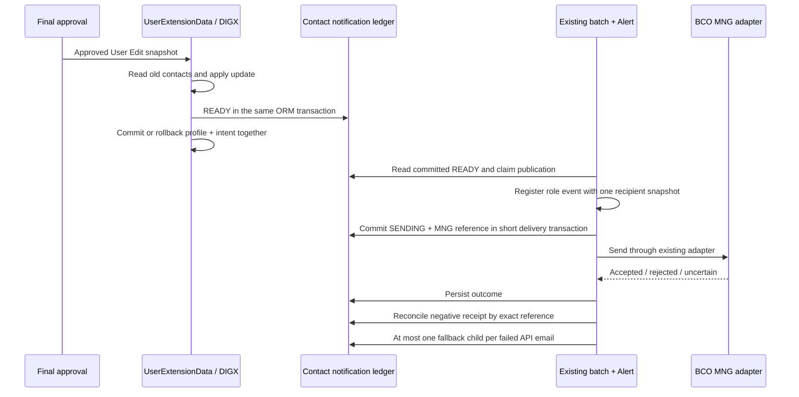

# BCOH2H-851 Technical Design — 实现版本

| 项目 | 内容 |
| --- | --- |
| Story / TD | BCOH2H-851 / BCOH2H-1295 |
| 功能 | CM Profile Contact Update Notification |
| 状态 | 2026-09-16 实现验证完成，本地运行测试通过；开关默认关闭，待 UAT |
| 需求基线 | Story PDF AC1–AC4；补充通知矩阵 #7/#8/#9；本次用户明确回复“按上述设计实现” |
| 代码基线 | `3a33b998` 后的 851 工作区修改；1216、791 本次未实施 |
| 发布说明 | [851 SQL、模块清单、状态与验收步骤](</Users/devs/CProj/hth-application/consulting/db/branch_change_history/20260915_HTH_Profile_Contact_851/README.md>) |

## 1. 已确认规则与 AC

“Contract” 按 AC 的 Email/Mobile 解读为 Contact。复用 CM User Edit 和最终批准路径，不新增用户页面或公开通知接口。

| 场景 | API 用户 | 最终审批人 | 事件类型 |
| --- | --- | --- | --- |
| AC1：Email + Mobile | 旧/新邮箱、旧/新号码 | Email + SMS | CONTACT |
| AC2：仅 Email | 旧/新邮箱、未变号码一次 | Email + SMS | EMAIL |
| AC3：仅 Mobile（含国家码） | 旧/新号码、未变邮箱一次 | Email + SMS | MOBILE |
| 未变、Maker/VALIDATE、中间审批 | 不产生 851 | 不产生 851 | NONE |
| AC4：API Email 确认失败 | 当前公司 officeEmail 不同才补发一次 | 不扩大通知范围 | 原 API 事件 |

**本次已确认** API 联系方式取 HTH 用户 CM Profile；BCO fallback 取公司 officeEmail；仅通知最终审批人；仅改一个通道时未变通道仍发一次。不把 API Password Code 通知的“全部签署人”规则套用到 851。

同一 API 旧/新地址去重。API/AP 邮件语义不同，同一邮箱保留各自邮件。矩阵三个场景的 API/AP 短信相同，同一号码只保留一条，API 收件记录优先。空目的地址不发送，不猜国家码。Email local-part 保留大小写，domain 归一化；手机号按国家码和本地号码归一化，避免二次拼接。

## 2. 数据来源与批准校验

| 数据 | 实现 |
| --- | --- |
| HTH 身份 | 同 Party 的 `IHthUserProfileAdapter.listCloseIdsByUserKey`，兼容完整/短 CloseID；不依赖 API Password、DSP、账户权限 |
| old contact | `User.read(UserKey)` + 原 `UserExtensionData.mobileCode`，在 assembler 更新之前复制 |
| new contact | 已批准 `UserExtensionDataDTO.userDTO` 与 `mobileCode` |
| 业务主键 | 请求 Party/User 与持久 extension 一致；只支持已部署配置的 `OBDX_BU` |
| 最终批准 | `TRANSACTION_REFERENCE_NO` 查询 Transaction；要求状态 APPROVED、serviceId 精确为 UserExtensionData.update，排除 VALIDATE |
| 最终审批人 | 批准记录 signedBy 最后一个非空用户；读取该用户 User/Extension 联系方式 |
| fallback | 按原 Party 查询 `DIGX_PI_PARTY_PREFERENCES.OFFICE_EMAIL` 当前值 |
| 时间 | 服务器时钟，HKT `dd/MM/yyyy HH:mm:ss` |

框架在执行业务前已提交 APPROVED，而 processing step 的 EXECUTION 此时只在内存，业务返回后才保存。因此不把数据库 EXECUTION 当作发通知前提。仅处于 APPROVED 也不足够，必须同时经过实际 update 成功路径和本地业务事务提交。

## 3. 实际代码变化

| 代码 | 作用及 BCO 边界 |
| --- | --- |
| `HthContactNotificationPlan` | 归一化、变更类型、角色/通道去重、确定性通知 ID；纯逻辑 |
| `HthProfileContactNotification` | 在 User Extension service 内校验批准、复制联系人，在当前 ORM 事务写通知意图 |
| `UserExtensionData.update` | 在更新前 capture，在 postUpdate 成功后 stage；新增私有 overload 保留 `USER_MANAGEMENT_EDIT`，仅 HTH Contact 通知分流；原 public 方法及其他调用者不变 |
| `HthProfileContactUpdateActivityLogDTO` | 仅模板字段 `hthContactUserName`、`hthContactApprovedAt` 和通知 ID；目的地址使用平台 NotificationDetail |
| `HthContactNotificationService` | 批次读已提交意图、处理负回执、注册现有 Alert 事件；保存/恢复 shared session 的 Party/Locale |
| `HthContactNotificationRepository` | ledger/MNG 短事务、并发领取、结果对账、一次 fallback 持久化；不更新用户或密码 |
| `HthContactNotificationDispatch` | 六个精确事件 allowlist；用快照目的地址调用 BCO MNG builder/adapter；模板未解析禁止发送 |
| `EmailDispatcher` / `SMSDispatcher` | 顶部 851 分支，其他事件原逻辑；两处 builder 改为 package 可见供复用，原方法体不变 |
| `BatchExecutionScheduler` | 原 BCO 批次之后执行 851；独立捕获异常，flag 关闭时不查 ledger；已有 dispatch 模块依赖可复用 |
| 三份 `ValidateAndSendBounceNotify` | root/UAT/PRD 的通用 Email/SMS 高风险查询排除六个 851 事件，不让专用失败进入多轮级联 |
| Preferences / SQL | 独立类别与默认关闭开关、ledger、六事件、36 模板/recipient、36 元数据绑定 |

没有修改 BCO 密码、OTP、RSA、DSP、Login/Form、Dashboard、Profile UI、审批授权规则或 1216/791 实现。普通 BCO 在 flag 开启时增加 HTH Profile 归属读取，不能据此宣称绝对零性能影响；共享 UAT 仍须回归 User Edit、Batch 和 MNG 派送。

## 4. 事务与一次派送

旧方案只有 ActivityLog 持久化，不能证明不会在最外层 commit 前派送，也没有批准 reference 的业务唯一约束。实际增加小型 **通知意图/派送记录表** `DIGX_CZ_HTH_CONTACT_NOTIFY`，没有增加 Profile/Password 表或新 Store 层。

业务 stage 使用当前 **DIGX ORM 事务**，不得独立 commit。派送独立使用可配置的既有资源本地数据源，默认 **NONXA**，因此已批准用户资料不被通知失败回滚。NONXA 没有替换 User Edit 的 DIGX。

每个批准 reference + 用户 + 变更 + 角色 + 通道 + 地址生成确定性 ID；重复 stage 不新增。并发 CAS 领取 SENDING；MNG 记录插入失败则回滚领取，不外发。超时或空响应记 UNKNOWN，进程在 SENDING 崩溃超过 15 分钟也转 UNKNOWN。不会为了“重试成功”自动再次提交未知请求；需要按原 reference 对账。

PUBLISHING/PUBLISHED 超过 5 分钟可重新注册 Alert；同一 ledger 只允许一份派送领取。框架注册次数可以多于实际 MNG 请求数。每批最多取 100 条；批次时长与网关超时仍是 UAT 容量验证项。

## 5. 事件、模板和回执

Activity 为 `com.ofss.digx.cz.bea.app.sms.service.user.UserExtensionData.update`。三个变更类型各有 `_API` / `_AP` 两个事件：

- `HTH_PROFILE_CONTACT_UPDATED_API` / `HTH_PROFILE_CONTACT_UPDATED_AP`
- `HTH_PROFILE_EMAIL_UPDATED_API` / `HTH_PROFILE_EMAIL_UPDATED_AP`
- `HTH_PROFILE_MOBILE_UPDATED_API` / `HTH_PROFILE_MOBILE_UPDATED_AP`

每个事件配置 EMAIL/SMS × en/zh-Hant/zh-Hans-CN，共 36 个模板。API fallback 使用原 API 邮件语义。邮件两个占位符通过 Generic Attribute → Service Attribute → Message Attribute/Source 完整链绑定，真实 `HostServiceMetadataService` 测试已解析。英文邮件加中文版本，SMS 对应语言；英文 SMS 最长 159 字符，TC/SC 最长 61 字符。保留现有短信长度与 mock 开关。

MNG 使用现有 request builder 和 `IMNGEmailAdapter` / `IMNGSmsAdapter`，`appID=89`、邮件 type=6、短信 type=1。reference 为 `HC` + 32 位 ledger ID，MNG 表先记录 Pending，再更新 Success/Failed/Exception。Success 只代表 MNG 接受，不代表实际送达。

负回执按 CCBEMAIL `SRC_SYS_REF_NUM` 精确关联，忽略通用 batch processed flag；不重新读取当前 User Email 来匹配旧地址。API 邮件失败才允许一次子记录；公司邮箱为空/相同、AP 邮件、SMS、fallback 再次失败都终止。每条原失败邮件单独关联自己的 fallback；不得直接把六事件追加到通用高风险列表。

新日志只记录通知 ID/阶段/结果/异常类型。ledger、NotificationDetail 和 MNG 是既有权限控制下的收件数据；未改造公共 User Edit 现有详细日志，不能把本 Story 当作 791 全链路脱敏完成。

## 6. 已完成验证与剩余验收

本地通过：真实类目标编译；实际 policy/capture、BCO/flag/unit/批准分支；三种联系方式变化、国家码、空目的地址、去重；快照更新后仍保留旧值；真实 EclipseLink/OBDX ORM 的 commit/rollback/reentry；实际 JDBC 并发领取、MNG-before-IO、网关成功/拒绝/超时/空响应、崩溃对账、重复回执与一次 fallback；SQL 两次执行、失败回滚、BCO/其他 BU/开关现值保留；真实模板 getter 解析。

边界：本地 H2 替代 Oracle，用户/审批仓库、JNDI、Event 注册和 MNG 网络使用 fixture。没有运行真实银行网关，没有完成 WebLogic/JTA/MDB 集成或收件验收，完整用例与命令见部署 README。

仍需验收：

1. Oracle SQL/数据源同 schema、模块同版、Scheduler/Alert/MDB 运行、回执字段容量和完整 reference。
2. 多级/批量/OMB 最终批准实测、业务回滚不派送，以及三个收件场景实际 Email/SMS 数量。
3. BCO/Merchant/原 User Management 通知、共享批次耗时和环境开关回退。
4. 正式三语模板文案。#9 原矩阵标题/正文不一致，本实现按 Mobile 变更修正标题；TC/SC 是可运行文案，仍待 BA 正式文案签字。

## 7. 需求与源码索引

[Story PDF](</Users/devs/CProj/hth-application/story/notification & audit log/[%23BCOH2H-851] Customer onboarding - CM - Profile Contract Update Notification.pdf>)：第 1–2 页：AC1–AC4；补充矩阵第 2、4–7 页：#7/#8/#9 收件人和模板。

[通知矩阵 Pending Review](</Users/devs/CProj/hth-application/story/notification & audit log/292819003_42a73221555b491c9269d186f430d7bc-140926-0744-3.pdf>)；本设计保留其中尚未确认的规则，不把修改痕迹当作最终批准。

| 源码证据 | 支持内容 |
| --- | --- |
| [UserExtensionData — 联系方式比较](</Users/devs/CProj/hth-application/consulting/middleware/projects/module/com.ofss.digx.cz.bea.module.sms/src/com/ofss/digx/cz/bea/app/sms/service/user/UserExtensionData.java>) | 旧/新 Email、Mobile 比较及后续通知分支。 |
| [UserExtensionData — 原通知](</Users/devs/CProj/hth-application/consulting/middleware/projects/module/com.ofss.digx.cz.bea.module.sms/src/com/ofss/digx/cz/bea/app/sms/service/user/UserExtensionData.java>) | BCO 通用用户维护及联系方式通知实现。 |
| [HthUserProfile ORM](</Users/devs/CProj/hth-application/consulting/config/orm/eclipselink/mappings/cz/hosttohost/HthUserProfile.orm.xml>) | 当前映射只有 Party/CloseID，没有独立联系字段。 |
| [ActivityData ORM](</Users/devs/CProj/hth-application/consulting/config_core/orm/eclipselink/mappings/alert/eventGeneration/ActivityData.orm.xml>) | DIGX_EP_ACT_LOG_B、ActivityLog BLOB 及 TXN_REF_NO。 |
| [EmailDispatcher](</Users/devs/CProj/hth-application/consulting/middleware/projects/module/com.ofss.digx.cz.bea.domain.service.dispatch/src/com/ofss/digx/cz/bea/domain/service/dispatch/EmailDispatcher.java>) | 既有派送入口、收件人处理及 MNG 路径。 |
| [SMSDispatcher](</Users/devs/CProj/hth-application/consulting/middleware/projects/module/com.ofss.digx.cz.bea.domain.service.dispatch/src/com/ofss/digx/cz/bea/domain/service/dispatch/SMSDispatcher.java>) | 事件对应的用户/手机号码解析配置。 |
| [UAT Bounce Batch](</Users/devs/CProj/hth-application/consulting/middleware/batchJobs/UAT/inboundbatchprocessor/ValidateAndSendBounceNotify.java>) | 高风险事件和 MNG 回执关联；实施需确认真实部署源码。 |

共用代码影响、发布控制和评审决策见 [总览](</Users/devs/CProj/hth-application/story/notification & audit log/README.md>)。源码行号对应本次读取基线，后续代码变化应重新核对。
