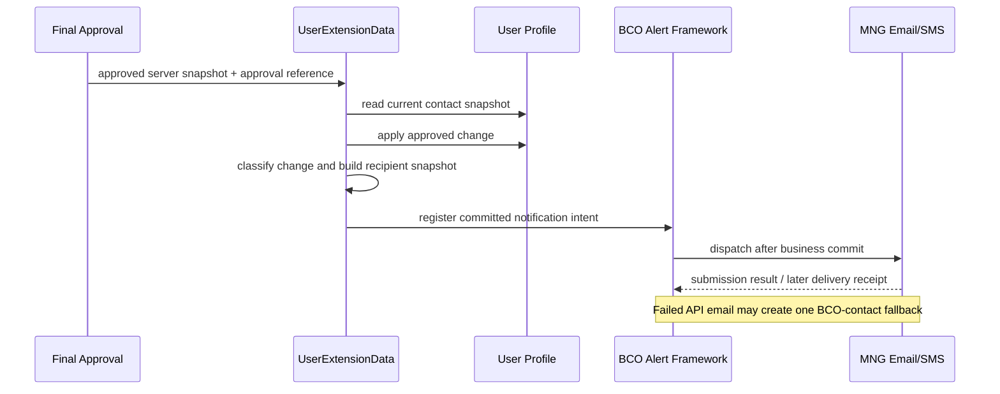

# BCOH2H-851 Technical Design

| 项目 | 内容 |
| --- | --- |
| Story / TD | BCOH2H-851 / BCOH2H-1295 |
| 功能 | Customer onboarding - CM - Profile Contact Update Notification |
| 状态 | Proposed for Review；本文件不代表功能已经实现或通过 UAT |
| 需求基线 | 2026-09-14 导出的 Story PDF；通知矩阵 Pending Review 的 #7、#8、#9 |
| 代码基线 | hth-application `be5abc68`，2026-09-14 阅读现有源码 |
| 依赖 | CM User Edit / 最终审批；BCO Alert、MNG、Bounce Back；共享边界见 README |

## 1. 设计结论

复用现有 CM User Edit 的生效路径、BCO Alert Framework 和 Email/SMS Dispatcher。仅对 HTH 用户增加按联系方式变更类型选择的通知，使用独立 HTH 事件及模板。BCO 用户继续执行现有通知规则。

本 Story 的 “Contract” 按 AC 中的 Email / Mobile 解读为 **Contact（联系方式）**，不设计合同维护。

通知在最终审批且用户资料更新成功后产生，不能在 Maker 保存草稿、提交审批或中间一级审批时发送。被修改用户、最终审批人、公司联系人是三种身份，不能使用当前会话用户名统一代替。

API Profile 原联系方式必须在更新前取自服务器；新联系方式取自批准的业务快照。不能在异步派送时重新读取最新 Profile 后丢失旧值。

## 2. AC 对应设计

| AC | 实现规则 | 验收证据 |
| --- | --- | --- |
| AC1 Email + Mobile | 同一批准变更只归类为 BOTH；旧/新 Email、旧/新 Mobile 分别去重；按 #7 通知最终审批人 | 一次业务事件；收件地址和模板清单；Email/SMS 派送记录 |
| AC2 Email only | EMAIL 类型；旧/新 Email 各通知；未变的 Mobile 只通知一次，按 #8 文案 | 不产生 Mobile 变更文案；无重复未变号码 |
| AC3 Mobile only | MOBILE 类型；旧/新 Mobile 各通知；未变的 Email 只通知一次，按 #9 文案 | 不产生 Email 变更文案；国家码变化也能识别 |
| AC4 Bounce Back | API Email 确认失败且不同于 BCO Account Profile Email，才允许一次 fallback；BCO fallback Email 再失败则结束，不扩散通知 | 原派送 reference、失败回执、fallback reference、终态可关联 |

AC2/AC3 的未变通道规则依据补充矩阵第 2 页：删除线划掉的是该通道的 “old and new”，并未划掉该通道本身。矩阵仍为 Pending Review，此解读须在业务评审确认；若最终改成只发变更通道，调整 HTH recipient 配置及对应测试，不改 BCO 默认规则。

## 3. 已存在实现与差距

| 位置 | 当前事实 | 设计动作 |
| --- | --- | --- |
| `UserExtensionData.update()` | 更新前读取 User，调用 `checkAlerts()`；用户更新无 errorCode 后调用 `alertUserProfileUpdate()` | 在同一生效路径获取不可变 before/after snapshot，并验证最终审批上下文 |
| `checkAlerts()` | 比较 trim 后的 Email、Mobile；布尔 true 表示相同 | HTH 使用明确 `emailChanged/mobileChanged`；比较 Mobile 国家码 + 号码，避免把现有布尔语义用反 |
| `alertUserProfileUpdate()` | 包含 USER_MANAGEMENT_EDIT、INFO_UPDATE_BY_CORP_ADMIN、Email/Mobile 提醒等 BCO 事件 | 保留 User Management 通用事件；对 HTH Contact 部分做互斥分流，避免同一对象同时收到原 Contact 和新增 Contact 通知 |
| `HthUserProfile` Entity / ORM | 只有 Party + CloseID 映射，没有独立 Email/Mobile 联系人字段 | 不虚构 `HTH_USER_PROFILE.EMAIL`；联系人来源按第 4 节实施 |
| Alert ActivityData ORM | `DIGX_EP_ACT_LOG_B` 保存 Activity、TXN_REF_NO、ActivityLog BLOB | 用现有平台持久化通知上下文，不另建 Profile / Password 表 |
| MNG/Bounce | Dispatcher 记录 `DIGX_CZ_EMAIL_MNG`；批处理读取 MNG 回执和高风险事件表 | 补 HTH 事件范围、收件人身份和有界 fallback；不能只配置模板就认为 AC4 完成 |

同一 Java 文件还包含 Merchant / 默认用户更新路径。本 Story 只挂入经过 HTH 身份校验的 CM User Edit 路径，不依据方法名字相似把所有调用点都替换。

## 4. 联系人来源和判定

### 4.1 数据来源

| 逻辑字段 | 现有可用来源 | 使用方式 |
| --- | --- | --- |
| ownerPartyId、targetUserId、CloseID | 已批准 UserExtensionDataDTO 的业务主键 + HTH Profile Repository | 必须验证同一 Party；保留服务器认可的完整 User ID |
| API old Email/Mobile | 更新前 `com.ofss.digx.domain.sms.entity.user.User.read(UserKey)` | 复制字符串值和国家码；不保留后续会被 ORM 修改的对象引用 |
| API new Email/Mobile | 已批准 `requestDTO.getUserDTO()`，并与成功生效结果一致 | 不从额外通知请求接受任意目的地址 |
| finalApproverId/contact | 平台最终审批记录 + 该用户的 User profile | 批量审批、OMB 路径也必须保留真实最终执行人；不能仅以 Session 存在判定最终审批 |
| BCO Account Profile Email | 现有 `IUserExtensionAdapter.getPartyPreferences(partyId)` → `officeEmailId` | 作为公司联系人的技术候选；业务需确认该术语是否确实指公司 Profile |

**关键依赖**：目前 API 用户联系人使用同一 CM User profile，并未发现另一套 HTH 专用联系资料。若需求实际指独立 API Notification Contact，本 Story 依赖该资料维护功能先提供字段、ORM、Repository 和审批快照；不能默认拿公司邮箱填充后宣称实现独立联系人。

### 4.2 变更和去重

```text
emailChanged  = normalize(oldEmail) != normalize(newEmail)
mobileChanged = normalize(oldCountryCode, oldMobile) != normalize(newCountryCode, newMobile)

false / false -> NONE，不发送 Contact Update 通知
true  / false -> EMAIL
false / true  -> MOBILE
true  / true  -> BOTH
```

Email 归一化遵从项目既有校验，不擅自改变邮箱 local-part；Mobile 沿用已有国家码格式，避免 Dispatcher 再次拼接国家码。空值按资料维护校验处理；不向空地址发送，也不因一条地址缺失中断其他合规收件人的派送。

去重维度为同一批准 reference + 事件语义 + 通道 + 归一化地址 + 模板语义。旧/新地址相同只发一次。同一自然人兼任 API User 和 Approver 时，若正式模板语义不同，可保留两份；若内容相同，合并并保留角色集合用于追踪。不能把两个不同通知语义盲目去重。

## 5. 事件与内部接口

以下均为**拟新增**名称，不是现有 API 或数据库配置。

| 变更类型 | 事件 ID | API Profile 模板来源 | 审批人模板来源 |
| --- | --- | --- | --- |
| BOTH | `HTH_PROFILE_CONTACT_UPDATED` | #7 To API Profile | #7 To Approver |
| EMAIL | `HTH_PROFILE_EMAIL_UPDATED` | #8 To API Profile | #8 To Approver |
| MOBILE | `HTH_PROFILE_MOBILE_UPDATED` | #9 To API Profile | #9 To Approver |

Activity ID 使用实际调用路径 `com.ofss.digx.cz.bea.app.sms.service.user.UserExtensionData.update`，无需新增公开 REST 接口。为三种事件配置角色对应的 recipient/template 路由；若目标版本不支持按角色在一个事件下选择模板，使用明确的角色子事件，发布前固定事件清单，不能依靠名字前缀隐式派送。

拟新增 `HthProfileContactUpdateActivityLogDTO extends ActivityLog`，字段如下：

| 字段 | 用途 |
| --- | --- |
| schemaVersion、partyId、targetUserId、closeId | 识别版本、用户及所属公司 |
| approvalReference、finalApproverId、approvedAt、changeType | 关联实际生效操作；时间按服务器时钟及 HKT 展示 |
| userNameId、compName | 复用 BCO 模板占位符语义；公司/用户名称按现有掩码规范 |
| old/new contact snapshot、NotificationDetail[] | 仅供平台派送；不写普通日志或审计展示，不把原始地址塞进模板标题 |
| originalEventReference、recipientRole、fallbackDepth | 原始事件及 fallback 追踪；初始 depth=0 |

共享收件人解析和 fallback 约束见 [评审总览](</Users/devs/CProj/hth-application/story/notification & audit log/README.md>)。本 Story 的编排留在 User Extension 对应 Service/Alert helper；不将通知逻辑放入 Repository，不新增 `Store` 层。

## 6. 时序、事务和失败



“register committed notification intent” 是事务要求，不是已验证的平台回调名称。实施先验证现有 Activity/Event 持久化是否参加同一业务事务、是否在 commit 后派送。不得只在 `finally` 发送，也不得把 `Interaction.close()` 一律当作最外层成功提交。

应满足：业务 rollback 不派送成功通知；业务 commit 后即使 MNG 不可用，通知意图仍可恢复；通知外部派送失败不回滚已生效的联系方式。若当前平台不支持可靠的提交联动，按 README 的平台适配项补齐后再交付，不以进程内异步任务或 catch 后丢弃代替。

重入使用同一批准 reference 重用原通知意图，不重新读当前地址；新的有效 Contact Update 使用新的 reference。重试和 fallback 不重放 User Edit，避免再次修改用户、再次生成 Password Code。

## 7. Bounce Back 处理

1. 通过 MNG REFNUMBER / ActivityData ID 找到确切失败的 API Email 派送及原始通知上下文。
2. 区分提交失败、提交超时未知、真实投递失败。超时未知先对账，不能立即发送第二份。
3. 查询 BCO Account Profile 的当前有效 fallback Email，并确认与失败地址不同、属于同一公司。
4. 仅为 API Profile Email 角色触发 fallback。Approver Email 失败不能自动把审批人邮件转发给公司所有用户。
5. fallbackDepth 只能从 0 到 1。同一原通知及 fallback 地址只能创建一项派送。
6. fallback 失败、地址为空或与原地址相同，记录终态，不再派生短信、站内信或其他联系人通知；这是本 Story AC4 的终止规则。

现有 `ValidateAndSendBounceNotify` 包含 SMS、公司 Email、AP/SYSADM、Webmail 等通用替代流程。新增 HTH Contact 事件必须先经过上述专用策略，再决定是否进入通用流程，不能仅加入 `DIGX_CZ_BATCH_HIGH_ALERT_EVENT_LIST` 而触发超出 AC 的多轮通知。

## 8. 数据库、模板和配置

本设计默认复用既有 User、Approval、Activity/Event 和 MNG 表，不新增业务表。通知上下文使用平台 ActivityLog 持久化；可重试和唯一性能力为实施验证项。

部署脚本单独归属 851，使用 Oracle SQL/PLSQL 完整语句块、顺序编号、MERGE/存在性检查及失败回滚。配置范围：

- `DIGX_EP_ACT_B`：确认实际 Activity 父记录存在，不覆盖 BCO Activity 的共享元数据。
- `DIGX_PM_EVENT`、`DIGX_EP_ACT_EVT_B`、`DIGX_EP_ACT_EVT_ACN_B`：注册三个 HTH 语义事件及实际所需角色子事件。
- `DIGX_EP_EVT_REC_B`、`DIGX_EP_MSG_TMPL_B`：按角色、EMAIL/SMS、en/zh-Hant/zh-Hans-CN 建立映射，使用 OBDX_BU 或环境既有 determinant。
- `DIGX_EP_MSG_ATTR_B`、`DIGX_EP_MSG_SRC_B`：每个模板占位符绑定到真实 Activity 的 service attribute；结合 `DIGX_MD_SERVICE_ATTR` 及对应通用属性元数据取值。DTO 存在 getter 不代表绑定已完成，须验证真实框架渲染结果。
- Dispatcher 的用户归属、国家码配置只在验证有需要时集合式追加 HTH event，不覆盖整份 BCO列表；这些配置不是“打开 SMS”的统一开关。
- Bounce 高风险事件配置配合专用终止策略一起发布。

补充矩阵 #9 的 API Email 标题仍写 Email Address and Mobile Phone Number Update，正文却只写 Mobile；`&1..&5` 变量定义、TC/SC 完整内容及 Approver SMS 文案也未定稿。设计按变更类型提供绑定字段，最终模板须经 BA/PO 确认，不直接把 Pending Review 文案当作最终模板。

## 9. 修改清单与 BCO 影响

| 修改单元 | 内容 | BCO 保护 |
| --- | --- | --- |
| SMS UserExtensionData / HTH Contact helper | 快照、分类、最终审批后事件接入 | HTH 分支内执行；保留原 USER_MANAGEMENT_EDIT 和非 HTH Contact 规则 |
| xface DTO | 新增 HTH ActivityLog DTO | 不修改现有公共 DTO 的序列化含义 |
| HTH notification 共享适配 | 收件人身份、关联、去重、失败状态 | 不让 Dispatcher 对普通 BCO 事件进入 HTH 规则 |
| Bounce Batch 实际部署源码 | HTH API Email 的一次 fallback 与终止 | 保持其他事件现有批处理分支；不在全局改 fallback 策略 |
| SQL / 模板 | 新增 HTH 事件、模板和配置 | 不更新原 BCO 模板正文；回滚不删除运行流水 |
| 前端 | 原则上无需变更 | 继续用现有 CM User Edit；不新增发通知按钮 |

## 10. SIT / UAT 验证

| 场景 | 预期 |
| --- | --- |
| Email、Mobile、两者同时变更 | 分别命中 #8/#9/#7；实际目的地址与 before/after 一致 |
| Email/Mobile 未变，仅编辑权限、姓名或生成 Code | 不发 Contact Update；其他既有通知按原规则 |
| 仅国家码变化；空值、号码格式变化 | 按归一化后的实际变化判定；没有双国家码 |
| Maker 提交、第一层批准、最后批准、拒绝、取消 | 仅最终生效产生 Contact 通知 |
| 相同审批 reference 重入、批量审批、两个节点并发 | 单份意图；最终审批人与被改用户不混淆 |
| Profile commit 失败；通知平台/MNG 失败 | 前者无成功通知；后者业务不回滚、通知可对账恢复 |
| 新 Email 失败、旧 Email 成功 | 只对失败派送做 fallback，不重发成功的旧地址 |
| BCO fallback 相同/空/也失败 | 不循环、不扩散、不影响其他成功收件人 |
| BCO 普通用户及原 1212 通知 | 事件、收件人、模板、次数与改前一致 |
| en/TC/SC；安全检查 | 无残留占位符；无其他用户联系方式、Password、Code 泄漏 |

验收必须同时提供原业务 reference、Activity/Event 记录、MNG 提交记录、Email/SMS 回执及收件实测。只收到一封邮件或 `DIGX_CZ_EMAIL_MNG` 有一行，不等于完整通过。

## 11. 评审待确认

1. “API Profile Contact” 是否就是当前 HTH 用户的 CM User 联系方式；“BCO Account Profile Contact” 是否就是 Party 的 officeEmailId。
2. #8/#9 未变通道是否保留一次通知；最终 Approver 是否 Email + SMS 均发。
3. 三种模板完整语言版本、#9 标题与占位符定义。
4. 平台通知意图事务/唯一性及 MNG 回执关联能力。对应开发验证项见 README。
5. 2026-09-15 补充截图显示 BCO Code 通知会处理全部实际审批人。该规则是否也适用于 851，需明确；当前文档使用的最终审批人范围尚不能据此视为已确认。

这些待确认项不影响本 TD 的代码差距分析；未确认前不能把收件人与模板矩阵标为最终上线配置。

## 12. 需求与源码索引

[Story PDF](</Users/devs/CProj/hth-application/story/notification & audit log/[%23BCOH2H-851] Customer onboarding - CM - Profile Contract Update Notification.pdf>)：第 1–2 页：AC1–AC4；补充矩阵第 2、4–7 页：#7/#8/#9 收件人和模板。

[通知矩阵 Pending Review](</Users/devs/CProj/hth-application/story/notification & audit log/292819003_42a73221555b491c9269d186f430d7bc-140926-0744-3.pdf>)；本设计保留其中尚未确认的规则，不把修改痕迹当作最终批准。

| 源码证据 | 支持内容 |
| --- | --- |
| [UserExtensionData — 联系方式比较](</Users/devs/CProj/hth-application/consulting/middleware/projects/module/com.ofss.digx.cz.bea.module.sms/src/com/ofss/digx/cz/bea/app/sms/service/user/UserExtensionData.java:1875>) | 旧/新 Email、Mobile 比较及后续通知分支。 |
| [UserExtensionData — 原通知](</Users/devs/CProj/hth-application/consulting/middleware/projects/module/com.ofss.digx.cz.bea.module.sms/src/com/ofss/digx/cz/bea/app/sms/service/user/UserExtensionData.java:1911>) | BCO 通用用户维护及联系方式通知实现。 |
| [HthUserProfile ORM](</Users/devs/CProj/hth-application/consulting/config/orm/eclipselink/mappings/cz/hosttohost/HthUserProfile.orm.xml:7>) | 当前映射只有 Party/CloseID，没有独立联系字段。 |
| [ActivityData ORM](</Users/devs/CProj/hth-application/consulting/config_core/orm/eclipselink/mappings/alert/eventGeneration/ActivityData.orm.xml:4>) | DIGX_EP_ACT_LOG_B、ActivityLog BLOB 及 TXN_REF_NO。 |
| [EmailDispatcher](</Users/devs/CProj/hth-application/consulting/middleware/projects/module/com.ofss.digx.cz.bea.domain.service.dispatch/src/com/ofss/digx/cz/bea/domain/service/dispatch/EmailDispatcher.java:1051>) | 既有派送入口、收件人处理及 MNG 路径。 |
| [SMSDispatcher](</Users/devs/CProj/hth-application/consulting/middleware/projects/module/com.ofss.digx.cz.bea.domain.service.dispatch/src/com/ofss/digx/cz/bea/domain/service/dispatch/SMSDispatcher.java:327>) | 事件对应的用户/手机号码解析配置。 |
| [UAT Bounce Batch](</Users/devs/CProj/hth-application/consulting/middleware/batchJobs/UAT/inboundbatchprocessor/ValidateAndSendBounceNotify.java:122>) | 高风险事件和 MNG 回执关联；实施需确认真实部署源码。 |

共用代码影响、发布控制和评审决策见 [总览](</Users/devs/CProj/hth-application/story/notification & audit log/README.md>)。源码行号对应本次读取基线，后续代码变化应重新核对。
